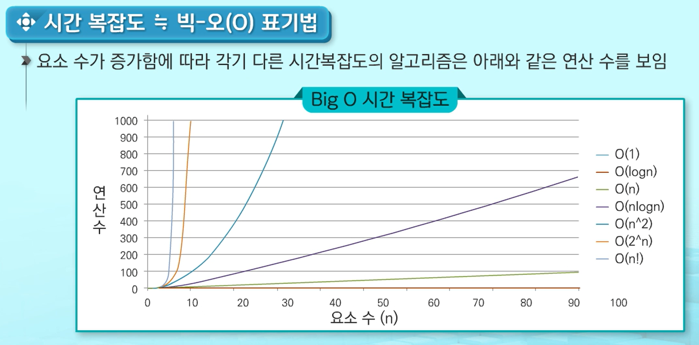
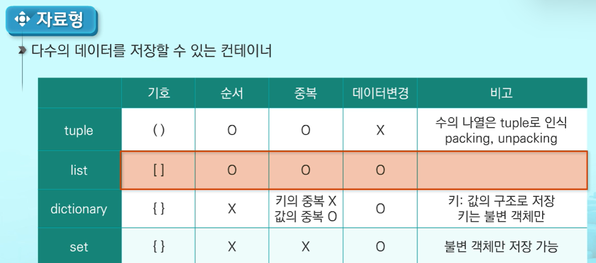
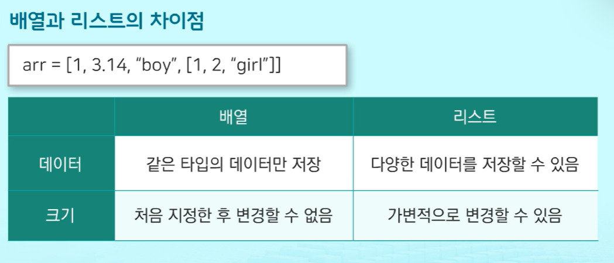
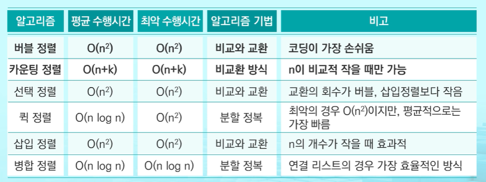

# 1차원 리스트의 활용

## 1. 알고리즘
- 유한한 단계를 통해 문제를 해결하기 위한 절차나 방법
- 표현법
    - 슈도코드 : 일반적인 언어로 코드를 흉내내어 알고리즘을 써 놓은 코드(알고리즘을 대략적으로 모델링)
    - 순서도 : 프로그램이나 작업의 진행 흐름을 순서에 따라 여러가지 기호나 문자로 나타낸 도표 
- 좋은 알고리즘의 요소
    - 정확성
    - 작업량: 적은 연산으로 원하는 결과를 얻는것
    - 메모리 사용량: 적은 메모리
    - 단순성: 얼마나 단순한가
    - 최적성: 더 이상 개선할 여지없이 최적화되었는지
- 알고리즘의 성능 분석: 분석 기준으로 작업량을 사용
    - 실행되는 시간 측정 - 컴퓨터 사양마다 달라짐
    **- 실행되는 명령문의 개수를 계산**
    - 시간복잡도 분석 == 빅-오(O) 표기법: 
    시간복잡도 함수중 가장 큰 영향력을 주는 n에 대한 항만을 표시, 계수 생략
    

## 2. List
 
- 배열(List): 같은 타입 변수들을 하나의 이름으로 열거하여 사용하는 자료구조로 c, 자바의 배열과 유사
- 배열과 리스트의 차이점
    
    - 리스트는 크기가 가변적이며, 다양한 데이터 형태를 저장가능
- 리스트 사용법: [02_data_type](../Python/02_data_type.md)참고
    - 시퀀스 자료형으로 시퀀스 필요로하는 함수 사용가능
    - list comprehension: 한줄로 리스트를 쉽게 만드는 법
        - [expression for element in iterable <if condition>]
## 3. 완전검색법
- 문제의 해법으로 생각할 수 있는 모든 경우의 수를 테스트해보고 확인하는 기법
- 경우의 수가 상대적으로 작을 때 유용함
- 수행속도는 느리지만 해답을 찾아내지 못할 확률이 적음

1. 순열(permutation): 서로 다른 것들 중 몇개를 뽑아서 한줄로 나열하는 것
- 서로 다른 n개 중 r개를 택하는 순열 (nPr)
- 파이썬 `itertools` 모듈을 이용하면 간편하게 순열 구할 수 있음
    ```python
    import itertools
    itertools.permutations(반복가능 객체, 뽑을 갯수) # 반복가능 객체 : 리스트, 튜플, 문자열
    # 결과를 튜플형식으로 반환
    
    arr = ['a', 'b', 'c']
    nPr = itertools.permutations(arr, 2)
    print(list(nPr))
    # [('A', 'B'), ('A', 'C'), ('B', 'A'), ('B', 'C'), ('C', 'A'), ('C', 'B')]
    ```     
## 2. 탐욕 알고리즘
- 최적 해를 구하는데 사용되는 근시안적인 방법
- 그 순간에 최적이라고 생각되는 것을 선택해 나가는 방식으로 진행하여 최종해답에 도달
- 전체적으로 봤을때 그것이 최적이라는 보장은 없고 해답을 찾지 못하는 경우가 있음
- ex) [0001_babygin](https://github.com/Dhyeonle9/algo/blob/b03c70e2dc9e4bff96d7f8ce633170c2c84b347b/swea/0001_babygin/sol.py)
## 3. 정렬
- 2개 이상의 자료를 특정 기준에 의해 작은 값부터 큰 값(오름차순:ascending) 혹은 반대(내림차순:descending)으로 재배열하는 것
1. 버블 정렬
- 인접한 두 개의 원소를 비교하며 자리를 계속 교환하는 방식, 시간복잡도 = O(n^2)
    ```python
    def bubble(list):
        a = [1, 5, 3, 4, 2]
        for i in range(len(a)-1, 0, -1): # 범위의 끝에서부터 시작
            for j in range(i): # 정렬된 것은 보지않음
                if a[j]>a[j+1]:
                    a[j+1], a[j] = a[j], a[j+1]
    ```

2. 카운팅 정렬
- 항목들의 순서를 결정하기 위해 집합에 각 항목이 몇 개씩 있는지 세는 작업을 하여, 선형 시간에 정렬하는 효율적인 알고리즘, 시간복잡도 = O(n+k) n은 리스트 갯수, k는 정수 최대값
- 정수나 정수로 표현할 수 있는 자료에 대해서만 적용 가능: 각 항목의 발생 횟수를 기록하기 위해, 정수 항목으로 인덱스되는 카운트들의 리스트를 사용하기 때문
- 카운트를 위한 충분한 공간을 할당하려면 집합 내의 가장 큰 정수를 알아야함
    ```python
    a = [0, 4, 1, 3, 1, 2, 4, 1]
    b = [0]*len(a) # 정렬된 리스트 
    c = [0]*max(a) # 카운트를 위한 리스트

    for i in range(len(b)):
        c[a[i]] += 1
    for j in range(1, len(c)):
        c[j] += c[j-1]
    for k in range(len(b)-1, -1, -1):
        b[c[a[k]]-1] = a[k]
        c[a[k]] -= 1

    ```
> 그외에도 
> - 선택 정렬
> - 퀵 정렬
> - 삽입 정렬
> - 병합 정렬    
> 이 있다.
3. 정렬 알고리즘 비교


# 알고리즘 문제
swea    
[0001_babygin](https://github.com/Dhyeonle9/algo/blob/b03c70e2dc9e4bff96d7f8ce633170c2c84b347b/swea/0001_babygin/sol.py)    
[0002_sort](https://github.com/Dhyeonle9/algo/tree/b03c70e2dc9e4bff96d7f8ce633170c2c84b347b/swea/0002_sort)    
[4828_minmax](https://github.com/Dhyeonle9/algo/blob/b03c70e2dc9e4bff96d7f8ce633170c2c84b347b/swea/4828_minmax/sol.py)    
[4834_숫자카드](https://github.com/Dhyeonle9/algo/blob/b03c70e2dc9e4bff96d7f8ce633170c2c84b347b/swea/4834_%EC%88%AB%EC%9E%90%EC%B9%B4%EB%93%9C/sol.py)     
[4831_전기버스](https://github.com/Dhyeonle9/algo/blob/b03c70e2dc9e4bff96d7f8ce633170c2c84b347b/swea/4831_%EC%A0%84%EA%B8%B0%EB%B2%84%EC%8A%A4/sol.py)