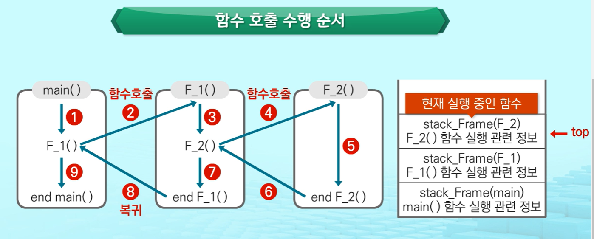
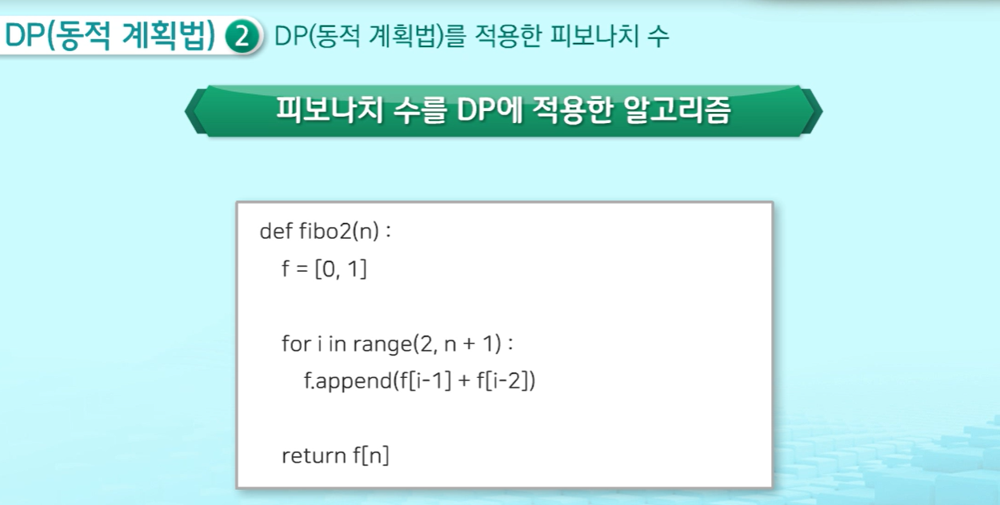
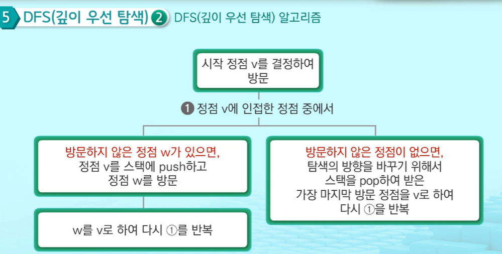
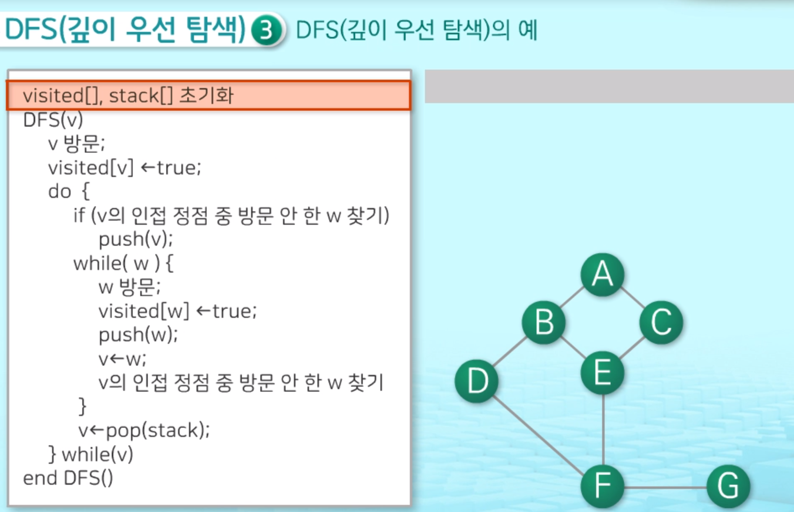
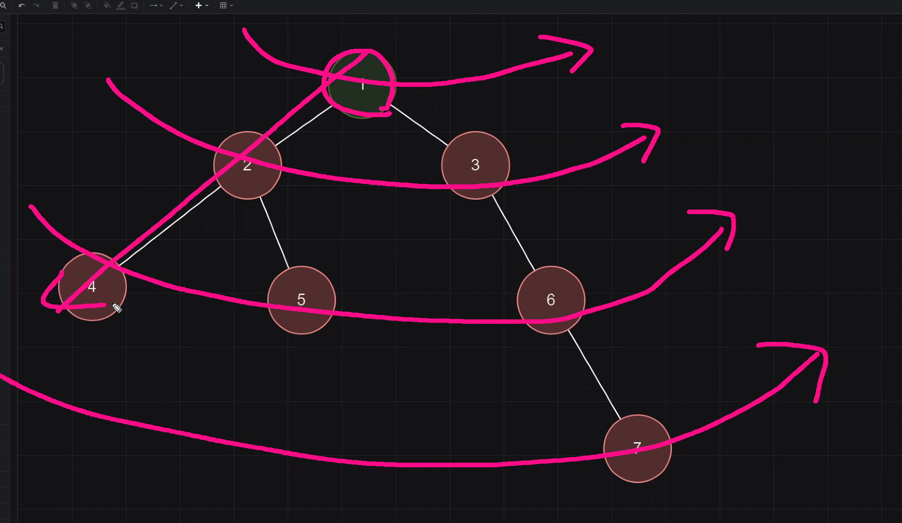

# Stack
1. 스텍이란
    - 프로그램에서 중요성과 활용도가 매우 높은 자료구조
    - 물건을 쌓아 올리듯 자료를 쌓아 올린 형태의 자료구조
    - 마지막에 넣은 자료를 제일 먼저 뺌
    - 메소드 `.append()`, `.pop()`가 stack을 활용한 예
2. stack의 응용
    - 괄호검사: 파이썬 내부 문법적으로 괄호 쌍이 맞는지 검사할 때 사용
    - function call: 프로그램에서의 함수 호출과 복귀에 따른 수행 순서를 관리
        - 먼저 호출한 함수가 마지막, 마지막에 호출한 함수를 제일 먼저 실행하고 복귀하는 후입선출 구조이므로, 스택을 이용하여 수행순서관리
    
연습)    
[4866_괄호검사](https://github.com/Dhyeonle9/algo/blob/bb99a8e1b5a68adea15b862007cb2effeeba6716/swea/4866_%EA%B4%84%ED%98%B8%EA%B2%80%EC%82%AC/sol.py)    
[4873_반복문자 지우기](https://github.com/Dhyeonle9/algo/blob/bb99a8e1b5a68adea15b862007cb2effeeba6716/swea/4873_%EB%B0%98%EB%B3%B5%EB%AC%B8%EC%9E%90%EC%A7%80%EC%9A%B0%EA%B8%B0/sol.py)

3. Memoization
    - 프로그램을 실행할 때 이전에 계산한 값을 메모리에 저장해서 매번 다시 계산하지 않도록 하는 것, 실행속도를 빠르게 함
    - DP(동적 계획법)의 핵심
    - ex) 피보나치 알고리즘에서 계산하자마자 저장하고 사용하면 실행시간 줄일 수 있음
4. DP(동적 계획법)
    - Dynamic Programming: 입력 크기가 작은 부분 문제들을 모두 해결한 후에 그 해들을 이용하여 보다 큰 크기의 부분문제들을 해결하며 주어진 입력의 문제를 해결
    - 최적화 문제를 해결하는 알고리즘
    - ex) 피보나치 수를 DP에 적용한 알고리즘
    
    연습)    
    [4869_종이붙이기](https://github.com/Dhyeonle9/algo/blob/bb99a8e1b5a68adea15b862007cb2effeeba6716/swea/4869_%EC%A2%85%EC%9D%B4%EB%B6%99%EC%9D%B4%EA%B8%B0/sol.py)

5. DFS (Depth First Search, 깊이 우선 탐색) 

    - 깊이우선탐색(DFS)는 비선형 구조인 그래프 구조를 빠짐없이 검색하기 위함
    >비교) 2중 for문 알고리즘은 모든 데이터를 빠짐없이 한번씩 순회하기 위함(**선형구조 데이터**)
    - 그래프 구조: 정점(vertex), 간선(edge)로 구성 
    
        - 그래프 구조의 예 : 지도
    - 깊이 우선 탐색 방법: 
        1. 시작 정점의 한 방향으로 갈 수 있는 경로가 있는 곳까지 깊이 탐색
        2. 더 이상 갈 곳이 없게 되면, 가장 마지막에 만났던 갈림길 간선이 있는 정점으로 되돌아옴
        3. 다른 방향의 정점으로 탐색을 계속 반복하여 결국 모든 정점을 방문하여 순회

    - DFS 알고리즘

    

    - 예시
    
    [dfs 설명동영상](https://www.youtube.com/watch?v=_hxFgg7TLZQ)
    > 비교) 너비우선탐색(Breadth First Search, BFS)    
        
    연습)    
    [4871_그래프경로](https://github.com/Dhyeonle9/algo/blob/bb99a8e1b5a68adea15b862007cb2effeeba6716/swea/4871_%EA%B7%B8%EB%9E%98%ED%94%84%EA%B2%BD%EB%A1%9C/sol.py)

# 알고리즘 문제
SWEA    
[4866_괄호검사](https://github.com/Dhyeonle9/algo/blob/bb99a8e1b5a68adea15b862007cb2effeeba6716/swea/4866_%EA%B4%84%ED%98%B8%EA%B2%80%EC%82%AC/sol.py)    
[4873_반복문자 지우기](https://github.com/Dhyeonle9/algo/blob/bb99a8e1b5a68adea15b862007cb2effeeba6716/swea/4873_%EB%B0%98%EB%B3%B5%EB%AC%B8%EC%9E%90%EC%A7%80%EC%9A%B0%EA%B8%B0/sol.py)    
[4869_종이붙이기](https://github.com/Dhyeonle9/algo/blob/bb99a8e1b5a68adea15b862007cb2effeeba6716/swea/4869_%EC%A2%85%EC%9D%B4%EB%B6%99%EC%9D%B4%EA%B8%B0/sol.py)    
[4871_그래프경로](https://github.com/Dhyeonle9/algo/blob/bb99a8e1b5a68adea15b862007cb2effeeba6716/swea/4871_%EA%B7%B8%EB%9E%98%ED%94%84%EA%B2%BD%EB%A1%9C/sol.py)