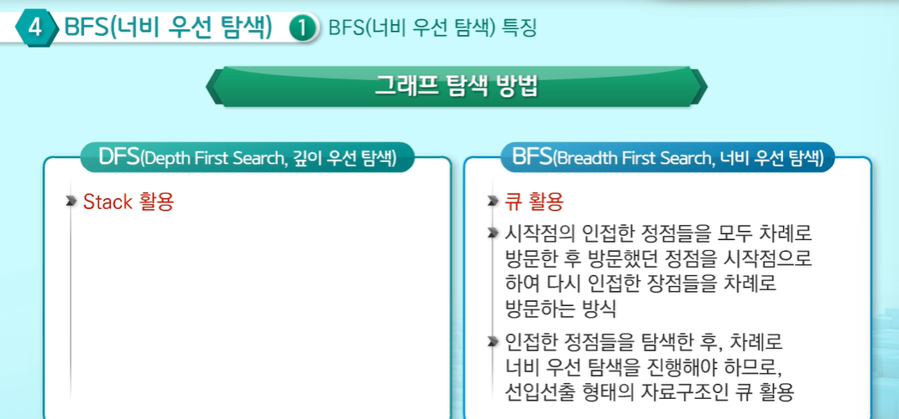
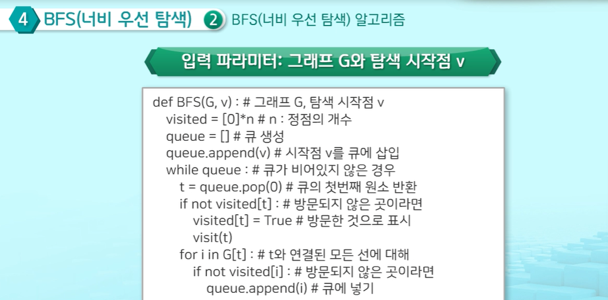

# 큐
1. 큐의 정의
    - 삽입, 삭제의 위치가 제한적인 자료구조
    - 큐 뒤: 삽입/ 큐 앞: 삭제
    - 선입선출구조(FIFO:First In - First Out)
    - 큐에 삽입한 순서대로 원소가 저장되고 가장 먼저 들어온 원소는 가장 먼저 삭제됨 
    - 파이썬에서는 리스트를 이용하여 사용가능
    - deque 객체:
    리스트보다 빠른 속도로 queue 사용을 지원해주는 객체
2. 큐의 종류
    - 선형큐
    - 원형큐
    - 리스트를 이용한 큐
    - 연결큐(단순연결리스트)를 이용한 큐)
    - Queue 라이브러리
3. 큐의 활용
    - 우선순위 큐
4. BFS (너비우선탐색):
    
     - 시작점의 인접한 정점들을 모두 차례로 방문한 후 방문했던 정점을 시작점으로 하여 다시 인접한 정점들을 차례로 방문하는 방식
    - 인접한 정점들을 탐색한 후, 차례로 너비 우선 탐색을 진행해야 하므로 선입선출 형태의 자료구조인 큐를 활용

    - BFS 알고리즘
    
