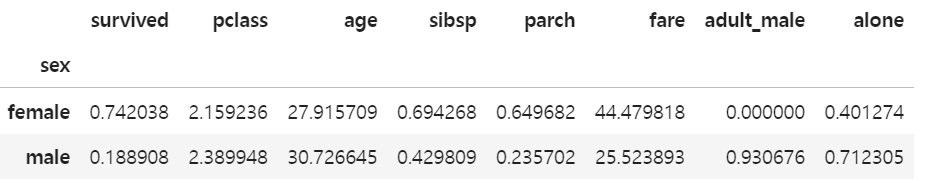
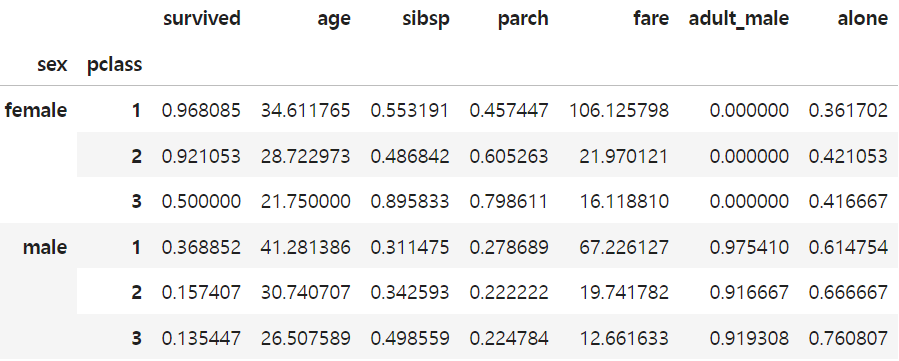
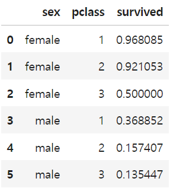
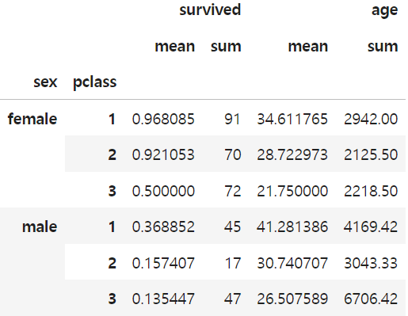

## groupby/pivottable

### apply()
함수를 적용
- 함수 정의
    ```python
    def transform_who(x):
    if x == 'man':
        return '남자'
    elif x == 'woman':
        return '여자'
    else:
        return '아이'
    ```
- 적용
    ```df['who'].apply(transform_who)```

- apply() - lambda 함수
    - `df['survived'].apply(lambda x: '생존' if x == 1 else '사망')`

### groupby()
그룹
- 데이터를 `특정 기준`으로 그룹핑할 때 활용(엑셀 피봇테이블과 유사)
- `df.groupby('sex').mean(numeric_only=True)`
    
- groupby()를 사용할 때는 반드시 aggregate 하는 통계함수와 일반적으로 같이 적용
- 두개 이상의 컬럼으로 그룹
    - 리스트로 묶어서 지정, 왼쪽에 있을수록 우선순위 큼
    - `df.groupby(['sex', 'pclass']).mean(numeric_only=True)`
    
- 특정 컬럼에 대한 결과 도출
- 그룹핑한 데이터를 대괄호접근으로 원하는 컬럼을 출력
- `df.groupby(['sex', 'pclass'])['survived'].mean(numeric_only=True)`
- 예쁘게 출력하려면 pd.DataFrame()으로 감싸주거나, survived 컬럼을 []로 한 번 더 감싸줌
    - `pd.DataFrame(df.groupby(['sex', 'pclass'])['survived'].mean(numeric_only=True))`
    - `df.groupby(['sex', 'pclass'])[['survived']].mean(numeric_only=True)`

### reset_index()
인덱스 초기화
- 그룹핑된 데이터프레임의 index를 초기화하여 새로운 데이터프레임을 생성
- `df.groupby(['sex', 'pclass'])['survived'].mean(numeric_only=True).reset_index()`
    

### agg()
다중통계함수적용
- 여러 가지의 통계 값을 적용할 때는 agg()를 사용
- `df.groupby(['sex', 'pclass'])[['survived', 'age']].agg(['mean', 'sum'])`
    

### pivot_table()
- 피벗테이블은 엑셀의 피벗과 동작이 유사하며, groupby()와도 동작이 유사
- 기본 동작 원리는 `index`, `columns`, `values`를 지정하여 피벗함
- 기본값은 `mean`
- `df.pivot_table(index='who', values='survived')`
- 다중 그룹에 대한 단일 컬럼 결과
    - `df.pivot_table(index=['who', 'pclass'], values='survived')`
- index에 컬럼을 중첩하지 않고 행과 열로 펼친 결과
    - `df.pivot_table(index='who', columns='pclass', values='survived')`
- 다중 통계함수 적용 aggfunc=[]
    - `df.pivot_table(index='who', columns='pclass', values='survived', aggfunc=['sum', 'mean'])`

## concat/merge
### concat()
데이터연결
- concat()는 지정한 DataFrame들을 연결함, 
- 연결시 index가 초기화되지않아 끝인덱스 - 0, 1 로 갯수와 index가 맞지 않음
- `gas = pd.concat([gas1, gas2], ignore_index=True)`index를 무시하고 연결가능
- 열방향으로 연결 `axis=1` 지정
    - `pd.concat([gas1, gas2], axis=1)`

### merge()
데이터병합
- 서로 다른 구성의 DataFrame이지만, `공통된 key값(컬럼)`을 가지고 있다면 병합할 수 있음
#### 참고: SQL Join
 
- `pd.merge(df1, df2)`
- 병합방법 4가지
    - left (왼쪽 데이터 key 기준): 빈 데이터는 NaN
    - right (오른쪽 데이터 key 기준): 빈 데이터는 NaN
    - outer (왼쪽 오른쪽 데이터 key 모두 취함): 빈 데이터는 NaN
    - inner (기본값): 공통으로 있는 데이터 key를 기준
- 병합하려는 컬럼의 이름이 다른경우 left_on가 right_on을 지정하여 기준 coloumn을 맞춰줌
    - `pd.merge(df1, df2, left_on='이름', right_on='고객명')`    
### 연습:
[타이타닉 데이터분석연습(pandas)](https://github.com/Dhyeonle9/pandas/blob/176c8c2009b9465889343817a63a2ffb478e3f7d/09-pandas-titanic-%EC%8B%A4%EC%8A%B5%EC%98%88%EC%A0%9C-(%EC%8B%A4%EC%8A%B5).ipynb)