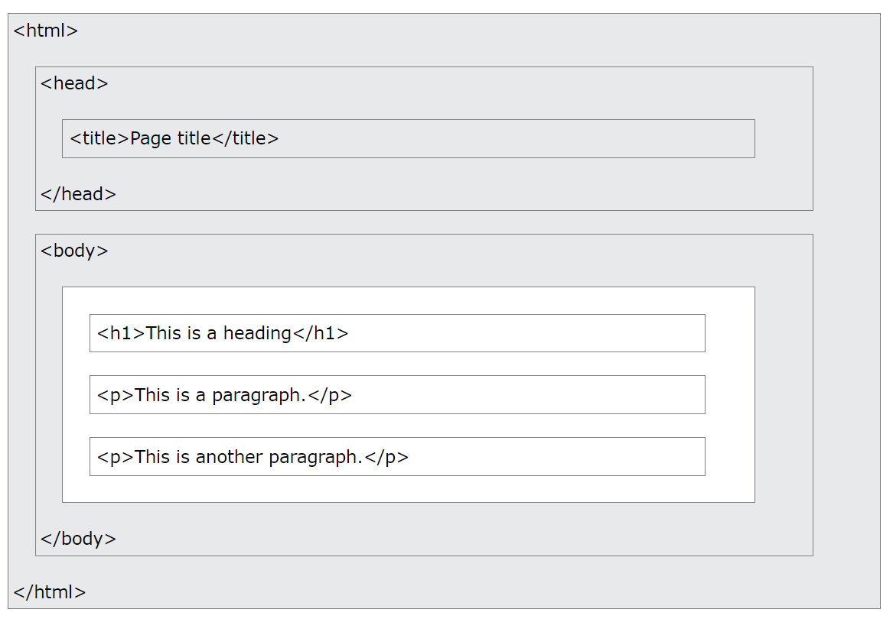
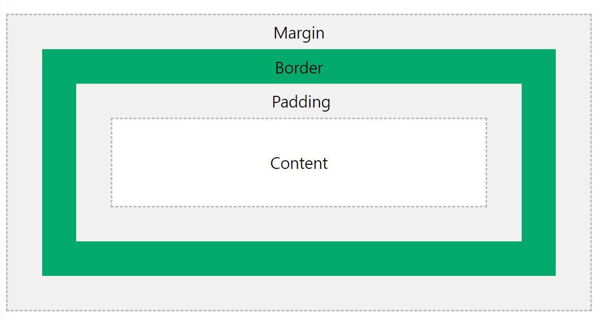

# web 개발
## web개발의 기술3요소
1. URI(Unified Resource Identifier)/URL(Unified Resource Locator): 요청 자원의 위치를 나타내기 위한 표기법 또는 위치 지정자
2. HTTP(HyperText Transfer Protocol): 웹 상에 존재하는 자원을 요청하는 주체와 해당 요청에 응답하는 주체간 통신할 때 준수해야하는 약속(통신규약)
    - HTML 문서를 주고받는 데에 쓰임
    - GET 요청 (있는 데이터 그대로 주세요)
    - POST 요청 (데이터 처리해주세요~)
3. HTML (HyperText Markup Language)
    - 연결 가능한 텍스트 방식인 링크를 통해 웹 상의 모든 리소스를 연결하여 표기할 수 있는 언어
    - 웹사이트 모습을 기술하기 위한 마크업 언어
## web페이지 구성요소
    1. HTML - structure
    2. CSS - presentation/apperance
    3. JavaScript - function
 ### HTML
 1. HTML의 역할
    - HTML은 웹 페이지를 생성하기 위한 표준 마크업 언어로 웹페이지의 구조를 설명함
    - HTML은 *HTML태그*라는 일련의 요소들로 구성됨
    - 브라우저에 내용을 어떻게 표시할지를 정함 
2. HTML 예시

```html
<!-- 선언: HTML5 문서임을 정의-->
<!DOCTYPE html>
<!-- HTML 루트요소 -->
<html>
<!-- HTML Head 요소: 페이지에 대한 메타 정보가 포함됨 -->
<head>
<!-- HTML 제목: 브라우저 제목표시줄/탭에 표시되는 제목 -->
<title>Page Title</title>
</head>
<!-- 문서의 본문으로 제목, 단락, 이미지, 하이퍼링크, 표, 목록 등과 같이 표시되는 모든 콘텐츠에 대한 컨테이너  -->
<body>
<!-- h1~h6까지로 제목을 중요도에 따라 크기로 표시 -->
<h1>My First Heading</h1>
<!-- 단락 요소-->
<p>My first paragraph.</p>
</body>
</html>
```
- VS code에서는 html문서에서 `!+ tab`으로 기본 구조 자동완성(shortcut) 가능
3. HTML 요소란?
    - HTML 요소는 시작태그, 내용 및 종료태그로 정의됨
    - `<태그이름>내용</태그이름>`
    - 일부 요소에는 내용과 종료태그가 없음(빈요소, empty elements)
    ```html
    <!-- 주요범위 -->
    <html></html> HTML 문서의 범위를 설정
    <head></head> HTML 문서의 정보를 설정
    <body></body> HTML 문서의 구조를 설정

    <!-- 메타데이터: head안에 위치-->
    <title></title> 브라우저의 제목표시줄/탭에 보여지는 문서의 제목을 설정
    <base /> HTML 문서에 포함된 상대 URL들의 기준 URL 설정(한 문서에 하나만 포함가능): 속성 href, target
    <link /> 외부 리소스의 연결 및 현재 문서와의 관계를 명시: 속성 rel, href, type
    <meta /> 기타 메타 데이터 요소로 나타낼 수 없는 메타 데이터를 설정: 속성 charset, name 등
    <style></style> 스타일 정보(CSS)를 설정: 속성 type

    <!-- 콘텐츠 -->
    <h1></h1> 문서의 정보 계층을 구조화(제목/목차 설정): h1~ h6까지
    <header></header> 문서의 헤더를 설정(로고, 제목, 검색 등을 포함)
    <footer></footer> 문서의 푸터를 설정(작성자, 저작권, 관련 문서 등을 포함)
    <main></main> 문서의 주요 콘텐츠를 설정(한문서에 하나의 요소만 포함 가능)
    <article></article> 독립적으로 구분되거나 재사용 가능한 영역을 설정(신문기사/블로그 등)
    <section></section> 문서의 일반적인 영역을 설정
    <aside></aside> 문서의 별도 콘텐츠를 설정(광고나 기타링크 등)
    <nav></nav> 다른 페이지 링크를 제공하는 영역(보통 메뉴, 목차, 색인 등을 설정)
    <address></address> body, article 등에서 연락처 정보를 제공하기 위해 포함
    <div></div> 본질적으로 아무것도 나타내지 않음, 콘텐츠 영역을 나누어 꾸미는 목적으로 사용(display: block)

    <!-- 문자 콘텐츠 -->
    <ol><li></li></ol> 정렬된 목록: 속성 start, type (li속성: value)
    <ul><li></li></ul> 정렬되지 않은 목록: 속성 type
    <dl><dt></dt><dd></dd></dl> 용어(<dt>)와 정의(<dd>) 쌍들의 영역(<dl>)을 설정: key/value 형태를 표시할 때 유용
    <p></p> 하나의 문단을 설정
    <hr /> 문단의 분리를 위해 설정(Horizontal rule)수평선 표시되나 의미적 관점으로만 사용
    <pre></pre> 서식이 미리 지정된 텍스트 설정(공백과 줄바꿈을 유지하여 표시가능)
    <blockquote></blockquote> 일반적인 인용문을 설정
    <b></b> Bold 체로 표시
    <strong></strong> 의미의 중요성을 나타내기 위해 사용(Bold체로 표시)
    <mark></mark> 하이라이팅(글자 배경이 노란색으로 표시)
    <i></i> 이탤릭체로 표시
    <em></em> 의미 강조를 표시, 이탤릭체로 표시(중첩 가능하고, 중첩될수록 강조의미가 강해짐)
    <u></u> underline, 밑줄로 표시
    <code></code> 컴퓨터 코드 범위를 설정(inline code)
    <sup>, <sub> 위첨자(sup), 아래첨자(sub)를 설정
    <span> 콘텐츠 영역을 설정(display: inline)

    <!-- 인라인 텍스트 -->
    <a></a> (Anchor)다른 페이지, 파일, 이메일 주소 등 다른 URL로 연결할 수 있는 하이퍼링크를 설정: 속성 download, href, rel, target, type
    <br /> 줄바꿈을 설정
    <!-- 표 -->
    <table>
        <tr><th></th><tr> tr은 행, th(제목), td(내용)
        <tr><td></td><tr>
    </table>

    <!-- 양식 -->
    <form></form> 웹서버에 정보를 제출하기 위한 양식 범위를 정의
    <form>
        <label></label> 라벨 가능요소의 제목, for 속성으로 요소를 참조하거나 콘텐츠로 포함
        <input type="입력타입" />
    </form>
    ```    
4. HTML 속성
    - 모든 HTML 요소는 속성을 가질 수 있음
    - 속성은 요소에 대한 추가 정보를 제공하며 항상 시작태그에 지정
    - 일반적으로 name="value"와 같이 이름/값 쌍으로 제공됨
    ```html
    <!-- 전역속성 -->
    <class>    
     공백으로 구분된 요소의 별칭을 지정, CSS나 JavaScript의 요소선택기를 통해서 요소를 선택하거나 접근
    <id>  
     문서에서 고유한 식별자를 정의, CSS나 JavaScript의 요소선택기를 통해서 요소를 선택하거나 접근
    <style>
     요소에 적용할 CSS를 선언
    <title>
     요소의 정보(설명)을 지정
    ```
5. HTML form 실습
[subway 응답](https://github.com/Dhyeonle9/web/blob/205a35741ea3a8f50b7e79e12d64d0bd87173508/3.subway.html)

## CSS (캐스케이딩 스타일 시트, Cascading Style Sheet)
1. CSS 란
- HTML 요소가 화면에 표시되는 방법을 설명 함
- 웹페이지의 디자인과 디자인과 스타일을 정해줌
- 레이아웃의 크기, 색깔, 모양 등을 설정 가능
- HTML 내부에서 사용하거나(inline, internal), 별도의 스타일 시트(css 파일)에서 설정 후 HTML에 적용(external)가능
2. CSS 예시
```css
    /* 선언 */
    선택자 {
        속성명1: 속성값;
        속성명2: 속성값2;
    }

    h1 {
        color: blue;
        font-size: 12px;
    }
```
3. CSS 선택자
    - CSS 선택자는 스타일을 지정하려는 요소를 찾거나 선택하기위해 사용됨
    - CSS 선택자 5가지    
        - 단순 선택자: name, id, class를 기준으로 요소 선택
        - Combinator selectors( 조합자 선택기): 요소 간의 특정 관계를 기반으로 선택
        - Pseudo-class selector(수도 클래스 선택자): 특정 상태에 따른 요소 선택
        - Pseudo-elements(수도 요소 선택자): 요소의 일부 선택 및 스타일 지정
        - Attribute(속성 선택자): 속성 또는 속성값을 기반으로 요소 선택
    - 단순 선택자
        - 우선순위: 태그선택자> .class 선택자> id 선택자 (덮어씌우기 됨)
        ```css
        /* id Selector */
        #id {
            text-align: center;
        }

        /* class Selector */
        .class {
            color: red;
        }
        /* 두개 이상의 클래스를 가질 수 있음 */
        <p class="class1 class2">
        /*클래스를 가진 요소를 지정할 수 있음 */
        요소.class {
            color: blue;
        }

        /* Universal Selector */
        * {
            text-align: center;
        }
        /* group Selector: 요소들을 그룹지어서 스타일 정의할 수 있음*/
        h1, h2, p {
            color: yellow;
        }
        ```
4. CSS를 지정하는 방법
    - inline CSS: 해당 요소에 스타일 속성을 추가하여 적용  
    `<h1 style="color:red;">`
    - internal CSS: HTML head 색션 내부에 <style></style>요소 내부에 정의, 단일 페이지의 스타일 적용 가능
    - external CSS: 외부 스타일 시트를 작성하여 HTML에 적용(head 섹션 내부의 <link></link> 요소 내부에 외부 스타일 시트 파일에 대한 참조가 포함되어야함)
    - 동일한 요소의 속성이 다중으로 정의된 경우, 마지막으로 읽어진 스타일 시트의 값을 참조(선언 순서에 따라) 
5. CSS 우선순위
   1. Inline style (inside an HTML element)
    2. External and internal style sheets (in the head section)
    3. Browser default
6. box모델
    
    - contents: 텍스트와 이미지가 표시되는 내용 부분
    - padding: 콘텐츠 주변 영역(border와 contents 사이)
    - border: 테두리(콘텐츠와 패딩을 둘러쌈)
    - margin: 테두리 외부영역으로 다른 요소와의 거리를 설정

7. CSS 속성값
```css
    /* 색상값 표시 */
    - RGB값: RGB(255,99, 71
    - HEX값: #ff6347
    - hsl(9, 100%, 64%)

    /* 배경 */
    background-color : 요소의 배경색 지정
    background-image : 배경 이미지 지정 url("source")
    background-repeat : 배경반복할지/말지
    background-attachment : 스크롤할지 고정할지
    background-position : 배경위치
    background(속기 속성) : 
        background: #ffffff url("img_tree.png") no-repeat right top;
    로 한번에 여러 속성 선언 가능
    /* 테두리 */
    border-style : 테두리 스타일
    border-width : 테두리 두께
    border-color : 테두리 색깔
    border-radius: 테두리 둥글게
    /* margin */
    margin 
    margin-top
    margin-right
    margin-bottom
    margin-left
    /* padding */
    padding
    padding-top
    padding-right
    padding-bottom
    padding-left
    /* 요소 높이 및 너비 설정 */
    height
    width
    max-width
    /* outline: border 바깥부분의 외각선으로 다른 요소와 겹칠 수 있음 */
    outline-style
    outline-width
    outline-color
    outline-offset: 윤곽선과 가장자리/테두리 사이에 공간을 추가
    /* 텍스트 색상*/
    color 
    /* 텍스트 정렬 */
    text-align
    text-align-last
    direction
    unicode-bidi
    vertical-align
    text-decoration-line
    /* 텍스트 장식 */
    text-decoration-color
    text-decoration-style
    text-decoration-thickness
    text-decoration
    /* 텍스트 변환 */
    text-transform

    /* 글꼴: 글꼴을 다운받거나 head의 link를 통해 가져온 후 속성 지정 */
    <link rel="stylesheet" href="https://fonts.googleapis.com/css?family=Sofia">
    font-family: "Times New Roman", Times, serif;
    /* 폰트 속성 */
    font-style
    font-variant
    font-weight
    font-size/line-height
    font-family

    /* 각각 상태의 링크에 대해 속성 설정가능 */
    a:link- 방문하지 않은 정상적인 링크
    a:visited- 사용자가 방문한 링크
    a:hover- 사용자가 마우스를 위에 올려 놓았을 때의 링크
    a:active- 클릭하는 순간의 링크

    /* 디스플레이 속성값 */
    display: block/inline
    /* 기본값 */
    block level element(한줄에 한개)
        div
        h1
        p
        form
        header
        footer
        section

    inline element(한줄에 여러개)
        span
        a
        img
    flex(가변 가능)
        display: flex;
        justify-content: space-around;
```

