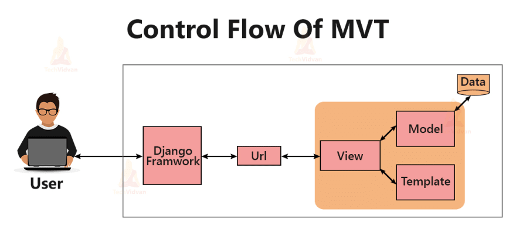
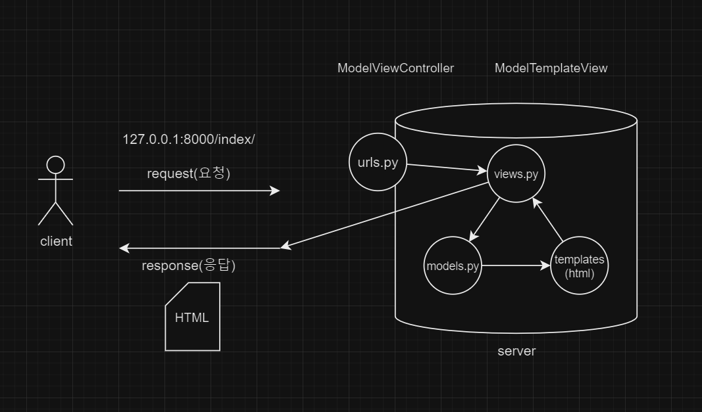

## CSS 2회차
flex 속성 익히기 [FLEXBOX FROGGY](https://flexboxfroggy.com/#ko)
- justify-content: 양옆정렬- 요소들끼리의 정렬
    flex-start(default): 요소들을 컨테이너의 왼쪽으로 정렬
    flex-end: 요소들을 컨테이너의 오른쪽으로 정렬
    center: 요소들을 컨테이너의 가운데로 정렬
    space-between: 요소들 사이에 동일한 간격을 둠
    space-around: 요소들 주위에 동일한 간격을 둠
    space-evenly:
- align-items: 위아래정렬
    flex-start: 요소들을 컨테이너의 꼭대기로 정렬
    flex-end: 요소들을 컨테이너의 바닥으로 정렬
    center: 요소들을 컨테이너의 세로선 상의 가운데로 정렬
    baseline: 요소들을 컨테이너의 시작 위치에 정렬
    stretch(default): 요소들을 컨테이너에 맞도록 늘림
- flex-direction: 축 기준 정렬(진행방향 변함)
    row(default): 요소들을 텍스트의 방향과 동일하게 정렬
    row-reverse: 요소들을 텍스트의 반대 방향으로 정렬
    column: 요소들을 위에서 아래로 정렬
    column-reverse: 요소들을 아래에서 위로 정렬
- order: 요소의 순서를 바꿈
    기본값은 0, 음수와 양수로 바꿀 수 있음
    -1: 한칸 앞으로
    1: 한칸 뒤로
- align-self: 개별요소에 적용할 수 있는 `align-items`
- flex-wrap: 여러줄로 할 지, 한줄에 정렬할 지
    nowrap(default): 모든 요소들을 한 줄에 정렬
    wrap: 요소들을 여러 줄에 걸쳐 정렬
    wrap-reverse: 요소들을 여러 줄에 걸쳐 반대로 정렬
- flex-flow: flex-direction과 flex-wrap을 합침
    `flex-flow: row wrap`로 사용
- align-content: 여러줄에 있는 데이터를 어떻게 정렬할 지
    flex-start: 여러 줄들을 컨테이너의 꼭대기에 정렬
    flex-end: 여러 줄들을 컨테이너의 바닥에 정렬
    center: 여러 줄들을 세로선 상의 가운데에 정렬
    space-between: 여러 줄들 사이에 동일한 간격을 둠
    space-around: 여러 줄들 주위에 동일한 간격을 둠
    stretch(default): 여러 줄들을 컨테이너에 맞도록 늘림

css 프레임워크(tailwind, bootstrap, google material )
## bootstrap
빠르게 반응형웹을 만들때 유용한 라이브러리
> Include via CDN
> CSS는 head끝나기 전, JS는 body 끝나기 전에 넣음
아이콘 사용도 동일(head에 링크, 사용하는곳에 i태그)


# Django(장고)
1. Django?
- python을 사용하여 웹사이트를 더 쉽게 만들 수 있도록 해주는 Python 웹 프레임워크
- DRY(Don't Repeat Yourself)라고도 하는 구성 요소의 재사용성을 강조하며 로그인 시스템, 데이터베이스 연결 및 CRUD 작업(Create Read Update Delete)과 같은 즉시 사용 가능한 기능을 제공
2. Django의 작동원리
- MVT(Model View Template) 디자인 패턴을 따름

    - Model: 표시하려는 데이터(일반적으로 데이터베이스의 데이터)
        - Django는 ORM(객체 관계형 매핑)으로 데이터를 전달하기 때문에 복잡한 SQL문 없이 데이터베이스와 쉽게 통신 가능
        - `models.py`
    - View: 사용자의 요청에 따라 관련 템플릿과 내용을 반환하는 **요청 처리기**
        - http 요청을 인수로 사용하고, 관련 모델을 가져오고, 템플릿으로 보낼 데이터를 찾아 최종 결과를 반환하는 함수/메소드
        - `views.py`
    - Template: 데이터 표시 방법에 대한 논리와 함께 웹 페이지의 레이아웃이 포함된 텍스트 파일(HTML 파일)
        - `template`폴더 안의 `해당 HTML파일`
    - URL: 사용자가 URL을 요청하면 Django는 각각 요청에 맞는 `view`를 보낼 수 있게 결정함
        - `urls.py`
> 비교: MVC(Model View Controller):일반적인 web framework가 가지는 구조 ~ MTV
     
        - Model: Defines data structure ~ database <-> Model   
        - View: Defines display(UI) ~ HTML, CSS, bootstrap <-> Template    
        - Controller: Contains control logic ~ <-> View
- 동작 순서

    1. Client(User)가 URL 요청(Request)
    2. Django는 URL을 수신하고 `urls.py`파일에서 URL과 일치하는 view를 호출
    2. `views.py`내부의 view는 관련된 모델을 확인함
    3. `models.py`에서 모델들을 import함
    4. view는 template폴더의 HTML파일로 데이터를 보냄
    5. 템플릿에는 HTML과 Django가 포함되어있고, Django는 데이터와 함께 완성된 HTML콘텐츠를 브라우저에 반환

3. Django 시작하기(Web만들기)
    1. 장고 모듈 설치
    ```python
    pip install django
    ```
    2. 프로젝트 생성
    ```python
    django-admin startproject <projectname> .
    ```
    3. 가상환경 설정 및 활성화
    ```python
    # 가상환경 설정
    python -m venv venv
    # 가상환경 활성화
    source venv/Scripts/activate
    # 가상환경 비활성화
    deactivate
    ``` 
    4. 서버 실행확인
    ```python
    python manage.py runserver
    # 서버 종료
    ctrl+c
    ```
    5. 앱 생성
    ```python
    django-admin startapp <appname>
    ```
    6. 앱 등록
    `setting.py` 파일의 `INSTALLED_APPS` 리스트에 `'appname'` 등록
    7. `url.py` 파일 수정
    ```python
    # 앱에 해당하는 views import, 안해도 사용가능하지만 불편함
    from appname import views
    # urlpatterns 리스트에 path 추가
    urlpatterns=[
        path('admin/', admin.site.urls),
        path('url주소/', 불러올 view/메소드),
        path('url주소/<입력값>/', 불러올 view/메소드),
        path('url주소/<int:입력값>/', 불러올 view/메소드),
    ]
    ```
    8. `views.py`
    ```python
    from django.shortcuts import render

    # 해당 함수 만들기:
    # request를 받으면 request에 대한 render를 불러오고 index.html을 열어줘, result값 내보내줘
    def index(request, n):
        result = {
            'n': n*2        
        }
        ## render(요청, html문서, 변수)
        return render(request, 'asdf.html', result)
    ```
    9. template 폴더 생성-> asdf.html 생성
    - 내용 작성 {{n}}를 통해 view에서 연산/작성한 변수값 받아올 수 있음  


