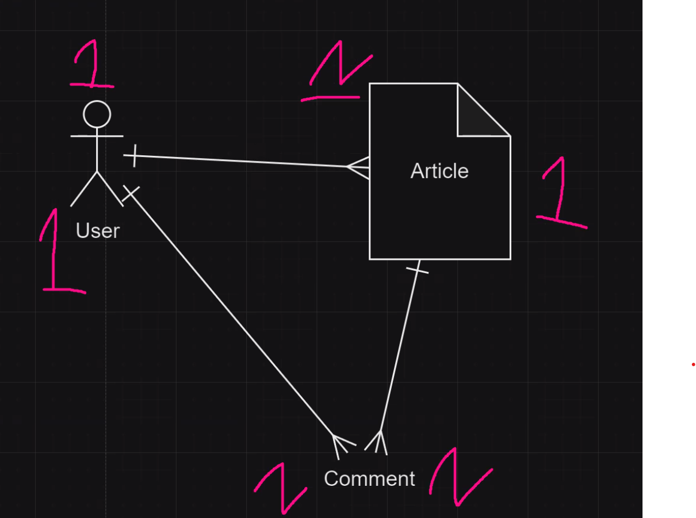
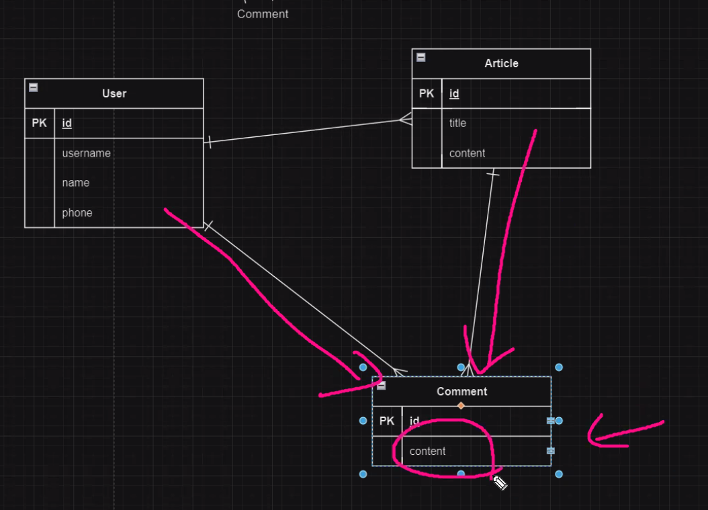

# Permission- login_required, user-article/comment
## login_required
### 구현 목표
- 로그인한 상태에서만 게시글/댓글 작성이 가능하게 함
    - web front-end에서의 작성 버튼 기능 차단
    - back-end에서의 작성 기능 차단
#### web front-end에서의 작성 버튼 기능 차단하기
- `index.html`, `detail.html`에서 분기를 통해 기능 구현
- `user.is_autenticated`를 이용
```html
<!-- index.html -> 'articles:create' url 접근 -->

    <a href="" class="btn btn-secondary">write</a>

<!-- detail.html 댓글작성 폼 접근 -->

    <form action="" method="POST">
        
        
        <input type="submit" class="btn btn-primary">
    </form>

```
#### back-end에서의 작성 기능 차단하기
- url타고 들어가지 못하게 막아야함
    - 처리구조
        - create페이지로 가면 @login_required
        - 로그인페이지로 가서 로그인하면 원래 가려고했던 페이지로 감
- articles앱의 `views.py`에서 `@login_required` 데코레이터 이용 선처리
- accounts앱의 `views.py`에서 후처리 
##### 1. articles앱의 `views.py`
```python
# login_require 이용을 위한 참조
from django.contrib.auth.decorators import login_required

@login_required
def create(request):
    if request.method == 'POST':
        form = ArticleForm(request.POST)
        if form.is_valid():
            article = form.save(commit=False)
            article.user = request.user
            article.save()
            return redirect('articles:index')
    else:
        form = ArticleForm()
    context = {
        'form': form,
    }
    return render(request, 'form.html', context)

@login_required
def comment_create(request, id):
    form = CommentForm(request.POST)
    if form.is_valid():
        comment = form.save(commit=False)
        comment.user = request.user
        comment.article_id = id
        comment.save()
    return redirect('articles:detail', id=id)

```
##### 2. accounts앱의 `views.py`
```python
def login(request):
    if request.method == 'POST':
        form = CustomAuthenticationForm(request, request.POST)
        if form.is_valid():
            auth_login(request, form.get_user())
            # next_url에 @login_required로 GET요청된 정보를 할당
            next_url = request.GET.get('next')
            # http://127.0.0.1:8000/accounts/login/ => None
            # http://127.0.0.1:8000/accounts/login?next=/articles/create/ => /articles/create
            return redirect(next_url or 'articles:index')
            # 단축평가 이용
            # next 인자에 url이 있을 때 => '/articles/create/' or 'articles:index' --> 앞에거를 무조건 반환
            # url 없을때 => None or 'articles:index' 뒤에거를 무조건 반환
    else:
        form = CustomAuthenticationForm()
    context = {
            'form': form,
    }
    return render(request, 'login.html', context)
```

#### 데코레이터
##### 데코레이터?
- 함수를 받아 명령을 추가한 뒤 이를 다시 함수의 형태로 반환하는 함수
- 함수의 내부를 수정하지 않고 기능에 변화를 주고싶을때 사용
- 일반적으로 함수의 전처리나 후처리에 대한 필요가 있을 때 사용
- 데코레이터를 이용해, 반복을 줄이고 메소드나 함수의 책임을 확장
##### 데코레이터 구조
- 함수 데코레이터
    ```python 
    def out_func(func):  # 기능을 추가할 함수를 인자로
        def inner_func(*args, **kwargs):
            return func(*args, **kwargs)    
        return inner_func
    ############################
    def decorator(func):
        def wrapper(*args, **kwargs):       
            print('전처리')   
            print(func(*args, **kwargs))
            print('후처리')
        return wrapper

    @decorator
    def example():
        return '함수'
    example()
    '''''''''
    전처리
    함수
    후처리
    '''''''''
    ```
- 클래스 데코레이터
    ```python
    class Decorator:
        def __init__(self, function):
            self.function = function
        def __call__(self, *args, **kwargs):
            return self.function(*args, **kwargs)
    #####################################
    class Decorator:
        def __init__(self, function):
            self.function = function
        def __call__(self, *args, **kwargs):
            print('전처리')
            print(self.function(*args, **kwargs))
            print('후처리')
    @Decorator
    def example():
        return '클래스'
    example()
    '''''''''
    전처리
    클래스
    후처리
    '''''''''
    ```
## user-article/comment
### 구현 목표
- 글과 댓글 작성자만 수정/삭제가 가능하게 함
    - Article 모델, Comment모델, User 모델 관계정의
- Model들 간의 1-N 관계 구조 이용
#### 1. articles앱 `models.py`
```python
from django.contrib.auth import get_user_model

class Article(models.Model):
    title = models.CharField(max_length=40)
    content = models.TextField()
    user = models.ForeignKey(get_user_model(), on_delete=models.CASCADE)
    # user_id = 장고가 자동으로 추가해주는 컬럼
    # comment_set = 장고가 자동으로 추가해주는 컬럼

class Comment(models.Model):
    content = models.TextField()
    article = models.ForeignKey(Article, on_delete=models.CASCADE)
    # article_id = 장고가 자동으로 추가해주는 컬럼
    user = models.ForeignKey(get_user_model(), on_delete=models.CASCADE)
    # user_id = 장고가 자동으로 추가해주는 컬럼
```
#### 2. accounts앱 `models.py`
```python
from django.db import models
from django.contrib.auth.models import AbstractUser
# Create your models here.
class User(AbstractUser):
    pass
    # article_set 장고가 자동으로 생성해주는 컬럼(ForeignKey)
    # comment_set 장고가 자동으로 생성해주는 컬럼(Foreignkey)

    #  *자동 생성 컬럼
    #   N인 모델: 1model_id
    #   1인 모델: nmodel_set

```
1:N관계 구조(모델간의 관계 정의)

>현업에서는 E-R model (DB개체-관계 모델)이용    
>

#### 3. articles앱 `views.py`
- `if request.user != article.user` / `if request.user == article.user` / `if request.user == comment.user` 분기처리
```python
from django.shortcuts import render, redirect
from .models import Article, Comment
from .forms import ArticleForm, CommentForm
from django.contrib.auth.decorators import login_required

# 게시글 관리 
@login_required
def update(request, id):
    article = Article.objects.get(id=id)
    if request.user != article.user:
        return redirect('articles:detail', id=id)
    if request.method == 'POST':
        form = ArticleForm(request.POST, instance=article)
        if form.is_valid():
            article = form.save()
            return redirect('articles:detail', id=id)
    else:
        form = ArticleForm(instance=article)
    context = {
        'form': form,
    }
    return render(request, 'form.html', context)
    

@login_required
def delete(request, id):
    article = Article.objects.get(id=id)
    if request.user == article.user:
        article.delete()
        return redirect('articles:index')
    return redirect('articles:detail', id=id)

# 댓글 관리
@login_required
def comment_delete(request, id, comment_id):
    comment = Comment.objects.get(id=comment_id)
    if request.user == comment.user:
        comment.delete()
    return redirect('articles:detail', id=id)  
```

> tip: 렌더 함수는 HTML+장고 문법등을 합쳐서 웹으로 렌더링해주는 역할

## django form - bootstrap 적용하기
- django 기능인 form/model form을 이용하면 템플릿 태그 {{ form }}으로 작성
- 기존 html을 이용할때처럼 각각 요소에 bootstrap / css 적용이 어려움
- 적용하는 방법 2가지
### 1. `forms.py`에서 각각의 요소들을 설정
- 각각의 attrs(attributes)에 스타일, 클래스 등 설정이 가능
```python
class ArticleForm(forms.ModelForm):
    title = forms.CharField(
        label='제목입니다.',
        widget=forms.TextInput(
            attrs={
                'class': 'form-control',
            }
        )
    )
    content = forms.CharField(
        label='내용입니다.',
        widget=forms.Textarea(
            attrs={
                'class': 'form-control',
                'style': 'max-width: 300px;',
                'placeholder': 'content',
            }
        )
        
    )
    class Meta():
        model = Article
        # fields = '__all__'
        exclude = ('user', )
```
### 2. django-bootstrap-v5 라이브러리 적용
- 간편하게 적용가능
- 사용방법- 설치
    ```python
    # 설치
    $ pip install django-bootstrap-v5
    # pip freeze: 현재 라이브러리 버전들을 보여줘
    # pip freeze 내용을 requirements.txt 파일을 만들어서 넣고 저장해줘 (requirements.txt)는 서비스를 타컴퓨터 등에서 열거나 배포할때 버전들을 저장해놓고 한번에 설치할 수 있게 함
    $ pip freeze >> requirements.txt
    ```
- 기본적용법
```html


{# Load CSS and JavaScript #}



{# Display django.contrib.messages as Bootstrap alerts #}



<form action="/url/to/submit/" method="post" class="form">
  
  
  
    <button type="submit" class="btn btn-primary">
      Submit
    </button>
  
</form>

```