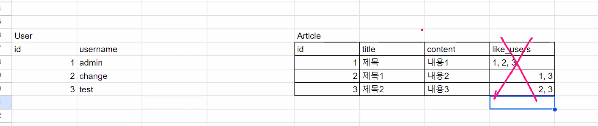
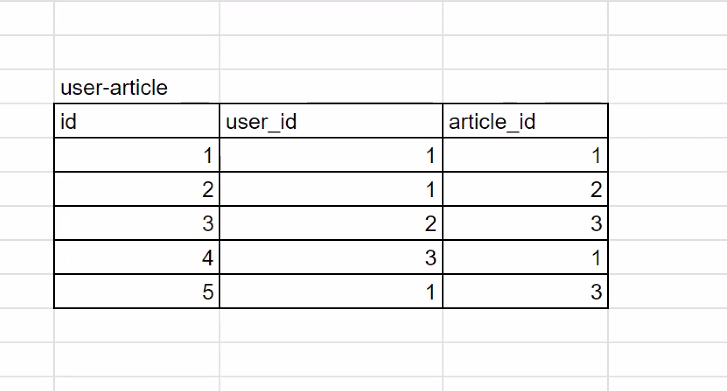

# django instagram 만들기2
## 목표
1. 좋아요 기능
2. 팔로우 기능
3. UI 수정 및 User profile_image 오류 수정

### 1. 좋아요 기능 
#### M-N 관계
- user는 다양한 post들에 좋아요를 할 수 있고, post는 다양한 user에게 좋아요를 받을 수 있음
- users (M) - posts (N) 관계
- M-N 관계는 두개의 1-N 관계로 구성
    - user:user-article
      1   :   N
    - article:user-article
      1      :    N
#### How?
- article에 좋아하는 사람들을 다 저장하는 방식(x)
    - article 테이블에 like_users 컬럼을 만들어 모두 넣는 것은 불가능, SQL에서 지원하지 않음(하나의 int값/str값 등만 가질 수 있음.)
    
- user와 post 의 M-N 관계를 설정해주기 위해 새로운 테이블을 만들어 중간다리 역할을 하게 만듬(o)
    - user-article 테이블
    - user_id와 article_id를 같이 저장함
    
- django의 `relationship field `이용
    - 1:N - ForeignKey
    - M:N - `ManyToManyField`
##### posts앱의 `models.py`
```python
from django.db import models
from django_resized import ResizedImageField
from django.conf import settings

class Post(models.Model):
    # content = models.TextField()
    # created_at = models.DateTimeField(auto_now_add=True)
    # updated_at = models.DateTimeField(auto_now=True)
    # # image = ImageField(upload_to='image/%Y/%m')
    # image = ResizedImageField(
    #     size=[500, 500], 
    #     crop=['middle', 'center'], 
    #     upload_to='image/%Y/%m',
    # )
    # user = models.ForeignKey(settings.AUTH_USER_MODEL, on_delete=models.CASCADE)
    like_users = models.ManyToManyField(settings.AUTH_USER_MODEL, related_name='like_posts')
```
- `like_users = models.ManyToManyField(settings.AUTH_USER_MODEL)` 했을때 `user.post_set`이라는 Reverse accesor를 만들려는 시도를 함
- user.post_set() 이 있기때문에 중복오류 발생
- `related_name='like_posts'` 자동으로 생성되는 역참조의 이름을 바꿔줌

##### posts앱의 `views.py`
- 이미 좋아요 버튼을 누른경우와 안누른 경우 분기처리
- `post.like_users.remove(user)`/`post.like_users.add(user)`로 각각 db에 추가/제거해 줌
```python
from django.contrib.auth.decorators import login_required

@login_required
def likes(request, id):
    user = request.user
    post = Post.objects.get(id=id)
    # 이미 좋아요 버튼을 누른경우 취소
    if post in user.like_posts.all():
    # if user in post.like_users.all()와 같음
        post.like_users.remove(user)
    else:
        post.like_users.add(user)
        # == user.like_posts.add(post)
    return redirect('posts:index')
```
##### posts앱의 `_card.html`
```html
<!-- 이미 눌렀을 경우와 안누른경우 분기처리  -->
<a href="" class="text-reset text-decoration-none">
    
        <i class="bi bi-heart-fill" style="color:red"></i>
    
        <i class="bi bi-heart"></i>
    
</a>
<!-- 좋아요 누른 사람 수 표시 -->

    <p>{{ post.like_users.count }}명이 좋아합니다.</p>

```
### 2. 팔로우 기능
#### M-N 관계(단방향)
- user - user M-N 관계
- 팔로우와 팔로잉의 관계가 같지않음     
- `1->2`와 `2->1`는 다른 데이터로 처리
- `models.ManyToManyField()`의 `symmetrical`옵션 이용
##### accounts앱의 `models.py`
```python
from django.db import models
from django.contrib.auth.models import AbstractUser
from django_resized import ResizedImageField
# Create your models here.
class User(AbstractUser):
    profile_image = ResizedImageField(
        size=[500, 500],
        crop=['middle', 'center'],
        upload_to='profile',
    )
    # post_set (Post의 ForeignKey 역참조)
    # like_posts (Post의 ManyToMany 역참조)

    followings = models.ManyToManyField('self', related_name='followers', symmetrical=False)
    # followers 
```
##### accounts앱 `views.py`
```python
from django.shortcuts import render, redirect
from .models import User
from .forms import CustomUserCreationForm, CustomAuthenticationForm
from django.contrib.auth import login as auth_login
from django.contrib.auth import logout as auth_logout

@login_required
def follows(request, username):
    # request한 유저=로그인한 유저
    me = request.user
    # profile의 유저, user_info
    you = User.objects.get(username=username)

    # 이미 팔로잉이 되어있는경우
    # you가 me가 followings 하는 목록들 중 있을 경우
    if you in me.followings.all():
        me.followings.remove(you)   
    # 팔로잉이 되어있지 않은 경우
    else:
        me.followings.add(you)
    return redirect('accounts:profile', username=username)
```
##### accounts앱 `profile.html`
- 자신일 경우 버튼 안보이게, 팔로우시 버튼 내용 변경
```html
<div class="row row-col-3 my-1">
    <!-- 로그인한 유저가 profile의 유저 아닐경우 -->
    
        <div class="col-5">
            <a href="" class="btn btn-light">
                <!-- profile유저가 내가 팔로잉한 유저목록에 있을 경우 -->
                
                    <span>팔로잉</span>
                    <i class="bi bi-check"></i>
                
                    <span>팔로우</span>
                
            </a>
        </div>
                
        <div class="col-5">
            <a href="" class="btn btn-light">message</a>
        </div>
    
</div>
<!-- 팔로워수 팔로우수 표시 -->
<div class="col">팔로워 {{ user_info.followers.all|length }}</div>
<div class="col">팔로우 {{ user_info.followings.all|length }}</div>
```
### 오류수정
- 터미널창에서 관리자계정을 만들때 이미지를 넣지 않음!
- profile/create에서 profile_image값이 없어 오류가 발생
- default image를 media/profile에 넣고, `profile.html`과 `_card.html`에서 분기처리해줌
```html
<!-- profile.html -->
<div class="col-4">
    
        
    
        
</div>
<!-- _card.html -->
<a href="" class="text-reset text-decoration-none">
      
        
    
        
    
    {{ post.user }}
</a>
```

> 팁!    
> 설치된 라이브러리 -> requirements.txt    
> $ pip freeze >> requirements.txt    
> requirements.txt 읽고 다 설치해줘    
> $ pip install -r requirements.txt