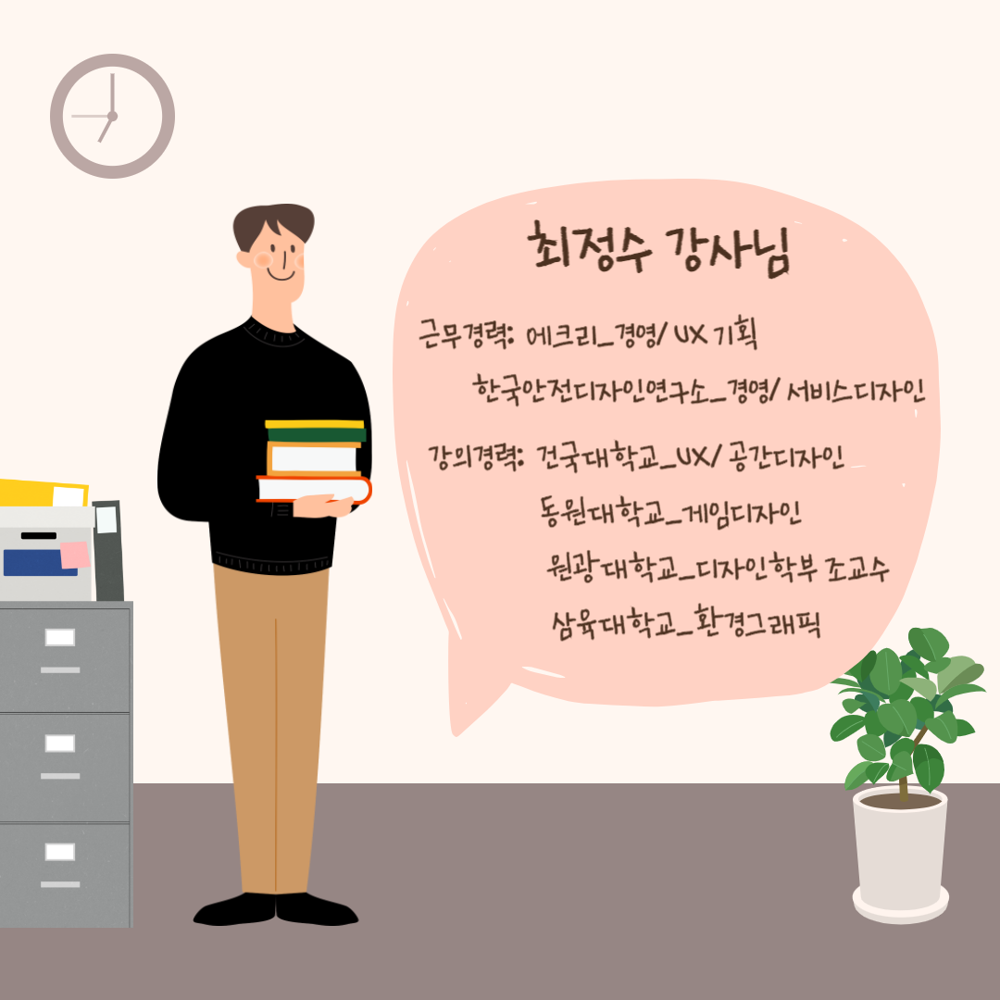
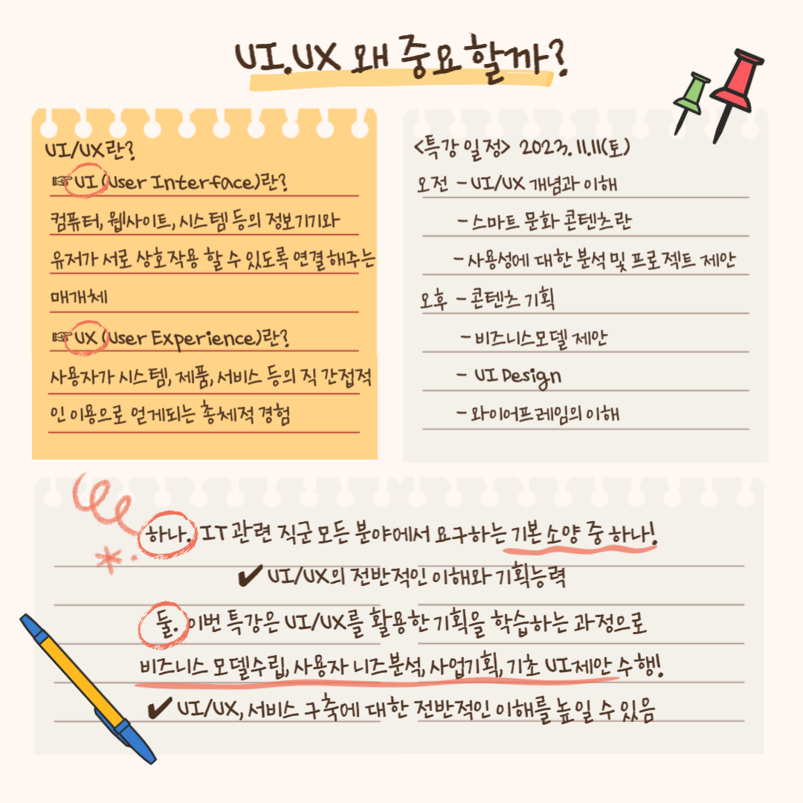

# UX/UI 기획 특강

콘텐츠를 개발한다는 것은?

프로덕트디자이너 ?플로우
디자인: 의도 기획 실행

이론 80
실습 
발표 

`도널드 노먼`

UX(User Experience)
사용자 경험이라는 총체적인 관점으로 컨셉을 잡고 개발방향을 정하기

UI(User Interface)
UX를 구현하는 제작단계에서 사용자에게 최적화되도록 디자인하기

GUI(Graphic User Interface)

ux와 ui 사례

`어포던스` 
문손잡이 어떻게 쓰는지?
경험을 통해,
직관적으로,

넛지(자유적 개입주의)
넛지 디자인

ux_ui

ux는 it/contents 뿐만이 아니라 다양한 분야에 필요
비즈니스, 공공 등

    UX_UI 의 세가지 요소
    - 사용성과 기능성
    제작자의 의도
       ^
       |
       v
    사용자가 어떻게 쓸것인가?

과거 물자가 귀해서 선택을 강요 받던 시대에서는 `기능성`에 중심을 주었지만,
지금은 선택을 하는 `사용자의 사용성`이 중요하다

- 피드백
`즉각적인 반응과 적용`의 힘

소통!

- 의미의 전달
다양한 리서치과정을 통해서 의미있는 정보를 캐내야한다.
숨어있는 정보를 찾기위해서 다양한 리서치와 모델평가를 진행한다

- 의미를 캐내는 과정은 스소리, 스토리텔링이 중요하다
--> 서비스를 사용하는 사람을 감동시켜야한다.

유머와 재미 감동으로 인간적인 감성에 어필해야한다.

'인간성 수업'발췌
주장하기 위해서는 근거를 대지만 느낌을 전달하려면 인간성을 입증해야 한다.

- 문화 콘텐츠란
재미있는 `문화`적인 요소를 `디지털매체`를 통해 사람들에게 전달하여 `상업적 이윤`을 창출하는 것

스마트 기기 + 문화 콘텐츠                                     

UI
 - 디지털 기기를 작동시키는 명령어나 
 의사소통을 할 수 있도록 일시적 또는 영구적인 접근을 목적으로 만들어진 물리적, 가상적 매개체

                          