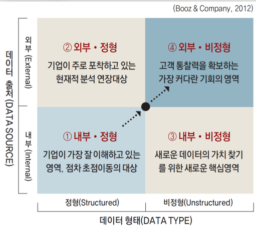
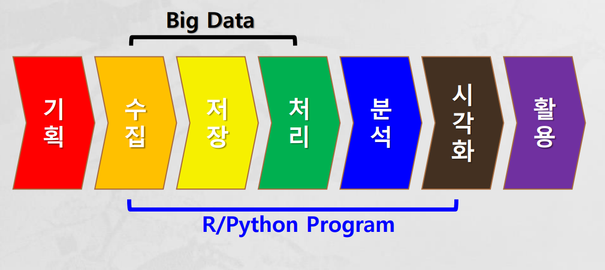
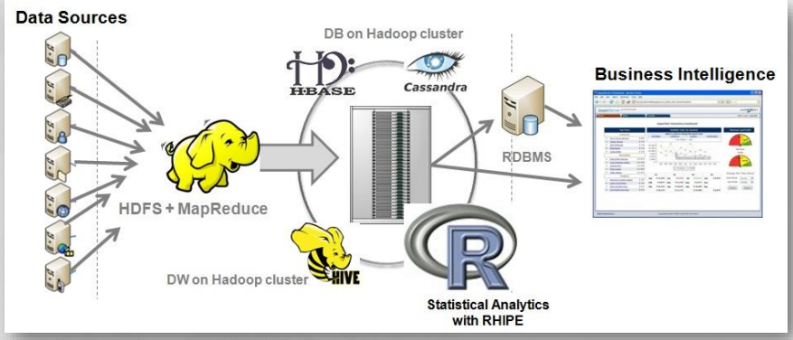

# 이준화 강사님
# overview

## 4차 산업혁명
- 1차 산업혁명 : 증기기관
- 2차 산업혁명 : 전기, 석유 -> 에너지의 축적이 가능
- 3차 산업혁명 : 디지털, 컴퓨터, 인터넷 (통신, 네트워크)
- 4차 산업혁명 : IoT, 초연결, 초지능 (connectivity) - ICMB(IoT, Cloud, Big data, Mobile), 인공지능
클라우드 - 네트워크를 통하여 접근할 수 있는 가상화된 서버와 서버에서 작동하는 프로그램과 데이터베이스를 제공하는 IT 환경
    컨테이너 - 컨테이너는 실행에 필요한 모든 파일을 포함한 전체 실행(runtime) 환경에서 애플리케이션을 패키징하고 격리할 수 있는 기술
모바일- 
AI - artificial inteligent
머신러닝/딥러닝 (학습)
데이터분석                --> 예측(컴퓨터), 사람(의사결정) 
기업: 추천시스템/공공: 예방시스템(범죄예방,cctv), 의료예방
아마존
지능정보화 - 정보의 생산ㆍ유통 또는 활용을 기반으로 지능정보기술이나 그 밖의 다른 기술을 적용ㆍ융합하여 사회 각 분야의 활동을 가능하게 하거나 그러한 활동을 효율화ㆍ고도화하는 것 

## 빅데이터
빅데이터?
- 거대한 규모(volume), 빠른 속도(velocity), 높은 다양성(variety)을 특징으로 하는 데이터입니다. 3V
- 기존 데이터베이스 관리도구의 능력을 넘어서는 대량(수십 테라바이트)의 정형 또는 심지어 데이터베이스 형태가 아닌 비정형의 데이터 집합조차 포함한 데이터로부터 가치를 추출하고 결과를 분석하는 기술

- 자료를 분류하여 정보를 생성 및 활용
 
자료(Data)-명령
정보(information)
지식
지혜 예측

- 빅데이터 3V
    - volume(크기) - 
    - variety(다양성) - 정형 데이터(DB형식의 데이터), 비정형데이터(**이미지**, 문장, 음악, 위치정보 등)
        - 이미지를 어떻게 수치화할 것인가? 컴퓨터는 0,1만 표시, 행렬로 표시 이미지가 있는 곳만 1로
        - 문장: 자연어 처리(형태소-명사, 대명사, 부사, 형용사, 동사- 나누고 분석)
            - 빈도수 + 거리
        - 음성:
        - 비정형 데이터를 수치화할 수 있게 됨
    - 6V (veracity 신뢰성, value 가치, visualization 시각화)

    - velocity(속도) - 분산처리시스템, 성능 증가

 
데이터 타입과 소스
 
 내부데이터: 회사가 가지고 있는 데이터 - 파일 디렉토리, DB, 내부시스템 연계
 외부데이터: 공공데이터, SNS, 웹사이트 -> 웹크롤링
            새로운 데이터 생성 ()

빅데이터 단계

* 분석 목표 설정 -> 필요한 데이터 정의 -> 데이터 수집 및 전처리 -> 분석 -> 인사이트 도출
- 기획: what? How? Insight?
- 수집: 존재/비존재 , 내부(file, db), 외부(SNS, API, 웹크롤링)
- 저장: 데이터베이스의 목적(저장, 검색, 관리)
    - FileSystem(파일로 저장) ->(중복을 없애기위해) 
    RDBMS(Oracle, MySQL, MSSQL, DB2(금융), SQLite(모바일)) - 테이블 구조, 테이블끼리 연결해서 사용 
    -> NoSQL(MongDB-딕셔너리, HBASE, 카산드라, Redis, Leoj4) (빅데이터) - 비정형 데이터
    - 클라우드 DB:
    - DB 처리 언어 - SQL(Structured Query Language)
        - DDL(Data Definition Language) - 데이터 정의어: create, alter, drop
        - DML(Data Manipulation Language ) - 데이터 조작어: select, update, delete, insert
        - DCL(Data Control Language ) - 데이터 제어어: grant, revoke, commit, rollback
- 처리(전처리): 수치화(비정형데이터), Null처리(제거, 대체데이터 채우기), 인코딩(레이블인코딩, 원랏인코딩 등), 스케일링(정규화, 표준화 등), 피처처리, 레이블링(라벨링)
- 분석: 
    - EDA(Exploratory Data Analysis, 탐색적 데이터 분석): 수집한 데이터가 들어왔을 때, 이를 다양한 각도에서 관찰하고 이해하는 과정, 한마디로 데이터를 분석하기 전에 그래프나 통계적인 방법으로 자료를 직관적으로 바라보는 과정
    - 통계(기술통계): 분포(중심극한점에 대해 모여있느냐(평균- 공통점), 떨어져있느냐(분산- 차이점))
                    확률, 상관관계 (R), P값, 
    - 머신러닝/딥러닝(신경망 알고리즘): 학습 -> 모델링
        - 전처리->학습데이터, 테스트데이터(검증을 위해) 나누기->학습(알고리즘) ->성능평가-> 파일HD5 -> 웹서버 등 업로드,, 데이터 예측
- 시각화:
    - 어떻게 표시하느냐에 ?따라 관점이 달라짐, Tool 이용
- 활용: 보정

- Data Engineering vs. Data Analytics

- 분산처리시스템(병렬처리시스템)
- Hadoop(오픈소스)
- HDFS(하둡분산처리시스템)+MapReduce(알고리즘)
- sparts(하둡 베이스, 리눅스 (java))
    - 메모리에서 처리하여 속도가 빠름
    - Hive,
- R 프로그램
- python도 많이 이용

- 활용데이터 
    - https://www.aihub.or.kr/ 
    - 공공데이터
    - 케글
- 클라우드 컴퓨팅 
    - 인터넷(Network) 기술을 이용하여 내-외부 고객들에게 확장성(Scalable) 있고 탄력적(Elastic)인 IT 서비스가 제공되는 방식
    - 컴퓨팅 자원이 필요한 만큼 늘어나거나 적정 수준으로 줄어들 수 있음
    - scale-up: 시스템 성능 업그레이드(1대를 성능 증가)<-> scale-down
    - scale-out: 같은 시스템을 복제해서 여러개를 만드는 것(갯수 증가)<->scale-in
- 클라우드 컴퓨팅의 장점
    - Reduced Cost(Pay-Per-Use, Economics of Scale)
    - Automated(Updates, Security Patches, Backups …)
    - On demand(Flexibility + Scalability = Elasticity)
    - Mobility(Accessible from any web enabled device)
    - Shared Resources(Multi-Tenancy)
    - Agility and Scalability
    - Back to core business
    - More IT functionality for a lower price
- 한계
    - Internet Access(No Internet = No Cloud)
    - Security(How do you know?)
    - Privacy(What legislation or regulations?)
    - Vendor Lock-in(Application migration may be impossible)

- 가상머신(VM) -> 컨테이너 기술, 
- Host, Hypervisor 위에 다양한 서버 등을 
- 컨테이너기술 -> 전체 구조를 이미지화, 생성
- 컨테이너 생성하고 변경/삭제할 수 있다
- tool - 구글의 docker, 쿠버네티스(구글)
