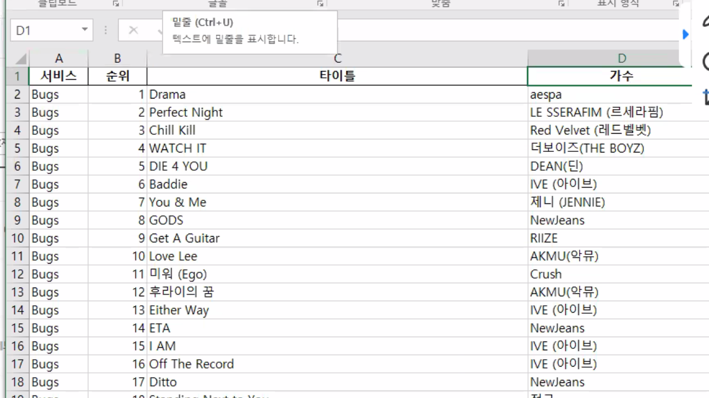

크롤러 설계
1. 수집
HTTP 
request(url)
response
(HTML)

2. 분석
- string
- 구조화 데이터(BS4)
3. 추출
- html 형식
- css형식(selector)
    - BS4 메소드 : find(), find_all(), select()
4. 가공
- 문자열 자르기 및 가공
5. 저장
- DB / directory(file)

자동화

### 대상 site 분석
### 무슨 데이터를 가져올 것인가

1. 구조화
BeautifulSoup(html, '형식:html, lxml')
html 객체(변수)를 형식으로 구조화 해 줘! (파싱해줘)

2. 추출

- 태그, 속성
    - fine('태그'), find_all() 이용: find는 태그, find_all()은 리스트로 반환
- css selector
    - select('태그 속성') :모두 가져와서 리스트로 반환

- get_text(): 추출한 요소에서 내용만 추출하기 위한 메소드(태그오ㅓㅏ 속성을 제거하고 텍스트 문자열만 추출)
    - select 및 find_all 이용 시 리스트이므로 for문 이용해서 항목별로 get_text() 적용

- 구조화
    BeautifulSoup(html, 'lxml')
    BS4.BeautifulSoup(html, 'html.parser')
- 추출
    - 태그추출
        - find('태그', {'id':'아이디'})
        - find_all <=> fineAll()
    - select
    - 추출된 태그 데이터 추출

- text -어트리뷰트
- get_text() - 메소드

- 미니프로젝트 목표
    - 서비스 정보 저장
        - 멜론 사이트 
            - 차트 top100
            - 순위 제목과 가수 가져와서 엑셀로 저장
        - 벅스차트
            - 순위 제목과 가수 가져와서 엑셀로 저장
        - 지니
            - 순위 제목과 가수 가져오기
    