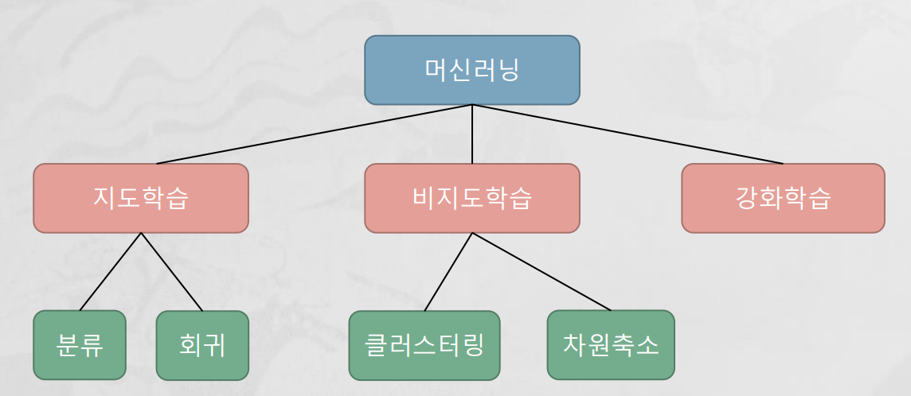
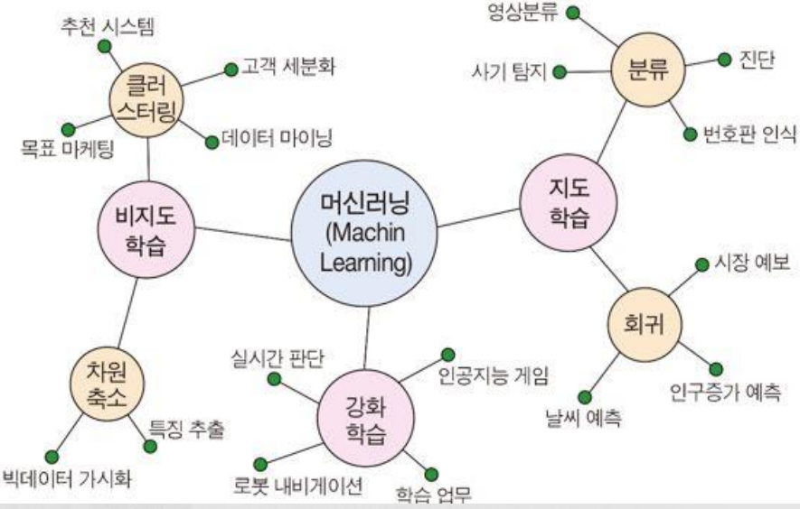

## 머신러닝

### 머신러닝의 개요
1. 머신러닝의 학습 개념
- 머신러닝을 통한 간단한 학습의 예
    - 입력과 출력이 여러개의 데이터 쌍으로 주어짐
        - ((1, 2), (2, 4), (4, 8), (7, 14), (5, 10), ..... )
    - 학습 후, 출력이 입력의 2배임을 유추
    - -> (3, ?), (8, ?) 등의 질문에 6, 16 등으로 답변

2. 머신러닝과 전통적인 프로그래밍과의 차이점
- 전통적인 프로그래밍에서는 모든 규칙들을 작성함
- 만약 규칙들이 추가로 작성될 경우 유지 관리가 어려운 문제점
- 그러나 머신러닝은 시간에 따라 점차 효율이 향상됨
- 입출력 데이터의 관계를 학습하여 규칙을 생성
- 프로그래밍에서는 데이터와 규칙이 결합하여 출력을 생성
- 머신러닝에서는 데이터와 출력이 함께 들어가서 규칙 생성

3. 머신러닝과 인공지능과의 관계
- 머신러닝은 인공지능에 속하는 부분 집합
- 인공지능은 머신러닝을 포함하는 상위 개념
- 따라서 추구하는 개념과 목표가 다소 다름
- 인공지능은 추론, 계획 등과 머신러닝을 포함

4. 머신러닝과 인공지능의 차이점
- 머신러닝은 데이터로부터 학습하여 지식을 획득
- 인공지능은 지식을 획득한 후, 그것을 활용함

5. 머신러닝 과정에서의 고려 사항
- 머신러닝 구상과정에서의 고려 사항들
• 주어진 데이터로부터 원하는 답을 찾을 수 있을까?
• 문제 해결을 위해 데이터가 충분한가?
• 어떤 머신러닝 기법을 적용하면 좋을까?
• 추출할 데이터의 특성은 무엇인가?
• 머신러닝의 결론은 무엇으로 설정할 것인가?
• 생성된 출력을 실제 응용에 어떻게 사용할 것인가

6. 머신러닝의 주요 종류들
- 신경망(Neural Network): 생물의 신경 네트워크 구조와 기능을 모방한 모델
    - 딥러닝
- 클러스터링(Clustering): 주어진 데이터를 클러스터라는 부분 집합들로 분리하는 것
    - 비지도학승
- 분류(Classification): 주어진 데이터를 비슷한 것들끼리 분류하는 것
    - 회귀, 지도학습
- 의사결정 트리(Decision Tree): 트리 구조 형태의 예측 모델로 의사를 결정하는 모델
    - 지도학습
- 나이브 베이즈(Naive Bayes): 베이즈 정리를 바탕으로 한 조건부 확률 모델 분류
    - 지도학습

7. 머신러닝의 활용 분야
- 머신러닝은 여러 산업 분야에 다양하게 활용 가능
    -  최근 딥러닝이 물체의 인식 등에 획기적으로 성공함
    -  미국에서는 머신러닝 기술로 빅데이터를 분석하는 ‘데이터 과학자(data scientist)’의 수요가 급증
    -  자율주행 자동차, 문자인식 등과 같이 알고리즘 개발이 어려운 문제 해결에 활용되고 있음
- 머신러닝의 개인비서(personal assistant)
    - 머신러닝은 스마트폰의 개인 비서에 활용됨
    - 음성인식, 언어 습관, 행동 패턴 등을 학습
    - 머신러닝 기법을 이용한 지능적인 역할 담당
    - 삼성의 Bixby, 애플의 Siri, 구글의 Assistant 등

8. 머신러닝에서의 학습 방법
- 학습의 형태에 따라 3가지 학습 방법
- 지도 학습, 비지도 학습, 강화 학습으로 구분

9. 머신러닝에서의 학습 방법과 활용 분야
- 머신러닝의 학습 방법과 활용 분야 체계
    
    - 지도 학습(supervised learning)
        - 입력과 미리 알려진 출력을 연관시키는 관계를 학습
        - 주어진 입력과 출력 쌍 사이의 대응 관계를 학습
        - 자동차 번호판이 오염된 경우 인식하지 못할 수도 있음
        - 그러나 오염된 번호판 사례들을 학습시켜 인식률을 높임
    - 비지도 학습(unsupervised learning)
        - 출력값을 알려주지 않고 스스로 모델을 구축하여 학습
        - 비지도 학습은 입력만 있고 출력 즉 레이블(label)이 없음
        - 규칙성을 스스로 찾아내는 것이 학습의 주요 목표
        - 결과는 지도 학습의 입력으로 사용 가능
        - 전문가에 의해 해석되어 다른 용도로 활용됨
        - 데이터 마이닝(data mining) 기법은 비지도 학습의 예
    - 강화 학습(reinforcement learning)
        - 주어진 입력에 대응하는 행동에 대해 보상(reward)
        - 이러한 보상을 이용하여 학습하는 방법
        - 주어진 입력에 대한 출력, 즉 정답 행동이 주어지지 않음
        - 주요 응용 분야로는 로봇, 게임, 내비게이션 등

1. 사이킷런 이용 scikit-learn
- 모델링 프로세스
    - 데이터 전처리
        - feature, lable 구분
    - 학습/테스트 데이터 분리,
        - `train_test_split()`
    - 모델 학습과 검증
        - `DecisionTreeClassifier()`
    - 예측수행
        - `predict()`
    - 평가
        - `accuracy()`
