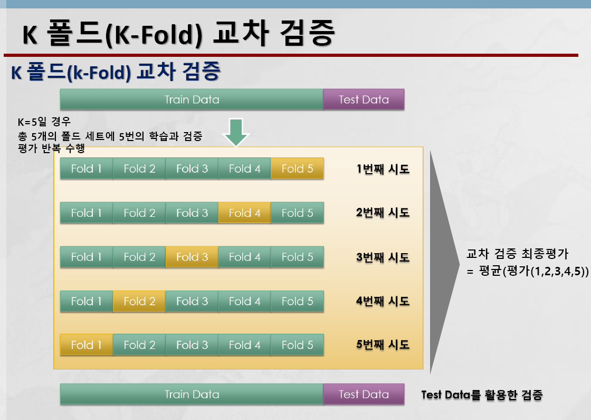

머신러닝

Model Selection
학습데이터와 테스트 데이터
- 학습데이터 세트
    - 머신러닝 알고리즘의 학습을 위해 사용
    - 데이터의 속성들과 결정값(레이블) 값 모두를 가지고 있음
    - 학습 데이터를 기반으로 머신러닝 알고리즘이 데이터 속성과 결정값의 패턴을 인지하고 학습
- 테스트 데이터 세트
    - 테스트 데이터 세트에서 학습된 머신러닝 알고리즘을 테스트
    - 테스트 데이터는 속성 데이터만 머신러닝 알고리즘에 제공하며, 머신러닝 알고리즘은 제공된 데이터를 기반으로 결정값을 예측
    - 테스트 데이터는 학습 데이터와 별도의 데이터 세트로 제공되어야 함
- 분리 `train_test_split()`

교차검증
- 학습 데이터를 다시 분할하여 학습데이터와 학습된 모델의 성능을 일차 평가하는 검증 데이터로 나눔

- K 폴드 교차 검증 `cross_val_score()`
