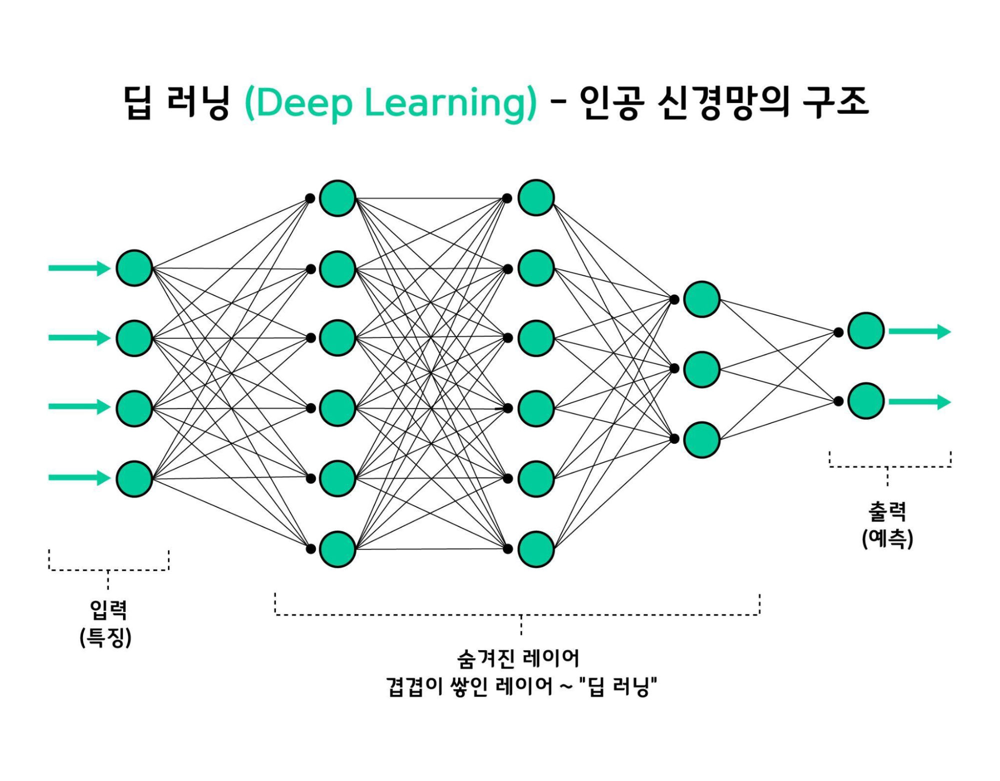

# 딥러닝

## 신경망 알고리즘

- 입력층, 은닉층, 출력층(예측)으로 구성
- 비정형데이터(이미지, 문장)들을 많이 이용
    - 비교) 머신러닝은 정형데이터를 많이 이용
- 중요
    - 어떤 알고리즘을 쓸것인가
    - 레이어 얼마나 쓸것인가
    - 비정형 데이터 피쳐, 수치화 2차원 -> 1차원
- 모듈: Tensorflow, Tensorflow.Keras

### 머신러닝
- 미지의 일을 예측
    - 기존 환자의 데이터를 이용해 새로운 환자의 생사를 예측하는 프로그램
    
    - 학습을 통해 규칙을 발견해 데이터를 가지고 예측하는 것
    
- Classification(분류)
    - 분류의 문제 = 선긋기 (기준 찾기)
        - 과일 분류하기(수확 가능여부 확인)
            - 고정기준ㅣ 크기,...
            - 크기만으로는 부정확
            - 색깔 추가
        

### 딥러닝?
#### Neural Network
- 인공 신경망
- 기계 학습 분야에서 연구되는 학습 알고리즘
- 시계열 자료의 예측, 분류, 패턴 인식, 제어 분야에 응용
- 인간의 뇌 구조를 모방
- 수상돌기(Dendrite), 신경세포체(soma), 축색(Axon), 시냅스(Synapse)
- 수상돌기= 입력, 축색 = 출력
- 신경세포체=노드, 시냅스-가중값을 갖는 연결네트워크

#### Multi Layer Perceptron(MLP)
- 다층 퍼셉트론(or Deep Neural Network)
- 퍼셉트론으로 해결할 수 없는 비선형 분리 문제에 필요
    
    - 여러층의 퍼셉트론을 쌓아서 동작
    - 직선을 여러번 그어서 비선형 분리 문제를 해결
    - 선형
    
    - 비선형
    
#### Artificial Neural Network(ANN)
- Handwritten digits in the M(mixed)-NIST database
- 숫자 손글씨 이미지 분석 - 92.2% 정확도

#### wrap up
- 데이터 저장 및 공유 기술의 발달로 신경망 학습에 필요한 데이터 제공 증가
- GPU 이용하여 컴퓨팅 파워 증가
- 개선된 알고리즘
- 인공신경망은 샘플 크기가 커야 함(많은 학습 데이터 필요)
- 서로 다른 활성화 규칙에 따라 여러개의 레이어로 구성되어 해석이 어려움
- 역전파: 예측 정확도에 따라 활성화 규칙을 정제
- 인공 신경망은 데이터가 크고 고성능 컴퓨팅 파워를 사용 가능할 때 적합

### 퍼셉트론

### 가중치, 가중합, 바이어스, 활성화 함수
- 기울기 a 나 y절편 b와 같은 용어를 퍼셉트론의 개념에 맞춰서 좀 더 '딥러닝답게'표현하면 다음과 같음

- 기울기 a는 퍼셉트론에서는 가중치를 의미하는 w로 표기
- b는 똑같이 b로 쓰지만 편향, 선입견이라는 뜻인 바이어스에서 따온 b
- 가중합(weighted sum):입력값과 가중치의 곱을 모두 더한 다음 거기에 바이어스를 더한 값 sum(x*w) + b
- 가중합의 결과를 놓고 1 또는 0을 출력해서 다음으로 보냄
- 활성화함수(activation function):0과 1을 판단하는 함수
    - 시그모이드 함수가 대표적인 활성화함수

#### 다층퍼셉트론
-XOR 문제를 해결하기 위해 두 개의 퍼셉트론을 한번에 계한할 수 있어야함
    - 은닉층을 만들면 됨
    
- 입력층과 은닉층의 그래프를 집어넣어보면 은닉층이 좌표 평면을 왜곡시키는 결과를 가져옴- 두 영역을 가로지르는 선이 직선으로 바뀜 

- 가운데 숨어있는 은닉층으로 퍼셉트론이 각각 자신의 가중치(w)와 바이어스값(b)을 보내고 은닉층에서 모인값이 시그모이드 함수를 통해 최종값으로 결과를 보냄
- 은닉층에 모이는 중간 정거장을 node라고 하며 n으로 표시

#### 오차 역전파

- 최적화의 계산 방향이 출력층에서 시작해 앞으로 진행됨 : 오차 역전파(bvack propagation)라고 부름
- 구동 방식
    1. 임의의 초기 가중치를 준 뒤 결과를 계산한다
    2. 계산 결과와 우리가 원하는 값 사이의 오차를 구한다
    3. 경사 하강법을 이용해 바로 앞 가중치를 오차가 작아지는 방향으로 업데이트한다
    4. 1~3 과정을 더이상 오차가 줄어들지 않을 때까지 반복한다(미분값이 0에 가까워지는 방향으로)
        - 가중치에서 기울기를 뺐을 떄 가중치의 변화가 전혀 없는 상태
        - 오차 역전파를 다른 방식으로 표현하면 가중치에서 기울기를 빼도 값의 변화가 없을 때까지 가중치 수정작업을 반복
        
### 신경망으로 딥러닝
- 다층 퍼셉트론이 오차 역전파를 만나 신경망이 되었고, 신경망은 xor문제를 가볍게 해결
- 기대만큼 좋아지지 않았음
- 이유는?
    
    - 기울기 소실 문제
        - 시그모이드 함수의 특성: 미분 최대치가 0.3
        - 1보다 작으므로 계속 곱하다보면 0에 가까워짐
        - 층을 거칠수록 기울기가 사라져 가중치를 수정하기가 어려워짐
        
    - -> 활성화 함수를 시그모이드가 아닌 여러 함수로 대체
    
    - 렐루는 시그모이드 대안으로 떠오르며 현재 가장 많이 이용하는 활성화 함수
        - x가 0보다 작을때는 모든값을 0으로, 0보다 큰 값은 x를 그대로 사용
        - 이방법을 쓰면 x 가 0보다 크기만하면 미분값이 1이 됨
        - 여러 은닉층을 거치며 곱해지더라도 맨 처음 층까지 사라지지 않고 남아있을 수 있음
            - 딥러닝의 발전
- 속도와 정확도 문제 해결
    - 고급경사하강법
        - 경사하강법은 정확하게 가중치를 찾아가지만, 한번 업데이트할 때마다 전체 데이터를 미분해야하므로 계산량이 매우 많다는 단점이 있음
        
    - 확률적 경사 하강법(SGD)
        - 전체 데이터를 사용하는 것이 아닌, 랜덤하게 추출된 일부 데이터를 사용하여 업데이트 -> 빠르게 전진 가능
        
    - 모멘텀
        - 경사 하강법과 마찬가지로 매번 기울기를 구하지만, 이를 통해 오차를 수정하기 전 바로 앞 수정값과 방향을 참고하여 같은 방향으로 일정한 비율만 수정되게 하는 방법(이동에 탄력을 더한다)
        
    - 딥러닝 구동에서의 고급 경사하강법의 활용법
    - `import tensorflow.keras`
    
    
    - 아담이 best방법

`Dense(8, input_dim = 4, kernel_initializer = 'uniform', activation = 'relu')`

- 첫번째 인자(units): 출력 뉴런의 수를 설정합니다.
- input_dim : 입력 뉴련의 수를 설정합니다.
- kernel_initializer : 가중치를 초기화하는 방법을 설정합니다.
- uniform : 균일 분포
- normal : 가우시
안 분포
- activation : 활성화함수를 설정합니다.
- linear : 디폴트 값으로 입력값과 가중치로 계산된 결과 값이 그대로 출력으로 나옵니다
- sigmoid : 시그모이드 함수로 이진분류에서 출력층에 주로 쓰입니다
- softmax : 소프드맥스 함수로 다중클래스 분류문제에서 출력층에 주로 쓰입니다.
- relu: Rectified Linear Unit 함수로 은닉층에서 주로 쓰입니다.

입력층
출력층 - sigmoid

compile(실행)(loss=, optimizer=고급경사하강법, metrics=측정방법(검증방법))
model.fit(X, y, epochs=전체 데이터셋을 몇 번 반복학습할지 설정합니다., batch_size=몇 개의 샘플로 가중치를 갱신할 것인지 설정합니다.)

- fit 후 가장 아랫줄 정확도를 눈여겨봐야함
- 1이 100%
