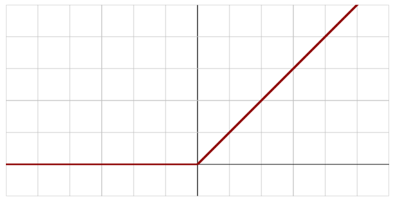
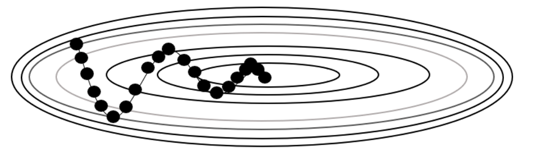

# 인공신경망(Artificial Neural Network)
- 딥러닝: 신경망 구조들의 집합인 입력층 은닉층 출력층으로 구성됨. 경사하강법 등을 이용하여 각각의 가중치들을 조정하며 손실/오차를 최소화하는 기계학습방법

## 퍼셉트론(Perceptron)

**퍼셉트론**은 딥러닝의 기본 구성 요소 중 하나로, 일종의 인공 뉴런.

- **뉴런**: 퍼셉트론은 우리 뇌의 뉴런과 비슷한 역할을 하는 작은 기계. 뇌의 뉴런은 신경 전달체 역할을 하고, 퍼셉트론은 정보를 처리하는 역할을 함.
- **입력과 출력**: 퍼셉트론은 여러 개의 입력을 받아 하나의 출력을 만들어냄. 이 입력은 숫자로 표현되며, 예를 들어, 숫자 1과 숫자 0을 입력으로 받으면 숫자 1을 출력할 수 있음.
- **가중치**: 입력에는 가중치라는 숫자가 곱해짐. 가중치는 입력의 중요도를 나타내며, 더 중요한 입력에는 큰 가중치가 곱해짐. → 최초 가중치는 일반적으로 임의의 값을 사용
- **임계값**: 퍼셉트론은 입력과 가중치를 곱한 값을 합산하고, 이 합계가 어떤 임계값을 넘으면 출력을 1로 설정하고, 그렇지 않으면 0으로 설정함 → **활성화 함수**를 사용
## 활성화 함수(Activation Function)
- 퍼셉트론에서 활성화 함수는 입력 값의 가중치 합을 변환하여 출력을 결정.
- 신경망이 복잡한 문제를 학습하고 판단할 수 있도록 돕는 역할
- **시그모이드 함수**
    - 시그모이드 함수는 S 모양을 그리는 함수(sigmoid가 s자 모양이라는 뜻)로, 주로 퍼셉트론에서 활성화 함수로 사용.
    
    - 비선형 함수로, 복잡한 패턴을 학습할 수 있게 도움.
    - 입력을 받아서 0과 1 사이의 값을 출력 → 입력 값을 확률로 해석할 수 있게 도와줌. 출력이 0.5보다 크면 뉴런이 활성화되었다고 볼 수 있고, 작으면 비활성화되었다고 볼 수 있음
- 학습: 퍼셉트론은 학습을 통해 올바른 가중치를 찾음. 즉, 올바른 입력과 출력 쌍을 학습하여 적절한 가중치를 조절함
## 경사하강법 (Gradient Descent)
- 경사하강법은 오차를 최소로 줄이기 위해, 가중치를 조절하여 미분했을 때 기울기가 0인 지점을 찾아 가는 과정.

- **목표**: 경사하강법의 목표는 신경망의 출력을 원하는 값으로 조절하는 것. 예를 들어, 입력을 주면 출력을 원하는 대로 조절하는 것이 목표.
- **오차 측정**: 경사하강법에서는 신경망의 출력과 실제 정답 사이의 오차(손실, loss)를 측정. 이 오차는 얼마나 예측이 정확한지를 나타냄.
- **가중치 조정**: 경사하강법은 가중치를 조정하여 오차를 최소화하려고 함. 가중치는 입력과 출력 사이의 관계를 나타내는데, 이를 조정하여 오차를 줄이는 방향으로 이동함.
- **학습률**: 학습률은 가중치를 얼마나 크게 조정할지 결정하는 요소. 너무 크면 학습이 불안정해지고, 너무 작으면 학습이 느려질 수 있음.
- **반복**: 경사하강법은 오차를 줄이기 위해 가중치를 조금씩 조정하고 이를 반복. 오차가 최소가 될 때까지 반복하면 신경망이 원하는 결과를 얻을 수 있음
    > 경사하강법은 가중치를 조정하여 신경망의 출력을 원하는 값에 가깝게 만드는 방법 → 학습의 방법

> 퍼셉트론은 입력을 받아서 어떤 규칙에 따라 출력을 내는 작은 뇌 모사체.
> 한계 : 퍼셉트론의 경우 XOR 문제를 해결하지 못함
## XOR 문제
- **XOR 게임**: XOR은 "배타적 논리합"을 나타내는 용어로, 두 개의 입력 중 하나만 참(True)일 때 결과가 참이 되는 게임. 예를 들어, A와 B 두 사람이 있고, A가 참이면서 B는 거짓이거나, A가 거짓이면서 B가 참일 때만 게임에서 승리함.
- **문제**: XOR 게임을 컴퓨터에게 가르치려면, 컴퓨터는 입력 A와 B를 받아서 XOR 연산을 수행한 결과를 올바르게 출력해야 함. 하지만 XOR 문제는 단순한 논리 게임처럼 보이지만, 기존의 뉴런(퍼셉트론)으로는 해결하기 어려움.
- **왜 어려운가?**: XOR 문제는 하나의 직선으로 입력을 나누어 정확한 결과를 얻기 어렵다는 것이 문제. 단순한 뉴런은 직선 하나로만 입력을 나눌 수 있기 때문에 XOR 게임을 정확히 이해하기 어려움.

- **딥러닝의 역할**: 딥러닝은 여러 개의 뉴런을 조합하여 더 복잡한 판단을 할 수 있음. XOR 문제를 해결하기 위해, 여러 개의 뉴런을 층(layer)으로 쌓고, 각 층에는 여러 개의 뉴런이 있어서 복잡한 판단을 할 수 있게 됨.
- **결과**: 여러 뉴런으로 구성된 딥러닝 네트워크를 사용하면, XOR 문제를 풀 수 있음. 여러 층의 뉴런이 협력하여 입력을 올바르게 나누어 참/거짓을 구분할 수 있게 됨.

## 다층 퍼셉트론(MLP, Multi-Layer Perceptron)
- 다층 퍼셉트론 (MLP): 다층 퍼셉트론은 여러 층으로 구성된 인공 뉴런의 네트워크.

- **뉴런과 층**: 다층 퍼셉트론은 여러 개의 뉴런이 층(layer)을 형성함. 입력층(input layer)에는 데이터가 들어오고, 은닉층(hidden layer)은 데이터를 처리하고, 출력층(output layer)에서 결과를 내보냄.
- **입력과 출력**: 입력 층은 데이터를 받아들이고, 출력 층은 최종 결과를 내보냄. 은닉층은 입력을 여러 단계로 처리하며, 이 과정에서 중요한 패턴을 학습함.
- **가중치와 활성화 함수**: 다층 퍼셉트론은 입력 층과 은닉층 및 은닉층과 은닉층 사이의 연결에 가중치가 있음. 이 가중치는 입력의 중요도를 나타내며, 활성화 함수를 거치면서 뉴런의 출력을 계산.
>다층 퍼셉트론은 여러 개의 뉴런과 층을 가진 네트워크로, 데이터를 처리하고 패턴을 학습하여 다양한 문제를 해결하는 데 사용

>한계 : 은닉층에 있는 가중치를 조절하는 방법이 명확하지 않았음.

## 오차 역전파(Backpropagation)
- **인공신경망 구조**: MLP는 입력층, 하나 이상의 은닉층, 출력층으로 구성됨. 각 층은 여러 '뉴런'으로 이루어져 있으며, 이 뉴런들은 서로 연결되어 있음.
- **전파(Feedforward)**: 입력 데이터가 네트워크를 통해 전파되어, 각 층의 뉴런을 거쳐 결과가 출력층으로 나옴.
- **오차 계산**: 출력층에서의 결과와 실제 정답 사이의 차이(오차)를 계산.
- **역전파(Backpropagation)**:
    - 오차를 줄이기 위해, 네트워크를 거꾸로 거슬러 올라가면서 각 뉴런의 가중치(중요도)를 조정. 이 과정에서 오차의 '미분값'(변화율)을 사용

- **가중치 업데이트**: 각 뉴런의 가중치를 조금씩 변경(업데이트)하여, 다음 번 입력 때 더 정확한 결과를 얻을 수 있도록 함.
- **반복 학습**: 위 과정을 여러 번 반복하면서, 네트워크 전체가 주어진 입력에 대해 정확한 출력을 할 수 있도록 학습.

## 시그모이드 함수의 한계와 ReLU 함수의 도입
- **시그모이드 함수의 한계**
    - **죽은 뉴런 문제**: 시그모이드 함수는 출력 값이 0 또는 1에 가까워지면 뉴런이 거의 활성화되지 않는데, 이러한 뉴런들은 학습 도중에 업데이트가 거의 이루어지지 않아 "죽은 뉴런"이 될 수 있음.
    - **기울기 소실 문제**: 역전파 과정에서 시그모이드 함수의 미분값이 0에 가까워질 수 있어, 신경망의 깊이가 깊어지면 기울기가 사라져 학습이 어려워짐. (**기울기 소실**)
- **ReLU 함수의 도입**
    - ReLU(Rectified Linear Unit) 함수는 이러한 한계를 극복하기 위해 도입
    - ReLU 함수는 입력이 양수인 경우 입력 값을 그대로 출력하고, 음수인 경우 0을 출력.
    
    - 학습이 빠르고 간단하며, 기울기가 소실되지 않아 깊은 신경망에서 더 효과적으로 학습할 수 있음.
    - 죽은 뉴런 문제를 완화시켜줌.

## 옵티마이저(Optimizer)
- `가중치`와 `편향`을 조절하여 모델이 데이터에 더 잘 적응하도록 도움.
- **가중치 조정**:
    - 딥러닝 모델은 가중치와 편향을 사용하여 입력 데이터와 결과를 연결.
    - 옵티마이저는 이 가중치와 편향을 조정하여 모델의 출력을 원하는 대로 만들어줌.
- **손실 함수 (Loss Function)**:
    - 옵티마이저는 손실 함수(예: `평균 제곱 오차(MSE)`)를 사용하여 모델의 예측과 실제 결과 간의 차이를 측정
    - 손실 함수를 최소화하기 위해 가중치를 업데이트.
- **학습률**(보폭)
    - 옵티마이저는 학습률이라는 파라미터를 사용하여 가중치를 얼마나 크게 조정할지 결정.
    - 학습률이 크면 빠르게 학습하지만, 작으면 안정적으로 학습.
- **반복 과정**:
    - 학습 데이터를 여러 번 반복하여 모델을 학습.
    - 옵티마이저는 매 반복마다 가중치를 업데이트하고 손실 함수를 최소화.
>경사하강법(GD)이 대표적인 옵티마이저

### 확률적 경사하강법(SGD, Stochastic Gradient Descent)

- SGD는 경사하강법의 한 종류로, 매 반복마다 무작위로 선택한 데이터를 사용하여 가중치를 업데이트.

- **미니배치**: SGD는 모든 학습 데이터를 한 번에 처리하는 대신, 미니배치라고 불리는 작은 데이터 그룹을 사용.
- 각 데이터 포인트마다 가중치를 업데이트하므로 "확률적(stochastic)"이라는 이름이 붙음.
> 확률적 경사하강법(SGD)은 무작위로 선택한 데이터를 사용하여 빠르게 학습하는 방법

- 속도 빠름, 정확도(안정성) 떨어짐 

### 모멘텀 SGD(Momentum Stochastic Gradient Descent)
- 모멘텀 SGD는 확률적 경사하강법(SGD)의 한 종류로, SGD를 개선한 방법 중 하나.
- **모멘텀 개념**:
    - 모멘텀은 물리학의 관성의 개념에서 착안.
    - 이전에 움직인 방향과 속도를 고려하여 움직이는 것처럼, 모멘텀 SGD는 이전 가중치 업데이트 방향과 속도를 고려하여 가중치를 업데이트.
    
    - **가중치 업데이트**:
    - 모멘텀 SGD는 현재 가중치 업데이트 방향에 이전 업데이트 방향을 일정 비율만큼 반영.
    - 이렇게 함으로써 이전에 움직인 방향과 속도를 더 고려하여 가중치를 업데이트.
- **가중치 업데이트 속도**:
    - 모멘텀을 크게 설정하면 이전 업데이트 방향이 더 크게 반영되어 업데이트 속도가 빨라짐.
    - 이렇게 하면 빠르게 수렴할 수 있지만, 너무 크게 설정하면 발산할 수 있으므로 조절이 필요.
- **장점**:
    - 모멘텀 SGD는 SGD보다 수렴 속도가 빠르며, 지역 최솟값을 빠져나오기 쉬움.
    - 이전 업데이트 정보를 활용하여 더 안정적인 학습이 가능. (지그재그가 덜함)
     
>모멘텀 SGD는 이전에 움직인 방향과 속도를 고려하여 가중치를 업데이트하는 방법
     
### 아다그라드(Adagrad, Adaptive Gradient)
- 각 가중치의 학습률을 개별적으로 조절하여 학습을 더 효과적으로 만들어줌
- **학습률 조절**:
    - Adagrad는 가중치마다 학습률을 다르게 설정.
    - 처음에는 모든 가중치의 학습률이 동일하게 설정되지만, 학습이 진행됨에 따라 자동으로 조절됨.
    
- **가중치 업데이트**
    - 더 자주 업데이트가 일어난 가중치(자주 방문한 가중치)는 학습률이 감소하고, 덜 업데이트가 일어난 가중치(별로 방문한 적이 없는 가중치)는 학습률이 증가.
    - 이렇게 하면 중요한 가중치는 덜 업데이트되고, 덜 중요한 가중치는 빠르게 업데이트됨.    
    
- **장점**
    - Adagrad는 각 가중치에 맞게 학습률을 조절하여 학습이 안정적으로 수렴하도록 도움
    - 특히, 자주 나타나는 기울기가 작은 가중치는 큰 학습률로 업데이트되어 빠르게 학습됨.
>Adagrad는 각 가중치에 맞게 학습률을 조절하여 딥러닝 모델이 안정적으로 학습하게 함
### RMSProp(Root Mean Square Propagation)
- RMSProp는 Adagrad처럼 각 가중치의 학습률을 조절하는데, 이때 지수 이동 평균을 사용
- 이전에 크게 업데이트된 가중치는 학습률이 작아지고, 이전에 적게 업데이트된 가중치는 학습률이 커짐. → Adagrad는 반복하다보면 학습률이 0으로 수렴할 수 있는데 지수 이동 평균으로 수렴을 방지
- **지수 이동 평균**:
    - RMSProp는 과거 기울기의 제곱을 지수 이동 평균하여 사용.
    - 이렇게 하면 최근 기울기의 변화에 민감하게 반응.
### Adam (Adaptive Moment Estimation):
- Adam은 딥러닝에서 가중치 업데이트를 조절하여 학습을 최적화하는 알고리즘.
- 과거의 기울기와 제곱된 기울기의 지수 이동 평균을 사용하여 학습률을 조절.
- 현재 가장 널리 사용되는 최적화 알고리즘 중 하나.
**Adam과 다른 알고리즘들과의 관계:**
- Adam은 Momentum SGD와 RMSProp의 특징을 결합한 알고리즘.
- Momentum SGD는 가중치 업데이트 방향을 관성을 고려하여 결정하고, RMSProp은 학습률을 조절하는데 기울기 제곱값을 사용.
- Adam은 이 두 가지 아이디어를 혼합하여 안정적이고 빠른 학습을 가능하게 함.

# TensorFlow & Keras
## 텐서플로우(TensorFlow)
- TensorFlow는 딥러닝을 위한 오픈 소스 라이브러리.
- 수학적 계산을 효율적으로 수행하여 인공 신경망을 구축하고 학습 시키는데 이용.
### **Tensor(텐서)**:
- TensorFlow의 이름에서 알 수 있듯이, 텐서는 TensorFlow의 핵심 데이터 구조.
- 텐서는 다차원 배열로 숫자 데이터를 표현합니다.
### **딥러닝**
- TensorFlow를 사용하면 딥러닝 모델을 만들고 학습할 수 있음
- 이 모델들은 데이터를 분석하고 패턴을 학습하여 예측, 분류, 이미지 인식 등 다양한 작업을 수행.
## 케라스(Keras)
- 딥러닝 모델을 만들고 학습시키기 위한 간단하고 사용하기 쉬운 인터페이스를 제공하는 라이브러리.
- **간편한 모델 구성**:
    - Keras는 딥러닝 모델을 만들 때 간단한 코드로 층(layer)을 쌓아나가는 방식을 제공
- **높은 유연성**:
    - Keras는 다양한 종류의 딥러닝 모델을 만들 수 있으며, 커스터마이징이 쉬움
    - 사용자가 원하는 형태의 신경망을 만들 수 있음
[TensorFlow Core](https://www.tensorflow.org/guide?hl=ko)

- https://huggingface.co/ 허깅페이스
- 트랜스포머 모델 - GPT

## 실습
### 데이터 분석 과정
1. 데이터 수집
2. 데이터 전처리(인코딩, Null 처리, 라벨링 등)
3. 모델링(머신러닝, 딥러닝)
4. 평가
5. 시각화/ 배포

MLOps(Machine Learning Operations)
EDA(Exploratory Data Analysis)
Feature selection

pandas (+ C++)/ polars (+rust) 대용량 데이터 최적화

### 폐암 수술 후 생존률 데이터
colas 진행

## 손실 함수 (Loss Function)

- 딥러닝 모델이 얼마나 '틀린' 예측을 했는지를 측정하는 도구
- 모델이 예측한 결과와 실제 정답을 비교하여 오차를 계산
- **모델 훈련 목표**
    - 모델의 목표는 손실 함수의 값을 최소화하는 것.
    - 손실 함수 값이 작을수록 모델의 예측이 더 정확하다고 볼 수 있음.
- **예시**
    - 회귀 모델에서 손실 함수는 모델이 예측한 값과 실제 값의 차이(오차)를 측정.
    - 분류 모델에서는 손실 함수가 모델이 예측한 클래스와 실제 클래스 간의 일치 여부를 판단.
- **학습 과정**
    - 모델은 학습 과정에서 손실 함수를 사용하여 오차를 계산하고, 이 오차를 줄이기 위해 가중치와 편향을 조정.
    - 이렇게 하면 모델이 데이터에서 패턴을 학습하고 더 나은 예측을 할 수 있게 됨.
- **다양한 종류**
    - 다양한 종류의 손실 함수가 있으며, 모델의 작업에 따라 선택.
    - 일반적으로 회귀 문제에는 평균 제곱 오차(Mean Squared Error)가, 분류 문제에는 교차 엔트로피(Cross Entropy) 등이 사용.

---

- **평균 제곱 오차 (Mean Squared Error, MSE)**:
    - 회귀(수치 예측) 모델에서 사용.
    - 실제 값과 모델 예측 값의 차이를 제곱하여 오차를 계산하고, 그 평균을 구함.
    - 값이 작을수록 모델이 예측을 잘하는 것을 의미.
- **이진 클래스 교차 엔트로피 (Binary Cross Entropy)**:
    - 이진 분류 모델에서 사용.
    - 모델이 예측한 클래스와 실제 클래스 간의 차이를 측정.
    - 두 개의 클래스 중 하나를 선택하는 작업에 적합.
- **다중 클래스 교차 엔트로피 (Categorical Cross Entropy)**:
    - 다중 클래스 분류 모델에서 사용.
    - 모델이 예측한 클래스와 실제 클래스 간의 차이를 측정.
    - 여러 개의 클래스 중 하나를 선택하는 작업에 적합.

### 피마 인디안 당뇨 분석

### 붓꽃데이터
## 소프트맥스(Softmax) 활성화 함수

- 소프트맥스 활성화 함수는 신경망에서 주로 다중 분류 문제를 해결하는 데 사용.
- 모델의 출력을 각 클래스에 대한 확률 분포로 변환.
    
    
    
- 각 클래스에 대한 확률을 계산할 때, 입력값에 따라 각 클래스의 확률이 얼마나 높은지를 계산.
- 소프트맥스 함수는 출력값을 0과 1 사이의 확률값으로 변환하며, 모든 클래스의 확률의 합은 1이 됨.

**왜 다중 분류에서는 소프트맥스를 사용하는지**

- 다중 분류 문제에서는 여러 개의 클래스 중 하나를 선택하는 문제. 예를 들어, 꽃의 종류를 분류하는 경우, 붉은 꽃, 파란 꽃, 노란 꽃과 같이 여러 개의 클래스 중 하나를 선택해야 함.
- 소프트맥스 함수는 입력값을 각 클래스에 대한 확률로 변환하여 어떤 클래스가 더 가능성이 높은지 알 수 있음. → 확률이 가장 높은 클래스를 선택하면 다중 분류 문제를 해결할 수 있음.

### 보스턴 집값 예측 (회귀) 분석

## 드롭아웃(Dropout)

- **드롭아웃이란?**
    - 모델이 과적합(Overfitting)을 방지하고 더 일반화된 결과를 얻기 위해 사용
- **뉴런 무작위 비활성화**:
    - 드롭아웃은 훈련 중에 신경망의 일부 뉴런을 무작위로 비활성화(끄는 것)
    - 즉, 몇몇 뉴런은 훈련 과정 중에 아예 사용되지 않을 수 있음.
    
- **랜덤하게 끄기**:
    - 매 훈련 단계에서 각 뉴런은 랜덤하게 일부 퍼센트만 남기고 나머지는 비활성화.
    - 이로써 모델은 다양한 뉴런 그룹으로 학습하게 되어 일반화 능력이 향상.
- **과적합 방지**:
    - 드롭아웃은 모델이 훈련 데이터에 과적합되는 것을 방지.
    - 즉, 모델이 훈련 데이터에 너무 맞춰져 다른 데이터에 대한 일반화 능력을 잃지 않도록 함.
- **모델 안정성 향상**:
    - 드롭아웃을 사용하면 모델이 더 안정적으로 훈련되며, 예측이 더 일관되고 신뢰성 있게 됨.
