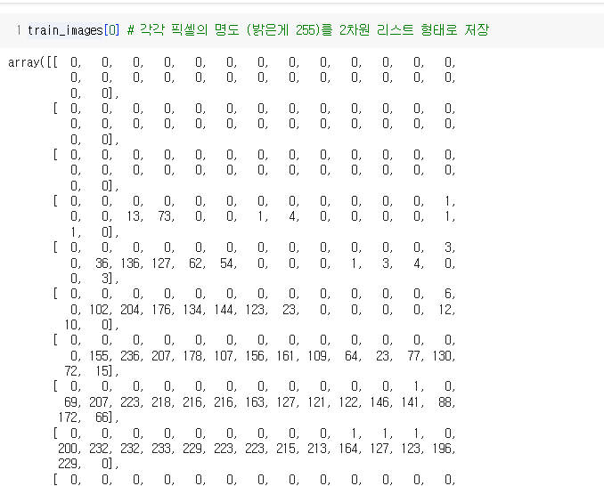
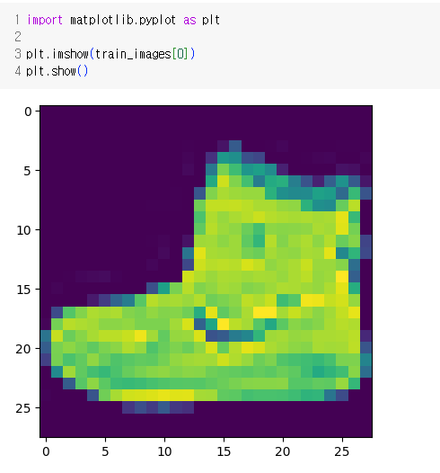
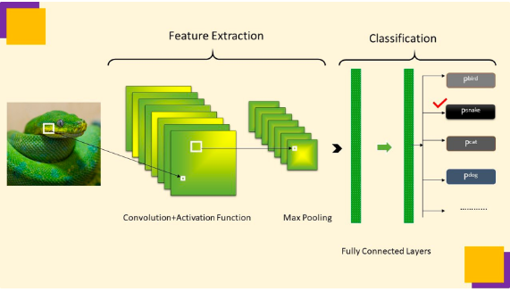
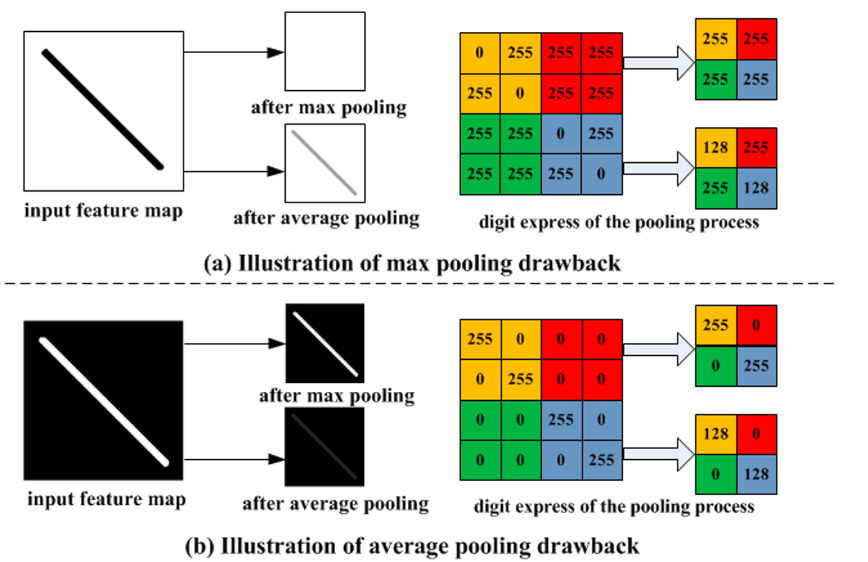

# 복습
## 이진분류
- 0, 1로 분류
- 출력값갯수 1
- 딥러닝, 범주형은 원핫인코딩이 기본
- pipeline(전처리를 numerical, categorical 나누어서 진행)
### Thoracic_Surgery_live 분석
- 이진분류
- 손실함수(binary_crossentropy)
- optimizer = adam 
- metrics = accuracy
### Pima indians Diabetes 분석
- 이진분류
- 손실함수(binary_crossentropy)
- optimizer = adam 
- metrics = accuracy
- 모델 저장:  `model.save('modelname.h5')`
- 모델 불러오기: `from keras.models import load_model` 후 `load_model('modelname.h5')`
## 다중분류
- 여러가지 classification section이 나누어 분류 softmax 활성화함수
- 출력값갯수 분류갯수와 같음
### Irisspecies live
- 다중분류
- 손실함수(categorical_crossentropy)
- 출력층 activations - softmax
- optimizer - adam
- metrics = accuracy
- 조기종료 callback (`EarlyStopping`) - `monitoring='val_loss' patience=10` 
## 회귀분석
- 마지막 활성화함수 x
### House Prices live
- feature selection
- layer `Dropout` - 오버피팅 방지하기위해 일정 비율의 뉴런을 무작위하게 비활성화함
- 출력 레이어에 활성화함수 x
- loss=`mean_squared_error`
- callback `ModelCheckpoint()`

# 컴퓨터비전(CV)
## 딥러닝을 통한 컴퓨터 비전 분석
- **컴퓨터 비전**: 컴퓨터가 이미지나 비디오에서 정보를 추출하고 이해하는 능력을 가리킵니다.
- **딥러닝**: 인공 신경망(뉴럴 네트워크)이라는 컴퓨터 프로그램을 사용하여 데이터를 학습하고 판단하는 방법입니다.
- **이미지 분석**: 딥러닝을 사용하여 이미지를 자동으로 해석하고, 예를 들어 고양이와 개를 구별하거나, 꽃의 종류를 파악하는 것이 가능합니다.
- **학습 데이터**: 모델이 학습하는데 사용되는 이미지와 그에 대한 정보입니다. 예를 들어, 고양이 사진과 "고양이"라는 레이블이 있는 데이터를 사용하여 모델을 학습시킵니다.
- **신경망**: 뇌의 작동 원리에서 영감을 받은 컴퓨터 프로그램으로, 여러 뉴런이 연결되어 복잡한 작업을 수행합니다.
- **특성 추출**: 이미지에서 중요한 정보를 추출하는 과정으로, 예를 들어 얼굴에서 눈, 코, 입의 위치를 찾는 것입니다.
- **예측과 분류**: 모델은 학습한 정보를 사용하여 주어진 이미지가 어떤 것인지 예측하거나 분류할 수 있습니다. 예를 들어, 주어진 이미지가 사과인지 바나나인지 분류할 수 있습니다.
- **자동화**: 딥러닝을 사용하면 사람이 직접 모든 이미지를 분석할 필요 없이, 컴퓨터가 대신 해줄 수 있어서 작업을 더 빠르게 처리할 수 있습니다.
>딥러닝을 통한 컴퓨터 비전은 컴퓨터가 이미지와 비디오를 이해하고 유용한 정보를 추출하는 데 사용되며, 자동화와 판단 능력을 갖춘 컴퓨터 프로그램을 만드는 과정을 포함합니다.
- 딥러닝 활용한 이미지 생성형 AI: DALLE, STABLE DIFFUSION, MIDJOURNY
- GAN, 오토인코더 - 비전 학습
- Object Detection

### 패션 MNIST 데이터셋
- 패션 MNIST는 옷과 신발과 같은 패션 아이템을 나타내는 70,000개의 작은 이미지로 이루어진 데이터 모음입니다.
- **이미지**: 각 이미지는 옷이나 신발 등 다양한 패션 아이템을 나타내며, 컴퓨터가 이해할 수 있는 숫자로 표현됩니다.
- **레이블**: 각 이미지에는 해당 아이템이 무엇인지 설명하는 레이블이 붙어 있습니다. 예를 들어, "티셔츠" 또는 "운동화" 등의 레이블이 있습니다.
- **분류 문제**: 패션 MNIST는 주어진 이미지가 어떤 패션 아이템인지 분류하는 문제를 해결하기 위해 사용됩니다. 즉, 컴퓨터는 각 이미지를 옷이나 신발과 같은 카테고리로 분류하려고 합니다.
- **학습과 테스트**: 데이터셋은 학습과 테스트로 나뉩니다. 학습 단계에서는 컴퓨터가 이미지와 레이블을 함께 보며 학습을 하고, 테스트 단계에서는 모델이 학습한 내용을 기반으로 새로운 이미지의 레이블을 예측합니다.
- **딥러닝**: 패션 MNIST 데이터셋은 딥러닝 모델을 훈련하고 테스트하는 데 사용됩니다. 딥러닝은 인공 뉴런을 사용하여 패션 아이템을 인식하고 분류하는 능력을 향상시키는 데 도움이 됩니다.

>패션 MNIST 데이터셋은 컴퓨터 비전과 머신 러닝을 이해하고 연습하는 데 유용한 도구로 활용되며, 어떤 이미지가 어떤 패션 아이템인지 분류하는 작업을 컴퓨터에게 가르치는 데 사용됩니다.
- 데이터셋 이미지는 색상값 추출되어 픽셀화 및 2차원 배열로 처리되어 들어가 있음 (np.ndarray)

- 이미지를 처리하기 위해 `numpy`, `pillow`, `matplotlib` 활용가능
- loss='sparse_categorical_crossentropy'
    - 레이블은 정수 형태로 주어집니다. 각 샘플의 레이블은 클래스의 인덱스입니다.
    - 예를 들어, 클래스가 0부터 9까지의 정수로 표현되는 경우 사용됩니다.
    - 모델의 출력은 클래스 수에 대한 로짓(점수)을 출력하며, 소프트맥스 활성화 함수와 함께 사용됩니다.
- sparse_categorical_crossentropy는 정수로 표현된 클래스 레이블에 적합하고 categorical_crossentropy는 원-핫 인코딩된 클래스 레이블에 적합합니다.

### **일반적인 DNN (Deep Neural Network) 을 통한 이미지 분류**

- DNN은 간단한 뉴런들이 연결된 계층을 여러 층으로 쌓은 구조입니다.
- 각 뉴런은 입력과 가중치를 곱한 후 활성화 함수를 통과하여 결과를 출력합니다.
- 이미지 분류와 같은 작업에도 사용할 수 있지만, 이미지의 특징을 직접 학습하기 어려울 수 있습니다.
- 이미지의 전체 픽셀을 일일히 고려하며 학습하기 때문에 큰 이미지나 복잡한 패턴에 한계가 있을 수 있습니다.

## **합성곱 신경망 (CNN:Convolutional Neural Network):**

- `CNN은 이미지 처리에 특화`된 신경망 구조입니다.
- 합성곱 층과 풀링 층으로 구성되며, 이러한 층들이 `이미지의 특징을 자동으로 추출`합니다.
- 예를 들어, 작은 부분에서 에지, 직선, 질감과 같은 특징을 학습하고 이를 조합하여 이미지를 인식합니다.
- 이로 인해 작은 이미지 패턴부터 큰 이미지 구조까지 효과적으로 학습할 수 있어 이미지 분류에 우수합니다.
- `CNN은 이미지 처리에서 많이 사용`되며, 컴퓨터 비전 작업에 적합합니다.

>💡 DNN은 이미지를 직접 다루고 학습하는 반면, CNN은 이미지의 중요한 특징을 자동으로 추출하여 이미지를 이해하는 데 뛰어납니다. 이러한 특징으로 CNN은 이미지 분류 및 컴퓨터 비전 작업에 매우 효과적입니다.

### 합성곱 (Convolution)
- **합성곱은 패턴 찾기:** 합성곱은 이미지나 `패턴에서 중요한 부분을 찾는 데 도움`이 됩니다.
- **작은 필터 사용:** 작은 사각형 모양의 `필터(커널, Kernel)`를 이미지 위를 이동시키면서 패턴을 찾습니다.
- **곱셈과 합계:** 필터와 이미지의 일부를 곱하고 그 값을 더하여 새로운 이미지를 만듭니다.
- **특징(feature) 추출:** 합성곱은 에지, 질감, 색상 변화와 같은 중요한 특징을 추출합니다.
- **여러 번 사용:** 여러 개의 필터를 사용하여 다양한 특징을 추출할 수 있습니다.
- 원하는 사이즈(설정 가능)의 렌즈(커널)에 있는 특징들을 찾고 특성맵을 만들고 이를 flatten하여 분석
>💡 합성곱은 이미지에서 중요한 부분을 찾아냅니다.

### 커널(Kernel)
- **커널은 작은 창:** 커널은 이미지 위에서 이동하면서 `작은 창(렌즈)` 역할을 합니다.
- **작은 패턴 탐색:** 커널은 작은 `패턴이나 특징을 찾`기 위해 이미지를 조사합니다.
- **곱셈과 합계:** 커널과 `이미지 일부를 곱하고 그 값을 더하여 새로운 값 생성`합니다.
- **패턴 인식:** 커널은 `에지, 질감, 색상 변경과 같은 패턴을 인식`합니다.
- **여러 개 사용:** 다양한 패턴을 찾기 위해 `여러 개의 커널을 사용`합니다.
>💡 커널은 작은 창처럼 동작하여 이미지의 다양한 패턴을 인식합니다.

### 풀링(Pooling)
- 풀링은 정보를 간단하게 요약하는 역할을 합니다.
- **작은 영역을 검토:** 풀링은 이미지를 작은 영역으로 나누고, 각 `영역에서 중요한 정보를 선택`합니다.
- **정보 요약:** 각 영역에서 `선택된 정보를 사용하여 작은 이미지를 만듭`니다.
- **크기 축소:** 주로 `이미지의 크기를 줄이`는 데 사용되며, 불필요한 세부 정보를 제거합니다.
- **계산 효율성:** 풀링을 사용하면 `연산을 줄이고 계산 효율성을 높일 수 있`습니다.
- **합성곱과 함께:** 주로 `합성곱과 함께 사용되어 이미지의 특징을 추출하고 크기를 줄`입니다.
>💡 풀링은 이미지를 작게 만들어서 필요한 정보만 남기고 불필요한 것을 제거하는 것으로, 이미지를 처리하는 데 도움을 줍니다.

- **맥스 풀링 (Max Pooling):**
    - 각 작은 영역에서 `가장 큰 값을 선택하여 정보를 요약`합니다.
    - 주로 이미지에서 `가장 중요한 특징을 강조`하고 불필요한 세부 정보를 줄입니다.
    - 예를 들어, 고양이 얼굴을 감지할 때 고양이 얼굴의 중요한 특징을 유지하고 다른 부분은 버립니다.
- **평균 풀링 (Average Pooling):**
    - 각 작은 영역에서 `값의 평균을 계산하여 정보를 요약`합니다.
    - 주로 이미지를 부드럽게 만들고 `세부 정보를 보존`하는 데 사용됩니다.
    - 예를 들어, 이미지에서 노이즈를 줄이고 이미지를 부드럽게 만들 때 사용합니다.
- **전역 평균 풀링 (Global Average Pooling):**
    - `전체 이미지의 평균을 계산하여 이미지를 하나의 값으로 요약`합니다.
    - 주로 `이미지 분류 작업에서 마지막에 사용`되며, `클래스에 대한 확률을 계산`하는 데 활용됩니다.
    - 예를 들어, 강아지와 고양이 이미지를 분류할 때 사용합니다.
- **최소 풀링 (Min Pooling):**
    - 각 작은 영역에서 가장 작은 값을 선택하여 정보를 요약합니다.
    - 주로 이미지에서 가장 어두운 부분을 강조하고 밝은 부분을 줄입니다.
    - 예를 들어, 이미지에서 `어두운 영역을 찾을 때 사용`합니다.
- **합성 풀링 (Sum Pooling):**
    - 각 작은 영역에서 값을 모두 더하여 정보를 요약합니다.
    - 주로 이미지에서 픽셀 값의 합을 계산할 때 사용하며, 이미지 세그멘테이션과 관련이 있습니다.
    - 예를 들어, `이미지에서 물체의 영역을 찾을 때 사용`합니다.

[Google Colaboratory](https://colab.research.google.com/github/BigDeepData/2312_dl/blob/main/notebook/231206_dl_06_fashion_mnist_cnn_practice.ipynb)