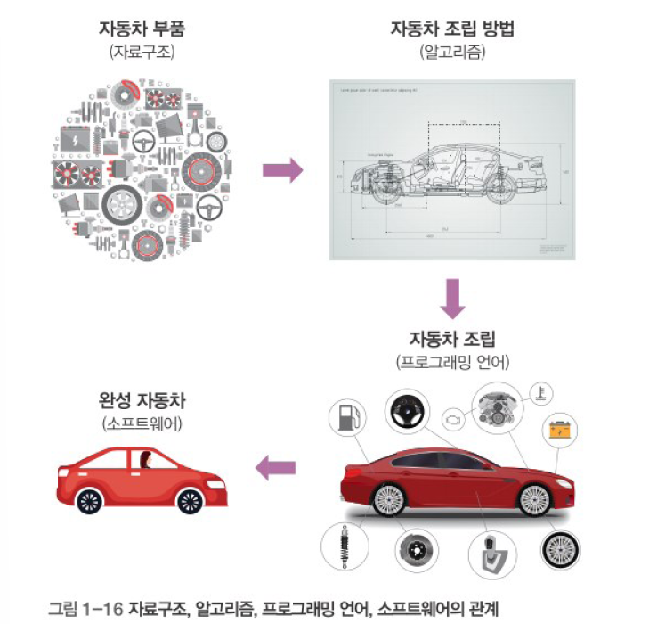

# 자료구조 알고리즘 특성
- 자료구조: 재료
- 알고리즘 코딩: 요리
## 자료구조
- 자료를 효율적으로 관리하는 방법
- 컴퓨터 프로그래밍 언어에서 효율적인 자료(데이터)의 형태
### 자료구조 종류
#### 선형 자료구조
- 데이터를 한 줄로 순차적으로 표현한 형태
    - 리스트: 선형 리스트, 연결 리스트
    - 스택
    - 큐
#### 비선형 자료구조
- 하나의 데이터 뒤에 여러 개가 이어지는 형태
    - 트리
    - 그래프
#### 파일 자료구조
- 순차파일
- 색인파일
- 직접파일
## 알고리즘
- 어떤 문제를 해결해 가는 논리적인 과정
### 알고리즘 예
- 트럭에는 최대 7톤의 무게를 실을 수 있고 단 1회만 운송할 수 있다면, 선호도 합이 최대가 되도록 동물을 태우는 방법은?
### 알고리즘 표현법
- 일반 언어: 자연어 설명
- 순서도
- 수도 코딩(의사코드를 이용한 표현): 프로그램 코드와 일반 언어의 중간 형태
- 프로그램 코드
- 혼합형태
### 알고리즘 성능
- 성능 측정
    - 알고리즘을 소요시간(=연산 수)을 기준으로 알고리즘 성능을 분석하는 방법을 씀(시간 복잡도)
    
- 알고리즘 성능 표기
    - 빅오 표기법
    
- 자료구조와 알고리즘과 프로그램의 관계

1. 고급 프로그램 가능
2. 효율적 코딩 가능

# 선형 리스트
> 파이썬의 리스트는 배열(array), 자료구조의 리스트
## 선형 리스트 개념
- 데이터를 일정한 순서로 나열한 자료구조
- 순차 리스트(Ordered List)라고도 함
- 선형 리스트는 입력 순서대로 저장하는 데이터에 적당
## 선형 리스트의 예
- 카톡으로 연락 온 친구를 배열을 이용하여 표현

## 선형 리스트의 원리
### 데이터 삽입
- 일반적으로 새로운 데이터는 가장 뒤에 추가됨
- 중간 삽입방법
    1. 칸 추가
    2. 자리 이동

``` python
# 함수 선언부

# 전역 변수부
katok = ['다현', '정연', '쯔위', '사나', '지효']

# 메인 코드부
print(katok)

# 1. 데이터 추가: 모모 카톡 1회
# 1단계 : 빈칸이 필요
katok.append(None)
# 2단계: 마지막 칸에 대입
katok[5] = '모모'


# 2. 데이터 삽입: 미나가 카톡 40회 --> 미나를 3등으로
# 1단계: 빈칸 추가
katok.append(None)
# 2단계: 한칸씩 뒤로 이동 (마지막부터 3등까지)
katok[6] = katok[5]
katok[5] = None
katok[5] = katok[4]
katok[4] = None
katok[4] = katok[3]
katok[3] = None
# 3단계: 데이터 삽입
katok[3] = '미나'
```
### 데이터 삭제
- 제거 후 자리 이동, 빈칸 제거 해야 함


# 연결리스트(단순연결리스트)
## 단순 연결 리스트의 개념
- 노드들이 물리적으로 떨어진 곳에 위치
- 노드: 데이터와 링크를 합친 것
- 각 `노드(node)의 번지도 순차적이지 않음`
- 화살표로 표시된 연결 **(링크, link)** 을 따라가면 선형 리스트 순서와 같음
### 데이터를 삽입/삭제할 때
- 선형 리스트는 많은 작업이 필요(`오버헤드 발생`) - 하나하나 위치를 당겨줘야 함
- 단순 연결 리스트는 해당 노드의 앞뒤 **링크만 수정**하면 되므로 `오버헤드가 거의 발생하지 않음`
## 단순 연결 리스트의 원리
### 노드 구조
- 단순 연결 리스트는 다음 데이터를 가리키는 링크가 더 필요
- 노드는 데이터와 링크로 구성
- head는 첫번째 위치에 있는 것


### 노드 삽입
- 새노드 생성
- 링크 수정 (앞의 링크 복사, 앞의 노드를 연결)

# 원형 연결 리스트
## 원형 연결 리스트의 개념
- 단순 연결 리스트와 구조와 구현 코드가 상당히 유사
- 리스트 형태가 원(Circle) 형태로 구성(계속 회전하면서 연속 가능)
- 오버헤드가 발생하지 않음


# 스택
## 스택의 개념
- 스택(Stack) 자료구조는 `한쪽 끝이 막힌 형태`(ex : 한쪽 끝이 막힌 주차장, 종이컵 수거함 등)
- 입구가 하나이기 때문에 `먼저 들어간 것이 가장 나중에 나오는 구조`(선입후출, 후입선출) (FILO)


## 스택의 기본 구조
- 스택에 데이터를 `삽입`하는 작동: push
- 스택에 데이터를 `추출`하는 작동: pop
- 스택에 들어 있는 `가장 위의 데이터`: top
### 데이터 삽입: push
top = -1 초기값 (비어있는상태, 0부터 쌓아야함)
top += 1, top에 push
top += 1, top에 push

### 데이터 추출: pop
top.pop
top -= 1
, top이 -1일때 비어있음

# 정리
## 자료구조
- 선형 자료구조
    - 리스트
        - 선형 리스트(순차 리스트): 배열! 빈틈없다
            - 장점: 공간 절약(=비용 저렴)
            - 단점: 오버헤드(삽입/삭제 시)
            - (사례) 신문사 발행 기사, 도서관 소설 연대별 기록 - 삽입/삭제가 없는
        - 단순 연결 리스트: Node(Data + link)
            - 장점: 삽입/삭제 오버헤드 x
            - 단점: 공간 더 필요(=비용 올라감), 속도 느림
            - (사례) 삽입/삭제가 빈번
        - 원형 연결 리스트: 마지막 노드? Link == Head
    - 스택
    - 큐
        - 순차 큐(일반 큐)
        - 원형 큐(환형 큐)
- 비선형 자료구조
    - 트리
        - 이진 트리
        - (쿼드 트리)
    - 그래프: 사례로 학습. 개념
## 알고리즘
- 정렬
    - 선택 정렬
    - (버블 정렬)
    - (퀵 정렬)
- 검색
    - 순차 검색
    - 이진 검색
- 재귀: 코드 샘플

# 미니특강 1: 자격증 관련
- 정보처리기사: 운전면허증, 나 컴맹 아니다. 회사의 업등록. 컴공과 4년의 요약과목
- 전자계산기조직응용(전공자)
- ADSP, SQLD, 인공지능 전문가, 데이터 분석 어쩌구? 모름

- 취업에 도움될 자격증 == 회사에서 필요로 하는 자격증 -> 취업 사이트 공고 확인(지난것도 확인)
    - 회사에 물어보기

정보처리기사 필기라도