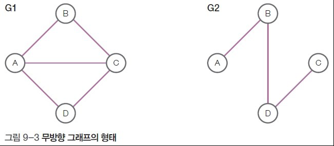
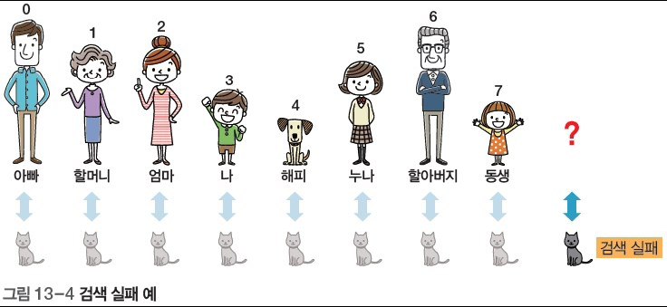
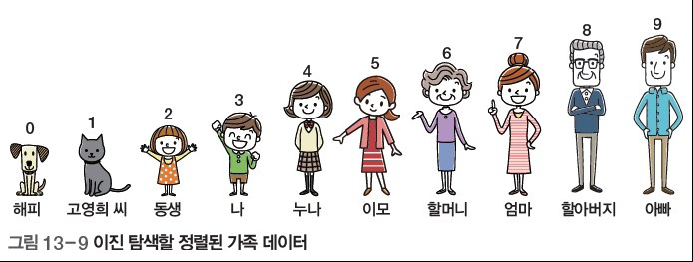

# 자료구조 알고리즘 특강 2일차

- 자료구조와 알고리즘의 기본을 탄탄하게
## 자료구조
### 선형
- 리스트
    - 순차리스트 : 배열, 빈 틈이 없다(공간 절약:비용절약, 속도 빠름, 삽입/삭제 오버헤드 o)
        - 순차리스트에 빈틈을 미리 만들어놔 오버헤드 방지 가능
    - 단순 연결 리스트 : 노드 + 링크(공간 많이 차지) 삽입/삭제 오버헤드x, 비용증가, 속도 느림
    - 원형 연결 리스트 : 마지막 링크->처음노드
- 스택
    - 한쪽이 막힌 파이프 FILO LIFO
    - push, pop, top 
    - isStackFull()->top==SIZE-1, isStackEmpty()->top==-1
    - 응용) 함수 호출, 괄호검사
- 큐
    - 일반큐(순차)
    - 원형큐
### 비선형
- 트리
    - 이진트리 (, 쿼드트리)
- 그래프 (이용: T맵, 카카오맵)

## 알고리즘
- 정렬
    - 선택정렬 (, 버블정렬, 퀵정렬)
- 검색(탐색)
    - 순차검색
    - 이진 검색
- 재귀

# 큐
## 큐의 개념
- 큐(Queue) 자료구조는 입구와 출구가 따로 있는 원통 형태(양쪽이 뚫린 파이프)
- FIFO LILO

## 큐의 구조와 용어
- 큐에 데이터를 삽입하는 작동: enQueue(인큐)
- 데이터를 추출하는 작동: deQueue(데큐)
- 저장된 데이터 중 첫 번째 데이터: front(머리)
- 저장된 데이터 중 마지막 데이터: rear(꼬리)

## 큐의 기본
### 초기화
- front = -1, rear=-1
### 삽입
- rear+=1 queue[rear] = data

### 추출
- front+=1, del queue[front]
## front, rear가 같을 때 빈 것

# 이진 트리
## 이진 트리의 개념
- 트리(Tree) 자료구조는 나무를 거꾸로 뒤집어 놓은 형태

- 용어
    - 차수: 자식의 개수
    - 노드
    - 루트
    - 예지
    - 리프노드 

- 이진트리의 예

    - 서브트리: 루트의 자식 트리
## 이진 트리의 종류
- 포화 이진트리(꽉 찬 거)

- 완전 이진 트리(이는 빠졌지만 순서는 맞음)

- 편향 이진트리: 한 쪽만 있음

- 일반 이진트리

### 이진 탐색 트리
- 이진 트리 중 활용도가 높은 트리로, 데이터 크기를 기준으로 일정 형태로 구성

이진 탐색 트리 특징
➊ 왼쪽 서브 트리는 루트 노드보다 모두 작은 값을 가진다.
➋ 오른쪽 서브 트리는 루트 노드보다 모두 큰 값을 가진다.
➌ 각 서브 트리도 ➊, ➋ 특징을 갖는다.
➍ 모든 노드 값은 중복되지 않는다. 즉, 중복된 값은 이진 탐색 트리에 저장할 수 없다.
#### 생성

# 그래프

## 개념
- 여러 노드가 서로 연결된 자료구조 

## 그래프 종류
- 무방향 그래프
    - 간선 방향성이 없는 그래프
    
    - 정점 집함 표현 
    
    - 간선 집합 표현
    
- 방향 그래프
    - 화살표로 간선 방향을 표기하고, 그래프의 정점 집합이 무방향 그래프와 같음
    
    - 정점 집함 표현 
    
    - 간선 집합 표현
    
- 가중치 그래프
    - 간선마다 가중치가 다르게 부여된 그래프
    - 무방향 그래프와 방향 그래프에 각각 가중치를 부여한 경우 예
    

## 깊이우선 탐색의 작동
- 그래프의 모든 정점을 한 번씩 방문하는 것을 그래프 순회(Graph Traversal)라고 함
- 그래프 순회 방식은 깊이 우선 탐색, 너비 우선 탐색이 대표적

# 알고리즘
## 정렬
### 개념
- 중요 알고리즘 중 하나인 정렬(Soft)은 자료들을 일정한 순서대로 나열한 것
### 종류
- 오름차순 정렬이든 내림차순 정렬이든 결과의 형태만 다를 뿐이지 같은 방식으로 처리됨
- 정렬하는 방법에 대한 정렬 알고리즘은 수십 가지
    - 선택 정렬(Selection Sort)
    - 삽입 정렬(Insertion)
    - 버블 정렬(Bubble)
    - 퀵 정렬(Quick)
#### 선택정렬의 개념
- 여러 데이터 중에서 가장 작은 값을 뽑는 작동을 반복하여 값을 정렬

- 최솟값 찾는 방법
1. 배열의 첫 번째 값을 가장 작은 값으로 지정한다.
2. 가장 작은 값으로 지정한 값을 다음 차례의 값과 비교하여 가장 작은 값을 변경하거나 그대로 두는 방법으로
3. 마지막 값까지 비교를 마친 후 현재 가장 작은 값으로 지정된 값을 가장 작은 값으로 결정한다.

### 삽입정렬

## 검색
### 검색의 개념
- 어떤 집합에서 원하는 것을 찾는 것으로, 탐색이라고도 함
- 검색에는 순차 검색, 이진 검색, 트리 검색 등이 있음
    - 이진검색: 정렬되어있는 데이터를 검색: 빠름
- 검색에 실패하면-1을 반환하는 것이 일반적임
### 검색의 종류
- 순차 검색
    - 검색할 집합이 정렬되어 있지 않은 상태일 때
    - 처음부터 차례대로 찾아보는 것으로, `쉽지만 비효율적임`
    - 집합의 데이터가 정렬되어 있지 않다면 이 검색 외에 특별한 방법 없음
- 이진 검색
    - 데이터가 `정렬되어 있다면 이진 검색`도 사용 가능
    - 순차 검색에 비해 `월등히 효율적`이라 데이터가 몇 천만 개 이상이어도 빠르게 찾아낼 수 있음
- 트리 검색
-   데이터 `검색에는 상당히 효율적이지만 트리의 삽입, 삭제 등에는 부담`

### 순차 검색
- 정렬되지 않은 집합의 순차 검색 원리와 구현

- 검색 성공

- 검색 실패

### 이진검색
- 이진 검색의 원리와 시간 복잡도
    - 이진 검색은 전체를 반씩 잘라 내서 한쪽을 버리는 방식을 사용

#### 구현
- 정렬된 가족 데이터에서 ‘할머니’와 키가 같은 사람을 찾는 과정을 이진 탐색으로 구현하는 예

1. 전체의 첫 데이터를 시작’으로 지정하고, 마지막 데이터를 끝’으로 지정한 후 시작과 끝의 중앙인 누나를 할머니와 비교한다.

2. 끝은 그대로 두고 시작을 중앙(이모)의 바로 오른쪽으로 옮긴다. 중앙(이모)의 오른쪽 그룹에서 다시 시작과 끝의 ½ 위치인 새 중앙(할머니)을 할머니와 비교한다.

- 이진 탐색에서 검색 실패4

## 재귀호출
### 재귀호출의 개념
- 재귀 호출(Recursion)은 자신을 다시 호출하는 것
### 재귀 호출의 작동
- 상자를 반복해서 여는 과정을 재귀 호출 형태로 표현

### 특징
- 느림 -> 반복문 쓰는게 나을지도...
- 많은 반복이 있으면 재귀를 쓰는게 낫다

# 미니특강 2: 취업전략
- 대기업 취업: 급여/복지
    - 신입을 안뽑음. 경력 많이 뽑음
    - 중견/중소(좋은 경력 3년) -> 이직
        - 50% 이상 중소기업에서 이직
- 좋은 경력 3년: 한군데에서 3년
- 그만두지 않을 회사 고르는 법
1. 집이 먼 사람: 회사는 천국이 아니다.
2. 비전: 내비전
3. 사람 자주 뽑는 회사 (같은업무): 나가서