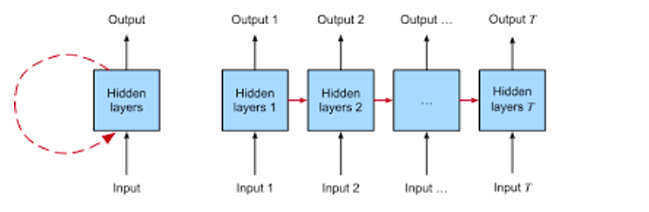
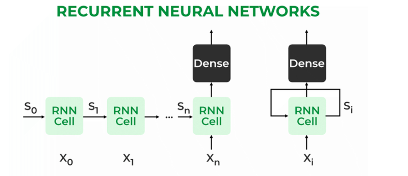

# 시퀀스와 시계열 데이터에 대한 이해
## **시계열 데이터** `time series`
- 시계열 데이터는 `시간에 따라서 변화하는 데이터`를 의미합니다. 예를 들어, 일일 온도 측정치, 주식 가격, 년도별 판매량 등이 시계열 데이터의 예입니다.
- 시계열 데이터를 분석하면 `과거의 패턴을 파악하고 미래를 예측`할 수 있습니다. 예를 들어, 날씨 데이터를 분석하면 내일의 날씨를 예측할 수 있습니다.
- 시계열 데이터는 시간에 따라 연속적으로 나타나므로 `순서가 중요`합니다. 또한, 시계열 데이터는 주기성, 추세, 계절성과 같은 패턴을 가질 수 있습니다.
- 예를 들어, 매일 아침에 우리는 온도를 측정합니다. 이 데이터를 시계열로 저장하면, 일주일 동안의 기온 패턴을 볼 수 있습니다. 이를 통해 내일의 기온을 예측하거나, 더워질 때 에어컨을 켜는 등의 결정을 할 수 있습니다.
- 시계열 데이터 분석은 기상 예측, 주식 시장 분석, 경제 예측, 공장 생산량 관리 등 다양한 분야에서 중요하게 활용됩니다.
### **일변량 시계열 데이터 `univariate time series`**

- 일변량 시계열 데이터는 하나의 변수(예: 온도, 주가)가 시간에 따라 어떻게 변하는지를 나타내는 데이터입니다.
- 예를 들어, 매일의 최고 기온만을 기록한 것이 일변량 시계열 데이터입니다. 하나의 변수(최고 기온)만을 관찰하고 시간에 따른 변화를 분석합니다.
- 일변량 시계열 데이터를 분석하면 해당 변수의 특성과 패턴을 파악하여 예측이나 의사결정에 활용할 수 있습니다.
### **다변량 시계열 데이터 `multivariate time series`**

- 다변량 시계열 데이터는 여러 개의 변수(예: 온도, 습도, 강수량)가 시간에 따라 어떻게 변화하는지를 나타내는 데이터입니다.
- 예를 들어, 일일 기상 데이터에서 최고 기온, 최저 기온, 강수량, 습도 등 여러 가지 변수를 기록한 것이 다변량 시계열 데이터입니다. 여러 변수를 함께 분석합니다.
- 다변량 시계열 데이터를 분석하면 여러 변수 간의 상호작용을 이해하고 다양한 예측 및 의사결정에 활용할 수 있습니다.
## 시계열 데이터의 공통 특징

### **트렌드 `Trend`**

- 트렌드는 `시간에 따른 데이터의 장기적인 경향 또는 패턴`을 나타냅니다.
- 예를 들어, 금융 시장에서 주식 가격이 오랜 기간 동안 꾸준히 상승하는 경향을 보이면 이것은 트렌드입니다.
- 트렌드를 파악하면 미래의 추세를 예측하는데 도움이 됩니다.

### **계절성 `Seasonality`**

- 계절성은 데이터에서 `주기적인 패턴 또는 계절적인 변동`을 의미합니다.
- 예를 들어, 아이스크림 판매량은 여름에 증가하고 겨울에 감소하는 경향을 보이는데, 이것은 계절성입니다.
- 계절성을 이해하면 제품 생산 및 재고 관리, 마케팅 전략을 조정하는 데 도움이 됩니다.

### **자기상관 `Autocorrelation`**

- 자기상관은 `현재 시간의 데이터가 과거 시간의 데이터와 어떤 관련성을 지니는지`를 나타냅니다.
- 예를 들어, 주식 가격이 오늘 상승한 경우, 내일도 상승할 가능성이 높다면 이것은 자기상관이 있는 시계열 데이터입니다.
- 자기상관을 분석하면 미래의 동향을 예측하고 시계열 데이터의 패턴을 이해하는 데 도움이 됩니다.

### **잡음 `Noise`**
- 잡음은 시계열 데이터에서 `예측하기 어려운 무작위 변동`을 나타냅니다.
- 예를 들어, 주식 가격에 영향을 미치는 뉴스, 이벤트 또는 랜덤한 거래가 잡음으로 작용할 수 있습니다.
- 잡음을 이해하고 관리하는 것은 정확한 예측을 위해 중요합니다.
## 09_time_series_practice

[Google Colaboratory](https://colab.research.google.com/github/BigDeepData/2312_dl/blob/main/notebook/231211_dl_09_time_series_practice.ipynb)

## 정확도 측정하기

### **평균 제곱 오차 (MSE - Mean Squared Error)**

- MSE는 예측 모델의 정확도를 측정하는 지표 중 하나로, 예측 값과 실제 값 사이의 차이를 제곱한 후 평균을 구합니다.
- 예를 들어, 날씨 예측 모델에서 오늘의 예상 온도를 25°C로 예측하였고, 실제 온도가 22°C였다면 오차는 (25 - 22)^2 = 9가 되고, 이 오차를 모든 예측값에 대해 구한 후 평균을 내면 MSE가 됩니다.
- MSE는 예측 오차의 크기를 측정하며, 오차가 작을수록 모델의 예측이 정확하다고 볼 수 있습니다.

### **평균 절대 오차 (MAE - Mean Absolute Error)**

- MAE는 예측 모델의 정확도를 측정하는 다른 지표로, 예측 값과 실제 값 사이의 차이를 절대값으로 변환한 후 평균을 구합니다.
- 위의 날씨 예측 모델에서 오늘의 예상 온도를 25°C로 예측하였고, 실제 온도가 22°C였다면 오차는 |25 - 22| = 3이 되고, 이 오차를 모든 예측값에 대해 구한 후 평균을 내면 MAE가 됩니다.
- MAE 역시 예측 오차를 측정하는데 사용되며, 오차가 작을수록 모델의 예측이 정확하다고 볼 수 있습니다.

## 이동 평균으로 예측하기

### **이동 평균 (Moving Average)**

- 이동 평균은 시계열 데이터에서 주어진 기간 동안의 평균 값을 계산하는 방법입니다. 이것은 데이터의 변동을 더 부드럽게 만들어주고 잡음을 감소시키는 데 사용됩니다.
- 특정 기간 (예: 7일, 30일) 동안의 데이터 포인트 값을 모두 더한 후, 그 값을 해당 기간의 데이터 포인트 개수로 나눕니다. 이렇게 계산한 값을 현재 날짜의 이동 평균 값으로 사용합니다.
- 이동 평균은 데이터의 `잡음을 줄이고 데이터의 장기적인 추세나 패턴을 관찰하기 쉽게 만듭`니다. 주식 시장, 기상 데이터, 경제 지표 등 다양한 분야에서 데이터 예측과 분석에 활용됩니다.

# 시퀀스 예측을 위한 머신러닝 모델 생성
## 윈도 데이터셋(Window dataset)
- 윈도 데이터셋은 `시계열 데이터를 일정한 크기의 창(윈도)으로 나누어 모델에 입력으로 제공`하는 방법입니다.
- 시계열 데이터는 시간의 흐름에 따라 변하는 패턴이 있기 때문에, 딥러닝 모델에 그대로 입력하면 패턴을 인식하기 어렵습니다. 그래서 윈도 데이터셋을 사용합니다.
- **윈도 데이터셋의 장점 (Pros of Window Dataset):**
    - **패턴 인식:** 윈도 데이터셋을 사용하면 모델이 데이터에서 패턴을 더 쉽게 파악할 수 있습니다. 윈도 안에 있는 데이터의 순서가 유지되므로 모델이 시간적인 연관성을 학습할 수 있습니다.
    - **고정된 입력 크기:** 윈도 데이터셋은 고정된 크기의 입력을 제공하기 때문에 딥러닝 모델이 일관된 방식으로 작동합니다.
    - **효율적인 처리:** 대용량 데이터를 일부분씩 처리하여 메모리를 효율적으로 사용할 수 있습니다.
- 윈도 데이터셋을 만들려면 시계열 데이터를 일정한 크기의 창(예: 과거 30일 데이터)으로 슬라이딩하면서 데이터를 추출합니다.
- 예를 들어, 일일 기온 데이터를 딥러닝 모델에 입력하려면, 과거 30일 동안의 기온 데이터를 하나의 윈도로 묶고, 다음 1일의 기온을 예측하는 모델을 만들 수 있습니다.
## 10_window_datatset_practice
[Google Colaboratory](https://colab.research.google.com/github/BigDeepData/2312_dl/blob/main/notebook/231211_dl_10_window_datatset_practice.ipynb)
라이브 : https://colab.research.google.com/drive/1ZQ9zIWImU8QtgB4cp1qTWXiwF44AgitM?usp=sharing
## 11_stock_dnn_practice
https://github.com/FinanceData/FinanceDataReader
[Google Colaboratory](https://colab.research.google.com/github/BigDeepData/2312_dl/blob/main/notebook/231211_dl_11_stock_dnn_practice.ipynb)
라이브 : https://colab.research.google.com/drive/1lM_z9P9Ml3uvwFo6I-HFPCgVBgmg1GR_
## RandomSearch 튜너
- RandomSearch 튜너는 기계학습 모델의 성능을 높이기 위해 여러 가지 시도를 하는 도구입니다.
- 모델을 만들 때 어떤 선택을 해야 하는데, 레이어의 뉴런 수나 학습률과 같은 중요한 선택들이 있습니다.
- RandomSearch는 이러한 선택들을 자동으로 시도해보고, 어떤 선택이 모델을 더 좋게 만드는지 찾아줍니다.
- 랜덤하게 다양한 선택을 시도하면서, 가장 좋은 결과를 얻을 수 있는 조합을 찾아냅니다.
- 이렇게 찾아낸 최적의 조합을 사용하여 모델을 훈련하고 더 나은 성능을 얻을 수 있습니다. → 하이퍼파라미터 튜닝

# 시퀀스 예측을 위한 순환 신경망 (RNN)
## RNN(Recurrent Neural Network, 순환 신경망)

- RNN(Recurrent Neural Network)은 시간에 따라 변화하는 데이터를 처리하고 예측하기 위한 특별한 종류의 인공 신경망입니다.
- 시계열 데이터는 시간에 따라 값이 변하는 데이터를 의미하며, 예를 들어 주식 가격, 날씨 데이터, 트래픽 패턴 등이 시계열 데이터의 예시입니다.
- RNN은 시간에 따라 발생하는 정보의 순서를 고려하여 데이터를 처리합니다. 이것은 RNN이 다른 일반적인 신경망과 다른 중요한 특징 중 하나입니다.
- RNN은 각각의 단계(또는 시간 단계)에서 이전 단계의 정보를 기억하고 사용합니다. 이전 정보를 현재 정보와 결합하여 미래 값을 예측하는 데 도움을 줍니다.
- 예를 들어, 날씨 예측 모델에서 RNN을 사용하면, 과거 날씨 데이터와 현재 날씨 데이터를 조합하여 내일의 날씨를 예측할 수 있습니다.
- RNN은 시간에 따른 데이터의 패턴을 파악하는 데 강력합니다. 예를 들어, 주가 데이터에서 특정 패턴이 반복되는 경우, RNN은 이러한 패턴을 학습하고 미래 주식 가격을 예측합니다.
- 시계열 예측을 위해 RNN 모델을 훈련할 때, 모델은 과거 데이터를 보고 미래 값을 예측하려고 합니다. 이를 통해 시간에 따른 변화를 예측하는 데 도움이 됩니다.
- RNN은 다양한 분야에서 활용되며, 시계열 데이터의 패턴을 파악하여 미래 값을 예측하는 데 사용됩니다.

- **구조**:
    - RNN은 여러 개의 순환 뉴런으로 이루어진 신경망입니다.
    - 각 순환 뉴런은 이전 단계에서의 출력을 기억하고 다음 단계로 전달합니다.
    - RNN은 시간에 따라 연결된 구조를 가지며, 이것이 시계열 데이터를 처리하는 데 유용합니다.
- **주요 요소**:
    1. **입력 데이터**:
        - RNN은 시계열 데이터 또는 순차적인 데이터를 입력으로 받습니다. 예를 들어, 시간에 따른 온도 데이터나 문장의 단어들을 입력으로 사용할 수 있습니다.
    2. **순환 뉴런 (Recurrent Neuron)**:
        - RNN의 가장 중요한 부분입니다.
        - 각 순환 뉴런은 현재 입력과 이전 단계의 출력을 합하여 새로운 출력을 생성합니다.
        - 이전 단계의 출력은 과거 정보를 기억하기 위해 사용됩니다.
    3. **출력**:
        - RNN은 각 단계에서의 출력을 생성합니다.
        - 시계열 데이터를 예측하거나 다음 단계의 입력으로 사용될 수 있습니다.
- **동작 방식**:
    - RNN은 각 단계에서 현재 입력과 이전 단계의 출력을 고려하여 새로운 출력을 생성합니다.
    - 이 과정은 연쇄적으로 진행되며, 모든 단계를 거치면 최종 출력이 생성됩니다.
    - 이전 단계의 정보가 현재 예측에 영향을 미치므로 시계열 데이터의 패턴을 파악할 수 있습니다.
    ## 12_stock_rnn_practice

[Google Colaboratory](https://colab.research.google.com/github/BigDeepData/2312_dl/blob/main/notebook/231211_dl_12_stock_rnn_practice.ipynb)

## GRU(Gated Recurrent Unit)

- **GRU란?**
    - GRU는 순환 신경망(RNN)의 일종으로, 시간에 따라 변하는 데이터를 처리하는 데 특화된 구조입니다.
    - 예를 들어, 날씨 변화나 언어의 연속적인 흐름 같은 시계열 데이터를 다루는 데 사용됩니다.
- **GRU와 일반 RNN의 차이점**
    - **기억력**: 일반 RNN은 오래된 정보를 잘 기억하기 어렵습니다. 반면, GRU는 필요한 정보를 오래 기억할 수 있는 능력이 있습니다.
    - **정보 관리**: GRU에는 '게이트'라고 하는 특별한 구조가 있어서 어떤 정보를 유지하거나 삭제할지 더 효율적으로 결정할 수 있습니다. 일반 RNN에는 이런 구조가 없습니다.
    - **문제 해결 능력**: GRU는 일반 RNN보다 복잡한 문제를 더 잘 해결할 수 있습니다. 이는 GRU가 정보를 더 오래, 더 정확하게 기억하기 때문입니다.
    - **학습 효율**: GRU는 일반 RNN보다 학습이 빠르고 효율적입니다. 즉, 같은 문제를 더 빨리 배우고 더 좋은 결과를 낼 수 있습니다.

## LSTM(Long Short-Term Memory)

- **LSTM이란?**
    - LSTM은 순환 신경망의 한 종류로, 시간에 따라 변하는 데이터를 처리하는 데 특화된 구조입니다.
    - 예를 들어, 문장에서 단어의 순서를 이해하거나, 음악의 멜로디를 따라가는 것과 같은 시계열 데이터를 처리하는 데 적합합니다.
- **LSTM과 일반 RNN의 차이점**
    - **기억력**: 일반 RNN은 시간이 지나면서 정보를 잃어버리는 경향이 있습니다. 하지만 LSTM은 중요한 정보를 더 오랫동안 기억할 수 있습니다.
    - **정보 관리**: LSTM에는 '게이트'라는 구조가 있어서 어떤 정보를 유지하고, 어떤 정보를 삭제할지 더 효율적으로 결정합니다. 일반 RNN에는 이런 기능이 없습니다.
    - **복잡한 학습 능력**: LSTM은 일반 RNN보다 더 복잡한 학습을 수행할 수 있습니다. 예를 들어, 긴 문장이나 대화에서 전체적인 맥락을 이해하는 데 유리합니다.
    - **학습 효율성**: LSTM은 일반 RNN보다 학습 과정에서 더 안정적이며, 더 나은 성능을 보입니다.

## LSTM과 GRU의 차이점

- **구조의 차이**
    - **LSTM**:
        - LSTM은 '게이트'라는 세 가지 주요 구조(입력 게이트, 출력 게이트, 삭제 게이트)를 가지고 있습니다.
        - 이 게이트들은 네트워크가 정보를 저장, 추가 또는 삭제할 때 어떻게 해야 할지 결정합니다.
    - **GRU**:
        - GRU는 두 가지 주요 구조(재설정 게이트와 업데이트 게이트)를 가지고 있습니다.
        - 이는 LSTM보다 간단하지만 효율적인 방식으로 정보를 관리합니다.
- **복잡성과 계산**
    - **LSTM**:
        - LSTM은 구조가 더 복잡하므로 계산이 더 많이 필요합니다.
        - 이로 인해 학습하는 데 더 많은 시간과 자원이 필요할 수 있습니다.
    - **GRU**:
        - GRU는 더 간단한 구조를 가지고 있어 계산량이 적습니다.
        - 따라서 학습 속도가 더 빠를 수 있습니다.
- **성능**
    - **LSTM**:
        - LSTM은 매우 복잡한 시계열 데이터를 처리하는 데 더 적합할 수 있습니다.
    - **GRU**:
        - GRU는 더 간단하거나 적은 데이터로도 좋은 성능을 낼 수 있습니다.
- **적용 사례**
    - 일반적으로 LSTM은 더 긴 시퀀스나 더 복잡한 문제에 적합하고, GRU는 더 간단하거나 빠른 처리가 필요한 경우에 적합합니다.
<!-- RNN -> LSTM/GRU -> 어텐션 -> 트랜스포머 -> GPT -->