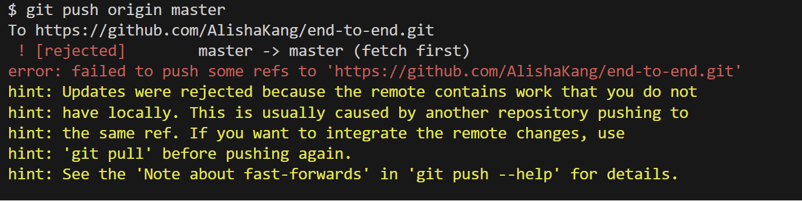
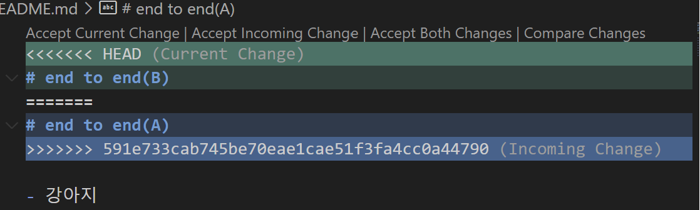
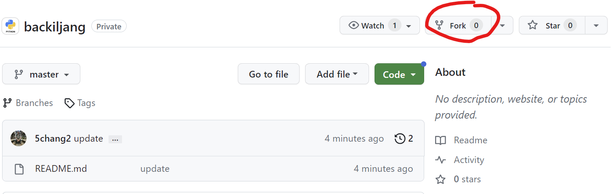
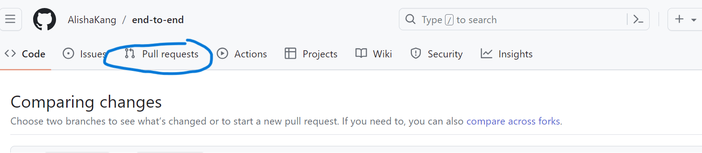
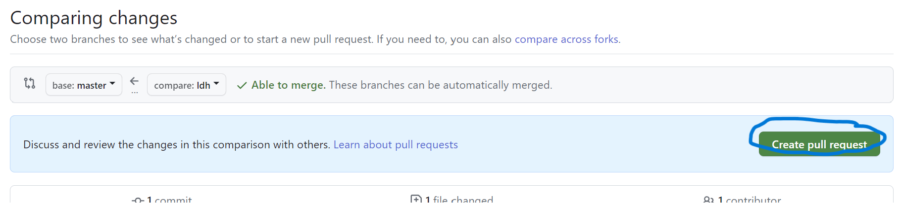

# 2회차 강의 내용 요약

## github.io 페이지 작성  
[Dhyeonle9.github.io](https://Dhyeonle9.github.io)  

## 협업시 git 이용
1. 하나의 branch 안에서 같은 repository 이용 clone/push/pull (충돌 위험 큼)
    - 협업할 파일이 있는 github에서 코드파일 http 코드주소 복사
    - 작업 폴더에서 git bash 열고 `git clone <코드주소>` 
        - : 작업원하는 코드를 Git-hub(원격저장소)에서 **working space**로 내려받음
        - github에 올려진 모든 git 정보를 내려받는 것이기 때문에 init/remote add 하지않아도 됨
    - 다운받아진 디렉토리에서 **Code로 열기** 후 작업 -> add/commit/push
    - `git pull`
        - 작업하고 있는 코드의 내용을 동기화(다운로드)하기 위해 사용

    > 같은 라인을 동시 수정하여 업데이트하게되면 충돌이 발생할 수 있으며, 이 경우 다시 pull하여 동기화하고 merging 과정을 거쳐야한다.

    
    > **충돌 발생하여 push 실패시**
    
    와 같은 메세지 생성  
      
    >**`git pull origin master` 시**
      
    충돌이 발생한 부분과 merge 방법, 비교 등을 확인할 수 있다.

2. branch 활용 (이상적)  
    
    >일반적으로 master branch는 작업에 사용하지 않는다. **작업 branch**들을 만든 후 develop, 시적용, 검토 등을 마친 후 **master branch**에 병합한다. 
    - `git branch` : git에 있는 branch들을 보여줌
    - `git branch -c <브랜치이름>` : 현재 작업폴더에 <브랜치이름>의 브랜치 생성
    - `git switch <브랜치이름>` : <브랜치이름> 브랜치로 작업 환경 이동
    
    - github를 이용한 코드 merging

3. Github Contribute  
Git hub에 공유된 다른 사람의 프로젝트/코드에 대해 질문, 수정, 보완 등을 논의할 수 있다. 협업시에도 의견공유가 가능하다.

    - fork  
    다른 사람의 Github에 공유된 Repository를 이용하기 위해 내 Github Repository로 복제하는 기능
        - fork한 저장소는 원본과 연결되어있어 원본에 변화가 생기면 forked된 repository로 반영이 가능하다.
      

    - clone  
    복제한 Repository를 local 작업환경으로 복사한다.  
    >original repository의 변경사항을 적용하고 싶다면 pull request가 필요하다.

    - 작성 및 add/commit/push  
    local 작업환경에서 코드 작성 및 수정 가능하다.  
    작성이후 내 git hub에 업로드 하기위해 add/commit/push한다.

    - pull request  
    내 github의 수정된 repository를 **original repository**에 적용 요청하는 것  
      
      
    
    - merge

