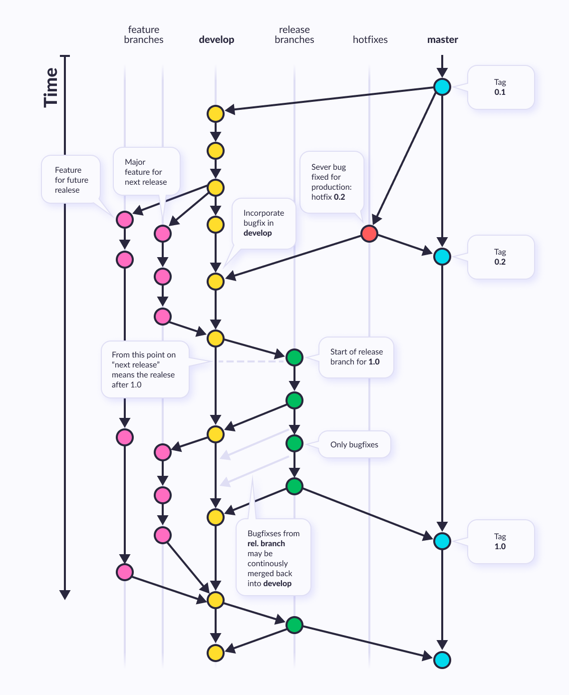

# 2회차 강의 내용 요약

1. github.io 페이지 작성  
[Dhyeonle9.github.io](https://Dhyeonle9.github.io)

2. 협업시 git 이용
    - 하나의 branch 안에서 같은 repository 이용 clone/push/pull (충돌 위험 큼)
        - 협업할 파일이 있는 github에서 코드파일 http 코드주소 복사
        - 작업 폴더에서 git bash 열고 `git clone <코드주소>` 
            - : 작업원하는 코드를 Git-hub(원격저장소)에서 **working space**로 내려받음
            - github에 올려진 모든 git 정보를 내려받는 것이기 때문에 init/remote add 하지않아도 됨
        - git push 
        - git pull
            - 작업하고 있는 코드의 내용을 동기화(다운로드)하기 위해 사용

    > 같은 라인을 동시 수정하여 업데이트하게되면 충돌이 발생하며, 다시 pull하여 동기화하고 merging과정을 거쳐야한다.
    - branch 활용 (이상적)  
            
        >일반적으로 master branch는 작업에 사용하지 않는다. **작업 branch**들을 만든 후 develop, 시적용, 검토 등을 마친 후 **master branch**에 병합한다. 
        - `git branch` : git에 있는 branch들을 보여줌
        - `git branch -c <브랜치이름>` : 현재 작업폴더에 <브랜치이름>의 브랜치 생성
        - `git switch <브랜치이름>` : <브랜치이름> 브랜치로 작업 환경 이동
    
        - github를 이용한 코드 merging

3. contribute
    - fork
    - clone
    - 작성 및 add/commit/push
    - pull request

    - merge

