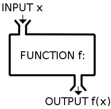
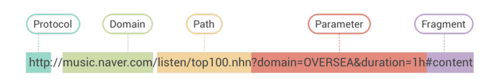

# 3회차 강의 내용 요약

## Python 설치 및 설정

## Python 프로그래밍 기초

> 작성시 주의사항  
    - 파일 작성 후 저장해야 compile 가능  
    - 들여쓰기 주의 (파이썬은 depth 중요)  
    - 대문자와 소문자의 사용 주의 (apple=/Apple)  
    - 띄어쓰기 주의 (git add. (x) / git add . (o))  
    - 오타주의 (message=/massage)

### variable (변수)

1. 숫자 (int, float, double)  
ex) dust = 10   
: 변수 dust에 10을 assignment(할당)   

2. 글자 (string)  
ex) dust = '5'

3. 참/거짓 (boolean)  
ex) dust = True / False (1 / 0)

### 자료형

1. **list** : 데이터를 순차적인 목록형태로 관리하는 자료형  
ex) 
```python
dust_list = [1, 2, 3, 4, 5]
```

2. **dictionary** : key(요소)에 따른 value(각각의 정보)를 짝지어서 나타낼 때 사용하는 자료형 (연관배열)  
ex)
```python
dust_dict = {
    '서울' = 100,
    '부산' = 50,
    ...
}
```
### 조건문

1. if 문
- 조건에 따라 코드 진행
- if / elif / else  
ex) 
```python
age = 10

if age > 20:
    print('성인입니다.')
elif age > 8:
    print('청소년입니다.')
else:
    print('어린이입니다.')
```

### 반복문

1. while
- 어떠한 조건동안 while문에 속한 동작 반복해서 수행  
ex)
```python
menus = ['김치찜', '삼겹살', '김밥', '머핀']
n = 0
while n < 4:
    print(menus[n])
    n = n + 1
```

2. for
- 리스트 등과 같은 시퀀스(sequence)를 이용해서 for문에 속한 동작 반복해서 수행  
ex)
```python
menus = ['김치찜', '삼겹살', '김밥', '머핀']

for menu in menus:
    print(menu)
```


### 함수 (function)


- 입력값을 받아 일련의 가공/ 처리 후 반환값을 출력함  
ex)
```python
var = 0
print(var)
```
var라는 변수의 값을 출력해줌

### 모듈 사용범
- python의 다양한 함수/기능등을 활용하기 위해 모듈을 불러와 사용할 수 있음
```python
import random

random_number = random.randint(0, 100)
# random = 모듈
# randint = 함수
```
```python
# 랜덤으로 메뉴고르기
menus = ['김밥', '라면', '만두']
menu = menus[random.randint(0,2)]
print(menu)

# 강사님 solution
random_number = random.randint(0,2)
print(menus[random_number])

# choice 함수 활용
menu = random.choice(menus)
print(menu)
```
- 파이썬에 탑재되지않은 모듈은 설치하여 사용가능  
ex) requests, numpy

```python
# 랜덤으로 로또번호 생성하고 당첨번호 비교

# pip install requests - 모듈 설치

numbers = range(1, 46)
lucky_number = random.sample(numbers, 6)

# print(sorted(lucky_number))

URL = 'https://www.dhlottery.co.kr/common.do?method=getLottoNumber&drwNo=1086'
# 일반적으로 상수 데이터는 대문자로 작성

# pip install requests

import requests

res = requests.get(URL)

data = res.json()
print(data)

drwtNo1 = data['drwtNo1']
drwtNo2 = data['drwtNo2']
drwtNo3 = data['drwtNo3']
drwtNo4 = data['drwtNo4']
drwtNo5 = data['drwtNo5']
drwtNo6 = data['drwtNo6']

lotto_number = [drwtNo1, drwtNo2, drwtNo3, drwtNo4, drwtNo5, drwtNo6]

print(lucky_number)
print(lotto_number)

print(set(lucky_number) & set(lotto_number))
# set 데이터를 집합의 형태로 바꿔줌
# & 교집합
```
> * URL의 구조  
- URL은 Protocol, Domain, Path, Parameter, Fragment로 구성되며 **Parameter는 쿼리스트링**이라고도 부른다. 파라미터는 딕셔너리 형태로 이루어져있으며, 'key' = value 들이 & 로 구분되어있다.


### 예시 실습 

**공공데이터포탈 의 '한국환경공단_에어코리아_대기오염정보'에서 강남구 미세먼지 값 가져오기**

```python
import requests
from pprint import pprint

URL = 'http://apis.data.go.kr/B552584/ArpltnInforInqireSvc/getCtprvnRltmMesureDnsty?serviceKey=%2B58fRxySTvs0PfFQUY4WIxmfUdNzO2PRCGrFR%2BwurNXadOEb4nRyU4TfZFft%2FX7IOwZchblSbWUzs2S9mm1q2Q%3D%3D&returnType=json&numOfRows=100&pageNo=1&sidoName=%EC%84%9C%EC%9A%B8&ver=1.0'

res = requests.get(URL)
data = res.json()
# items = pprint(data['response']['body']['items'])
items = data['response']['body']['items']

for item in items:
    if item['stationName'] == '강남구':
        pprint(item['pm10Value'])
```
