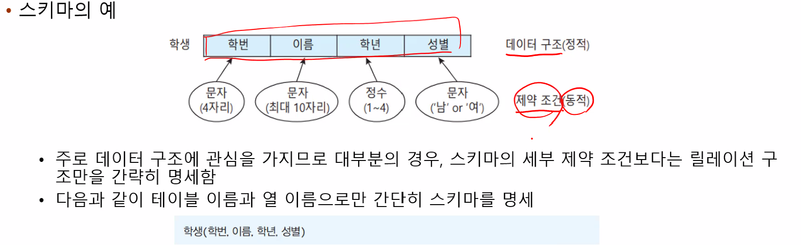

# 데이터베이스의 개념
## 데이터베이스와 정보 시스템
1. 일상속의 데이터베이스
- 데이터를 가공 처리함(전처리)으로써 정보를 생성할 목적으로 현재 다양한 정보 시스템이 활용
- 정보 시스템 안에는 가공 이전의 `데이터나 가공 이후 생성된 정보 저장소`가 반드시 필요함 -> 데이터 베이스
- 우리 일상의 거의 모든 곳에 존재함
    
> 정형 데이터:     
비정형 데이터: 
2. 데이터와 정보
- 데이터 베이스를 명확히 이해하기 위해 그 차이를 구별
    - 보통 일상생활에서는 데이터와 정보를 구별하지 않고 사용
    - 데이터
        - 현실에서 관찰 또는 수집의 결과로 나타난 객관적 사실
        - 획득된 그대로의 정량적 혹은 정성적 실제 값
    - 정보
        - 획득된 데이터에 의미를 부여하거나 가공 처리를 통해 의사결정에 활용하도록 체계적으로 조직한 결과물

- 데이터와 정보의 관계
    - 정보
        - 가공 처리된 데이터
            - 가공 처리: 간단한 데이터의 조건 검색, 정렬, 사칙연산부터 복잡한 업무 처리나 통계 처리 등 다양한 행위를 포함
        - 데이터는 현실 세계로부터 상대적으로 쉽게 획득
        - 정보는 정보 시스템을 이용하여 특별한 노력의 과정을 통해서 획득됨
- 데이터, 정보의 연쇄적 흐름
    - 생성된 정보는 정보 시스템을 통해 다른 사용자의 입력 데이터로 활용되기도 함
    - 결국 어느 정보 시스템이나 또는 어느 사용자이냐 등 상황과 관점에 따라 데이터 혹은 정보로 간주
    - 보통 정보 시스템의 결과물이 특정 사용자의 의사 결정에 활용될 수 있다면 정보로 간주
    
3. 정보 시스템의 발전
- 정보 시스템
    - 한 조직의 활동과 운영에 필요한 데이터를 수집, 저장해 두었다가 다양한 방식으로 처리 및 가공함으로써 의사 결정에 필요한 정보를 생성하는 `소프트웨어 체계`
    - 수집된 데이터를 저장했다가 필요할 때 제공하는 역할은 정보 시스템의 핵심요소인 `데이터베이스`가 담당
- 정보 시스템의 구조
    
- 정보 시스템의 종류
    - 데이터는 사람, 자본, 기술과 함께 기업의 4대 요소로 고려될 만큼 중요성이 커지고 있음
        - 책이나 언론 매체, 사람 등의 전통적 방식으로는 불가능했던 대량의 정보 소비는 다양한 정보 시스템을 통해서만 가능함
        - 오늘날 컴퓨터와 정보 시스템 ㄱ리고 그 안의 데이터베이스가 더욱 중요해진 이유임
    
- 정보 시스템의 발전 과정
    - 전통적 파일 정보 시스템의 처리방식
    
    - 개선된 파일 정보 시스템의 처리방식(개선2)
    
    - 데이터베이스 시스템의 등장
        - 데이터 종속성 문제를 `공통의 데이터 모델`과 `표준 데이터 언어`를 이용하여 해결
        - 데이터 중복성 문제를 `통합 저장소`를 이용하여 해결
        - 데이터베이스 접근을 DBMS가 제공
            - 응용 프로그램이나 사용자는 DBMS를 통해서만 데이터 처리가 가능
            - 데이터 처리에 관한 복잡하고 힘든 과정을 DBMS가 모두 떠맡아 처리 
      
4. 데이터베이스 시스템의 장단점

- 데이터 종속성, 데이터 중복성, 데이터 공용, 무결성 유지
## 데이터베이스의 등장
1. 
- 데이터 베이스 용어는 `Data`와 `Base`의 합성어로 1960년 초부터 공식적으로 사용
- 현재는 언론 매체를 통해 누구나 쉽게 접하는 일상적인 용어가 됨
    - 넓은 의미의 데이터베이스
        - 관련된 콘텐츠를 모아놓은 데이터저장소
        - 데이터 형식이나 구성에 제약없이 자유롭게 활용하는 사용자 관점에서의 데이터베이스
        - 예) 인터넷 웹문서, 전자책을 제공하는 전자도서관, VOD 등
    - 좁은 의미의 데이터베이스
        - 데이터베이스를 보다 효율적이고 체계적으로 활용하기 위해 구성한 데이터 형식이나 구성에 엄격한 제약을 갖는 시스템 관점에서의 데이터베이스
        - 예) 인터넷 뱅킹 시스템, 극장예매 시스템, 쇼핑몰구매 시스템, 편의점 재고 시스템 등
        - 보통 데이터베이스를 배운다고 할 때의 대상은 이것임
2. 데이터베이스의 정의
- 여러 사용자나 응용 프로그램들이 함께 사용할 목적으로 체계적으로 통합하여 저장한 운영에 꼭 필요한 필수 데이터들의 저장소
3. 데이터베이스의 특성
- 실시간 접근: 사용자의 데이터 요구에 실시간(수 초) 응답해야 함
- 끊임없는 변화: 현실 세계가 변화함에 따라 역동적으로 변화함으로써 현실 세계를 정확히 반영해야 함
- 동시공용: 여러 사용자가 동시에 사용하며, 누구나 필요할 때 자기가 원하는 데이터를 활용할 수 있어야 함
- 내용 기반 참조: 데이터 저장 위치는 알 필요 없고, 찾고자 하는 데이터의 내용 즉, 값을 이용하여 데이터 접근이 가능해야 함
## 관계형 데이터 모델
1. 데이터 모델의 구성요소
- 데이터베이스(DB): 저장소
- 데이터베이스 관리 시스템(DBMS): 데이터 베이스 관리 소프트웨어
- 데이터베이스 시스템(DBS): 데이터베이스와 데이터베이스 관리 시스템들을 모두 포함하는 개념
- 데이터베이스 시스템의 구성요소

- 데이터베이스 시스템의 개념
구분
2. 데이터베이스 사용자
- 일반 사용자 = 최종 사용자(end user)
- 응용 프로그래머: 응용 프로그램을 개발할 목적으로 DB에 접근, 전문 개발자 -> 프론트 개발자
- 데이터베이스 관리자(DBA): 데이터베이스를 구축하고 데이터베이스 시스템을 자체적으로 운영/통제하는 특별한 소수의 사용자유형, DBMS의 슈퍼 사용자
    - 데이터베이스에 대한 모든 권한과 최종 책임을 갖는 전문가
    - DBA의 주요 역할
    
- 데이터베이스 사용자별 요구 능력
    
## 데이터 언어
1. 데이터 언어
- 데이터베이스 사용자와 응용 프로그램은 모두 DBMS를 통해서만 데이터베이스에 접근할 수 있음
- DBMS에 요청 내용을 전달하기 위한 도구
- 표준 언어 SQL
- 데이터 언어의 분류: 사용 목적에 따라 3가지 명령어 그룹으로 분류

2. 데이터 언어의 분류
- 데이터 정의어(DDL)
    - 새로운 데이터베이스 구조를 정의하고 구조를 변경하는 명령어 집합
    - 예) CREATE, ALTER, DROP
- 데이터 조작어(DML)
    - INSERT UPDATE, DELETE, SELECT
- 데이터 제어어(dCL)
 - GRANT, REBOKE, 
## 데이터베이스 관리 시스템
1. 데이터베이스 관리 시스템
    - 데이터베이스를 효율적으로 관리하고 데이터베이스에 대한 데이터 요청을 처리하는 소프트웨어 시스템
2. DBMS의 구성요소 

3. DBMS의 필수 기능
    - 정의 기능: 필요한 모든 데이터를 저장하는 통합 데이터베이스 구조를 생성하거나 이미 생성된 구조를 삭제 또는 변경할 수 있도록 함
    - 조작 기능: 입력, 수정, 삭제, 검색 요청
    - 제어 기능: 데이터를 정확하고 안전하게 유지하도록 통제함, 사용자별 보안과 권한을 설정하고 데이터 조작 과정 중에 높은 동시성과 무결성을 유지하면서도 백업을 통해 장애 발생시 필요한 회복 조치가 가능하도록 제어
4. 사용자 유형별 활용 SQL 및 DBMS 기능
- 사용자 유형에 따라서 사용하는 SQL 명령어와 이를 해석하고 처리하는 DBMS의 필수 기능이 밀접하게 관련됨

## 데이터베이스 서버
- 데이터베이스 서버
    - 데이터베이스가 구동되는 서버의 역할을 하는 컴퓨터
    - 클라이언트/서버 컴퓨팅 환경
- 구축하고자 하는 정보시스템의 규모와 용도에 맞게 적절한 사양의 컴퓨터를 선택
    - 전통적으로 데이터베이스 컴퓨터는 고성능의 사양을 요구
    - 점차 컴퓨터의 처리 능력과 성능이 크게 발절됨에 따라 현재는 데이터베이스 전용 컴퓨터가 없어도 일반 컴퓨터를 데이터베이스 서버로 활용하는 것이 가능한 환경이 됨
## 데이터 모델
- 데이터 모델: 데이터베이스 종류에 따라서 다양한 저장 구조를 갖게 되는데 이러한 데이터베이스 구조를 명세하기 위한 개념 틀
- 데이터 모델의 종류
    - 계층형(HDM: Hierarchical Data Model)
        - 데이터 사이의 연관관계를 물리적 위치 정보인 포인터로 표현하는 저장방식
        - 트리형태의 계층구조
        - 장점: 검색속도가 빠르기 때문에 일대다 관계를 갖는 대용량 데이터베이스 처리 유리
    - 네트워크형(NDM)
        - 데이터 사이의 연관 관계를 포인터로 표현하는 저장방식
        - 계층형 모델의 단점을 보완하여 트리형태로 
        - 다대다 관계 처리 유리
    - 관계형(RDM)
        - 테이블 형태의 저장 구조를 가지며 데이터 사이의 연관 관계를 테이블의 key column을 통해 표현하는 저장방식
        - 장점: 연관된 데이터 사이에 `기본키:primary`와 `외래키:foreign`를 통해 논리적 관련성을 표현함으로써 유연하고 이해하기 쉬움
    - 객체 지향형(OODM: Object Oriented Data Model)
        - 객체 단위의 저장 구조를 가지며 연관된 데이터 사이의 관곌ㄹ 객체 식별자(OID)로 표현하는 저장 방식
        - 클래스, 상속, 자료 추사화 등의 객체 지향 개념과 데이터베이스 개념을 통합하여 실세계와 유사하게 모형화하는 데이터 모델
            - 구조적 측면에서는 계층형 또는 네트워크형 데이터 모델과 비슷
            - 객체 지향 언어의 상속, 캡슐화 등의 개념을 저장 구조에 도입
    - 객체 관계형(ORDM: Object Relational Data Model)
        - 관계형 데이터 모델을 기본 개념으로 하고 객체 데이터 모델의 객체 특성을 일부 반영한 절충형 모델
            - 객체 지향 데이터 모델과 관계형 모델의 장점을 취해 하나의 시스템으로 통합
            - 범용적인 관계형, 특정부분 객체지향형
- 데이터 모델과 DBMS의 관계
    - 데이터 베이스 또는 DBMS를 분류하는 가장 중요한 기준은 데이터 모델
    - 데이터모델에 따른 DBMS의 역사
    
## 3단계 데이터베이스
1. 스키마(schema)
- 데이터베이스 안에 저장되는 데이터 구조와 제약 조건 등을 정의한 것
- 데이터베이스의 정적인 구성뿐만 아니라 동적인 유지 조건까지를 포함
- 동일한 데이터베이스라도 접근 관점에 따라 스키마는 다를 수 있음
- 스키마의 예

2. 3단계 데이터베이스의 구조
- ANSI에서 제시한 방법으로 데이터베이스를 보는 관점을 3단계로 분리

3. 스키마의 종류
- 외부 스키마(external schema)
    - 사용자가 외부에서 바라보는 관점에서의 개인적 데이터베이스 구조를 정의한 것
    - 일반 사용자나 응용프로그래머 차원에서 접근하는 일부 데이터베이스의 논리적 부분을 표현
    - 데이터베이스 전체가 아닌 데이터베이스 일부만을 대상으로 한정하여 명세한 구조이므로 서브 스키마라고도 부름
    - 각 사용자별로 외부에서 바라보는 관점은 다양하므로 여러 외부 스키마가 존재
- 개념 스키마(conceptual schema)
    - 모든 사용자들의 관점을 통합하여 전체 조직 관점에서 데이터베이스 구조를 정의한 것
    - 데이터베이스 관리차원에서 접근하는 통합된 데이터베이스의 논리적 부분을 표현
    - 조직이나 기관의 데이터베이스 전체를 명세한 구조로서 간단히 스키마라고 부름
    - `데이터베이스에는 하나의 개념 스키마만 존재`
    - 보통 `스키마라고 하면 개념 스키마를 의미`함
- 내부 스키마(internal schema)
    - 저장 장치의 관점에서 전체 데이터베이스의 내부 구조를 정의
    - 개념 스키마에 대한 시스템 내부의 저장 방식을 표현
    - `내부 레코드의 형식이나 배치방법, 인덱스 등에 대한 명세`를 포함
    - 실제 장치의 물리적 저장방식이나 구조를 명세한 것은 아니며 그보다는 추상화된 상위 표현
    - `내부 스키마도 데이베이스 당 하나만 존재`
4. 데이터 사전
- DBMS는 스키마와 스키마 사상 정보를 데이터 사전이라는 별도의 저장소에 관리
- 데이터 사전
    - 다양한 데이터베이스 객체에 대한 모든 데이터를 포함(메타데이터)
    - DBMS가 스스로 생성하고 유지
    - 사용자뿐만 아니라 시스템 관리를 위해서도 필요한 저장 공간으로 그 자체가 하나의 데이터베이스
    
5. 