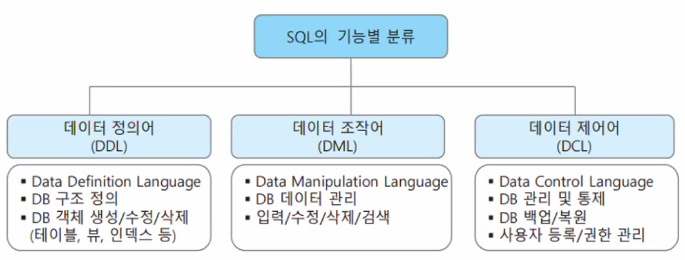
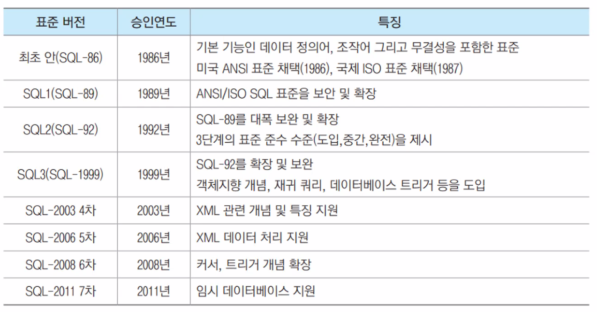

# SQL 정의 및 분류
- SQL(Structured Query Language)
    - 관계형 데이터베이스 표준 언어로서 가장 많이 사용되는 데이터 언어
        - system R 이라는 실험용 DBMS를 위한 데이터언어로 IBM 연구소에서 처음 개발
        - 현재는 미국 표준과 국제표준 관계형 데이터베이스 표준 언어로 승인
    - ORACLE, MS SQL-Server, MySQL 등 거의 모든 관계형 DBMS가 지원
- SQL을 구성하는 3가지 부속 언어의 분류와 관련 주요 기능

- SQL 표준의 역사


# MySQL 설치 및 실습
```SQL
CREATE TABLE `tbl_subject` (
	`sub_no` char(4) Not null,
    `sub_name` varchar(20) Not null,
    `sub_classroom` char(3) Not null,
    `sub_dept` varchar(20) Not null,
    `sub_time` int Not null,
	PRIMARY KEY (`sub_no`)
);

-- CREATE TABLE `tbl_sugang` (
-- 	`sugang_std_id` char(4) Not null,
--     `sugang_sub_no` char(4) Not null,
--     `sugang_date` date Not null,
--     `sugang_midscore` int Not null,
--     `sugang_finalscore` int Not null,
--     `sugang_mark` char(2) Not null,
-- 	PRIMARY KEY (`sugang_std_id`, `sugang_sub_no`)
-- );
CREATE TABLE tbl_signup
	( id_students char(6) NOT NULL,
	  sub_no CHAR(4) NOT NULL,
	  regist_date DATE NOT NULL,
	  mid_score INT NULL DEFAULT 0,
	  final_score INT NULL DEFAULT 0, 
	  sign_grade CHAR(1) NULL,        
	  PRIMARY KEY(id_students, sub_no) ) ;
      
INSERT INTO tbl_subject 
VALUES ();

INSERT INTO tbl_subject 
VALUES (
	('c001', '데이터베이스', '126', '컴퓨터', 3)
    
    );
    
INSERT INTO tbl_subject 
VALUES 
    ('c002', '정보보호', '137', '정보통신', 3),
    ('c003', '모바일웹', '128', '컴퓨터', 3),
    ('c004', '철학개론', '117', '철학', 2),
    ('c005', '전공글쓰기', '120', '교양학부', 1)
    ;

INSERT INTO tbl_students
VALUES ('s001', '김연아', '서울 서초', 4, 23, '여', '010-1111-2222',  '컴퓨터') ;
INSERT INTO tbl_students
VALUES ('s002', '홍길동', DEFAULT, 1, 26, '남', NULL,  '통계') ;
INSERT INTO tbl_students
VALUES ('s003', '이승엽', NULL, 3, 30, '남', NULL,  '정보통신') ;
INSERT INTO tbl_students
VALUES ('s004', '이영애', '경기 분당', 2, NULL, '여', '010-4444-5555', '정보통신') ;
INSERT INTO tbl_students
VALUES ('s005', '송윤아', '경기 분당', 4, 23, '여', '010-6666-7777', '컴퓨터') ;
INSERT INTO tbl_students
VALUES ('s006', '홍길동', '서울 종로', 2, 26, '남', '010-8888-9999', '컴퓨터') ;
INSERT INTO tbl_students
VALUES ('s007', '이은진', '경기 과천', 1, 23, '여', '010-2222-3333', '경영') ;

INSERT INTO tbl_signup
VALUES ('s001', 'c002', '2019-09-03', 93, 98, 'A') ;
INSERT INTO tbl_signup
VALUES ('s004', 'c005', '2019-03-03', 72, 78, 'C') ;
INSERT INTO tbl_signup
VALUES ('s003', 'c002', '2017-09-06', 85, 82, 'B') ;
INSERT INTO tbl_signup
VALUES ('s002', 'c001', '2018-03-10', 31, 50, 'F') ;
INSERT INTO tbl_signup
VALUES ('s001', 'c004', '2019-03-05', 82, 89, 'B') ;
INSERT INTO tbl_signup
VALUES ('s004', 'c003', '2020-09-03', 91, 94, 'A') ;
INSERT INTO tbl_signup
VALUES ('s001', 'c005', '2020-09-03', 74, 79, 'C') ;
INSERT INTO tbl_signup
VALUES ('s003', 'c001', '2019-03-03', 81, 82, 'B') ;
INSERT INTO tbl_signup
VALUES ('s004', 'c002', '2018-03-05', 92, 95, 'A') ;

SELECT * FROM tbl_students;
SELECT * FROM univdb.tbl_signup;
SELECT database();

SHOW TABLES;
DESC tbl_students;

-- SELECT 
SELECT students_name, students_add
FROM univdb.tbl_students;

SELECT DISTINCT students_dep
FROM univdb.tbl_students;

SELECT DISTINCT students_dep
FROM univdb.tbl_students
WHERE students_grade > 1;

SELECT students_name, students_grade, students_dep, students_phone
FROM univdb.tbl_students
WHERE (students_grade>=1 AND students_grade<=3) OR NOT (students_dep='컴퓨터');

SELECT students_name, students_grade, students_dep, students_phone
FROM univdb.tbl_students
WHERE (students_grade BETWEEN 1 AND 3) OR NOT (students_dep='컴퓨터');

-- ORDER BY
-- SELECT[DISTINCT|ALL] 열_리스트
-- FROM 테이블_리스트
-- [ORDER BY {정렬_기준열 [ASC|DESC][.]}];

SELECT students_name, students_grade, students_dep
FROM tbl_students
WHERE students_dep='컴퓨터' OR students_dep='정보통신'
ORDER BY students_grade ASC;
 
SELECT *
FROM tbl_students
ORDER BY students_grade ASC, students_name DESC;

SELECT *
FROM tbl_students
ORDER BY students_grade ASC, students_name DESC
LIMIT 3;
-- 첫 3개

SELECT *
FROM tbl_students
ORDER BY students_grade DESC, students_name ASC
LIMIT 3;
-- 마지막 3

-- 집계함수 사용(aggregate function)
-- 기본 집계 함수
-- COUNT(열이름), MAX(열이름), MIN(열이름), SUM(열이름), AVG(열이름)

-- 전체 학생수 
SELECT COUNT(*)
FROM tbl_students;

-- 학번 수 카운트
SELECT COUNT(id_students)
FROM tbl_students; 

SELECT COUNT(*) AS 학생수1, COUNT(students_add) AS 학생수2, COUNT(DISTINCT students_add) AS 학생수3
FROM tbl_students;
-- 7, 5, 4 

SELECT AVG(students_age) '여학생 평균나이'
-- AS 생략가능 
FROM tbl_students
WHERE students_sex='여';
-- 23

SELECT * FROM tbl_students;

-- GROUP BY
-- SELECT [DISTINCT|ALL] 열리스트
-- FROM 테이블리스트
-- [GROUP BY 그룹_기준열_리스트]
-- [HAVING 그룹_조건식];

-- 전체 학생의 성별 최고 나이와 최저 나이 
SELECT students_sex, MAX(students_age) AS '최고나이', MIN(students_age) AS '최저나이'
FROM tbl_students
GROUP BY students_sex;

-- 20대 학생 나이별 학생 수 
SELECT students_age, COUNT(*) AS '나이별 학생수'
FROM tbl_students
WHERE students_age>=20 and students_age<30
GROUP BY students_age;

SELECT students_age, COUNT(*) AS '나이별 학생수'
FROM tbl_students
WHERE students_age BETWEEN 20 and 29
GROUP BY students_age;

-- HAVING
-- GROUP BY절을 통해 생성된 그룹중에서 특정조건을 만족하는 그룹으로 검색을 제한
SELECT students_grade, COUNT(*) AS '학년별 학생수'
FROM tbl_students
GROUP BY students_grade;

SELECT students_grade, COUNT(*) AS '학년별 학생수'
FROM tbl_students
GROUP BY students_grade 
HAVING COUNT(*) >=2;

-- LIKE 문자 연산자 검색: '_', '%' 와일드카드
-- _: 문자열 중 특정 위치에 1개의 모든 문자를 허용
-- %: 문자열 중 임의 위치에 0개 이상의 모든 문자열을 허용

SELECT id_students, students_add
FROM tbl_students 
WHERE students_name LIKE '이__';

SELECT students_name, students_add, students_grade
FROM tbl_students
WHERE students_add LIKE '%서울%'
ORDER BY students_grade DESC;

-- 폰 중간자리 4 2번나오는 사람 전체 정보
SELECT *
FROM tbl_students
WHERE students_phone LIKE '%44%';

-- 학생 테이블에서 학과가 정보통신이 아닌 학생 이름과 학과
SELECT students_name, students_dep
FROM tbl_students
WHERE students_dep != '정보통신';

-- 소속학과가 '컴퓨터', '통계'학과인 학생들의 이름, 주소, 나이에 대해 나이의 순위를 출력하는데, 순위항목을 만들어서 출력하시오.
SELECT students_name, students_add, students_age, RANK() OVER(ORDER BY students_age ASC) AS rank_age
FROM tbl_students
WHERE students_dep = '통계' OR students_dep = '컴퓨터';

SELECT *
FROM tbl_students
```