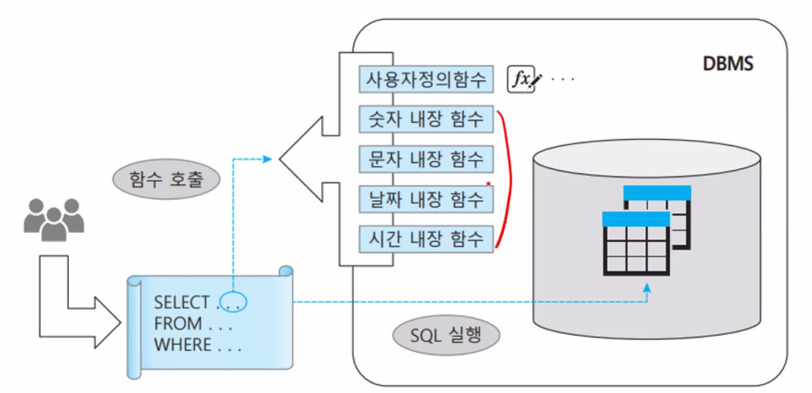
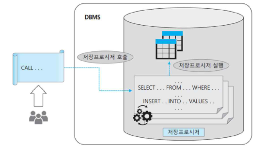
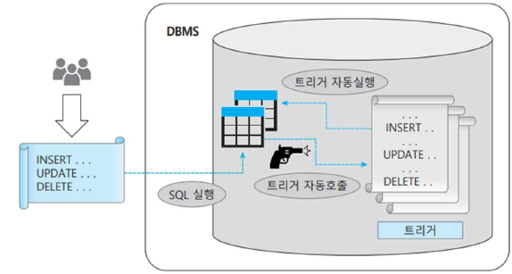
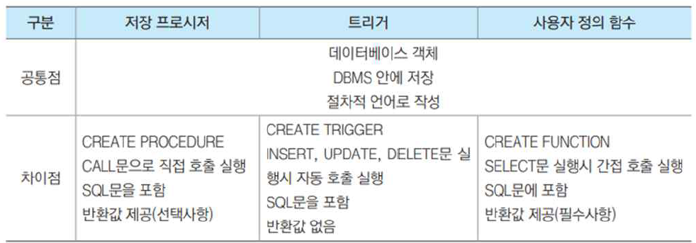
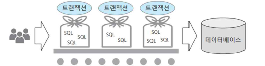
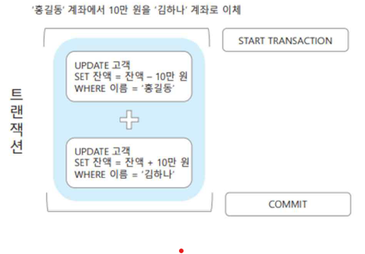
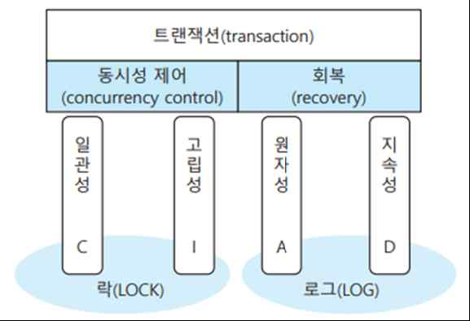
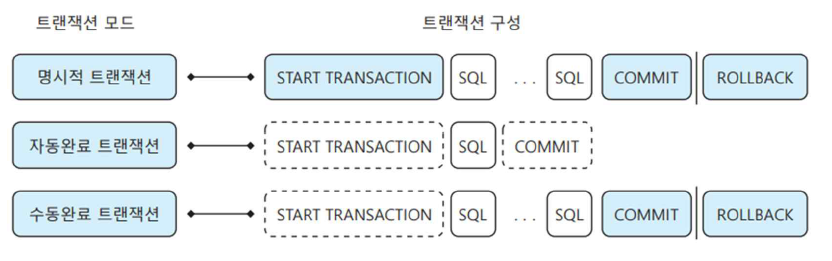
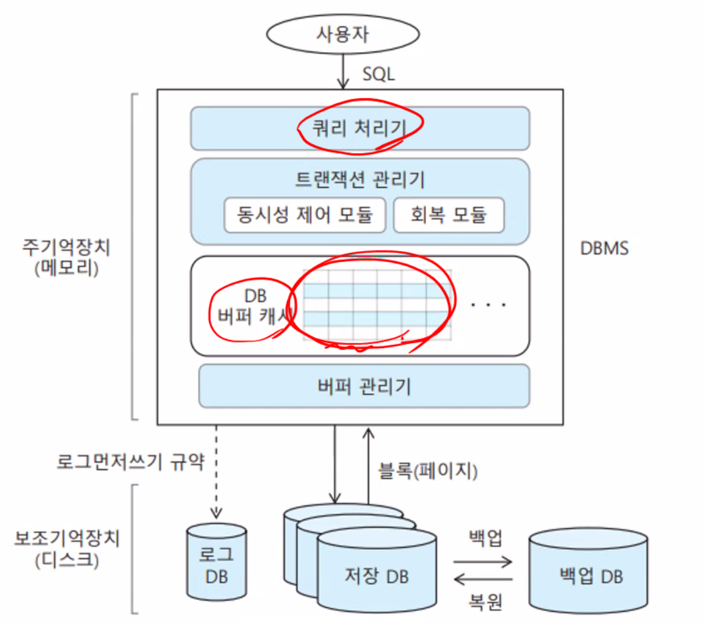
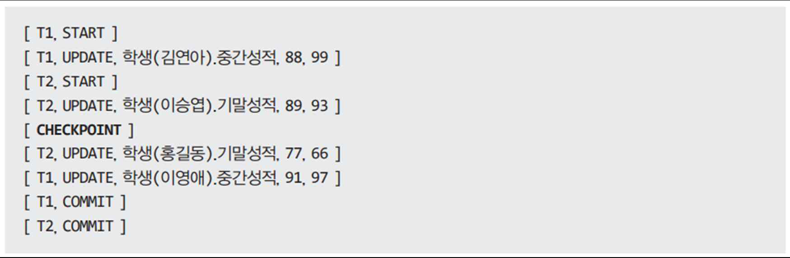

 ## 내장함수
 ### 내장함수의 개요
 1. SQL 내장함수
 - 내장함수(built-in function)과 사용자 정의함수(user-defined function) 구분
 - 열이름이나 상수값을 입력받아 값 하나를 결과로 반환
 - 기본 연산 함수와 시스템 정보 제공 함수, 데이터 가공 함수 등을 지원
 - SELECT절이나 WHERE절, UPDATE SET 절에서도 사용가능
 
 2. 주요 내장함수
 - 숫자함수
    - ABS(값): 입력값의 절대값 반환
    - CEIL(값): 입력값보다 큰 정수 중에서 가장 작은 수 반환(올림)
    - FLOOR(값): 입력값보다 작은 정수 중에서 가장 큰 수 반환(내림)
    - ROUND(값, 자리수): 입력값을 소수점이하 자리수까지 반올림한 값 반환
    - FORMAT(값, 형식): 입력값을 형식에 맞게 변환하여 반환
 - 문자함수
    - LENGTH(문자열): 문자열의 길이(바이트수)를 반환
    - CHAR_LENGTH(문자열): 문자열의 길이(문자수)를 반환
    - LEFT/RIGHT(문자열, 길이): 문자열의 왼쪽/오른쪽부터 길이만큼 반환
    - CONCAT(문자열리스트): 콤마로 구분된 문자열, 컬럼 값들의 결합 반환
    - LTRIM/RTRIM(문자열): 문자열의 왼쪽/오른쪽 공백을 제거하여 반환
    - SUBSTRING(문자열,위치,길이): 문자열의 위치번째부터 길이 개수만큼의 부분 문자열 반환
    - REPLACE(문자열, 검색문자열, 치환문자열): 문자열의 일부를 치환하여 반환
    - REPEAT(문자열, 반복횟수): 문자열을 반복 횟수만큼 반복하여 반환
 - 날짜/시간함수
    - SYSDATE(), NOW(): 현재 날짜와 시간을 반환
    - CURRENT_DATE(): 현재 날짜를 반환
    - CURRENT_TIME(): 현재 시간을 반환
    - YEAR(날짜)/MONTH(날짜)/DAY(날짜): 입력날짜의 연도/월/일 부분을 반환
    - HOUR(시간)/MINUTE(시간)/SECOND(시간): 입력시간의 시/분/초 부분을 반환
    - LAST_DAY(날짜): 입력 날짜의 해당 월의 마지막 날짜를 반환
    - DATE_ADD(날짜, INTERVAL 증분값 DAY/MONTY/YEAR): 입력날짜에서 증분값만큼 날/월/년을 더한 날짜를 반환
    - DATE_SUB(날짜, INTERVAL 감소값 DAY/MONTY/YEAR): 입력날짜에서 감소값만큼 날/월/년을 뺀 날짜를 반환
    - DATE_FORMAT(날짜, '형식'): 입력날짜를 형식에 맞게 변환하여 반환
 3. 내장함수의 적용
 - 숫자함수
 ```SQL
 SELECT ABS(+17), ABS(-17), CEIL(3.28), FLOOR(4.259);

 SELECT 학번, SUM(기말성적)/COUNT(*), ROUND(SUM(기말성적)/COUNT(*), 2)
 FROM 수강
 GROUP BY 학번
 ```
- 문자함수
```SQL
SELECT LENGTH(소속학과), RIGHT(학번,2), REPEAT('*',나이), CONCAT(소속학과, '학과')
FROM 학생;

SELECT SUBSTRING(주소,1,2), REPLACE(SUBSTRING(휴대폰번호,5,9),'-','.')
```
- 날짜, 시간함수
 ```SQL
  SELECT 신청날짜, LAST_DAY(신청날짜)
 FROM 수강
 WHERE YEAR(신청날짜)='2019';

 SELECT SYSDATE(), DATEDIFF(시넝날짜, '2019-01-01')
 FROM 수강;

 SELECT 신청날짜, DATE_FORMAT(신청날짜, '%b/%d/%y'), DATE_FORMAT(신청날짜, '%y년%c월%e일')
 FROM 수강;
 ```

## 저장프로시저
1. 저장 프로시저(stored procedure)의 개념
    - 미리 작성하여 데이터베이스 안에 저장한 SQL 문장들의 묶음
    - 독립된 프로그램으로 데이터베이스 안에 하나의 객체로 저장
    - 장점: 최적화된 sql문을 미리 데이터베이스에 저장해둘 수 있고 복잡한 sql문을 저장할 필요가 없어 네트워크 부하가 줄어들며 여러 응용 프로그램간의 공유가 가능함
    
2. 저장 프로시저 생성형식(CREATE PROCEDURE문)
    ```SQL
    CREATE PROCEDURE 프로시저_이름
    BEGIN
    ---
        SQL 명령문;
    ---
    END
    ```
3. 삽입/수정 저장 프로시저 생성/호출
    ```SQL
    -- 삽입/수정 저장 프로시저 생성
    DELIMITER //
    CREATE PROCEDURE InsertOrUpdateCourse (
    IN CourseNo VARCHAR(4),
    IN CourseName VARCHAR(20),
    IN CourseRoom CHAR(3),
    IN CourseDept VARCHAR(20),
    IN CourseCredit INT)
    
    BEGIN
    DECLARE Count INT ;
    SELECT COUNT(*) INTO Count FROM tbl_subject WHERE sub_no = CourseNo ;
    IF (Count = 0) THEN
        INSERT INTO tbl_subject(sub_no, sub_name, sub_classroom, sub_dept, sub_time)
        VALUES(CourseNo, CourseName, CourseRoom, CourseDept, CourseCredit) ;
    ELSE
        UPDATE tbl_subject
        SET sub_name = CourseName, sub_classroom = CourseRoom, sub_dept = CourseDept, sub_time = CourseCredit
        WHERE sub_no = CourseNo ;
    END IF ;
    END //
    DELIMITER ;

    -- 삽입 저장 프로시저 호출
    -- 예제 7-2 InsertOrUpdateCourse 저장 프로시저를 호출하여 과목 테이블에 연극학개론을 등록하시오
    CALL InsertOrUpdateCourse('c006', '연극학개론', '310', '교양학부', 2) ;
    SELECT * FROM tbl_subject ;

    -- 수정 저장 프로시저 호출
    -- 예제 7-3 InsertOrUpdateCourse 저장 프로시저를 호출하여 '과목'테이블의 '연극학개론 과묵 강의실을 410으로 수정하시오
    CALL InsertOrUpdateCourse('c006', '연극학개론', '410', '교양학부', 2) ;
    SELECT * FROM tbl_subject ;
    ```
4. 검색 저장 프로시저 생성/호출
    ```SQL
    -- 검색 저장 프로시저 생성
    -- 예제 7-4 수강 테이블에서 중간성적 혹은 기말 성적으로 특정 점수 이상을 받은 학생수를 반환하는 SelectAverageOfBestScore 프로시저 작성
    DELIMITER //
    CREATE PROCEDURE SelectAverageOfBestScore (
    IN Score INT,
    OUT Count INT)

    BEGIN
    DECLARE NoMoreData INT DEFAULT FALSE ;
    DECLARE Midterm INT ;
    DECLARE Final INT ;
    DECLARE Best INT ;
    DECLARE ScoreListCursor CURSOR FOR -- CURSOR
        SELECT mid_score, final_score
        FROM tbl_signup ;
    DECLARE CONTINUE HANDLER FOR NOT FOUND SET NoMoreData = TRUE ; -- 마지막 행일때, 모두 다 가져왔다는 것을 표시해줌
        SET Count = 0 ;
    OPEN ScoreListCursor ;
    REPEAT
        FETCH ScoreListCursor INTO Midterm, Final ;
        IF Midterm > Final THEN
            SET BEST = Midterm ;
        ELSE
            SET BEST = Final;
        END IF ;
        IF (Best >= Score) THEN
            SET Count = Count + 1 ;
        END IF ;
    UNTIL NoMoreData END REPEAT ; 
    CLOSE ScoreListCursor ;
    END ;
    //
    DELIMITER ;

    -- 검색 저장 프로시저의 호출
    -- 예제 7-5
    CALL SelectAverageOfBestScore(85, @Count) ;
    SELECT @Count  ;
    ```
5. 저장 프로시저 삭제
    ```SQL
    -- 저장 프로시저의 삭제 형식
    DROP PROCEDURE 프로시저이름 ;
    -- SHOW CREATE PROCEDURE InsertOrUpdateCourse ;

    -- 예제 7-6 InhsertOrUpdateCourse 프로시저를 삭제하시오
    DROP PROCEDURE InsertOrUpdateCourse ;
    SHOW CREATE PROCEDURE InsertOrUpdateCourse ;
    ```
## 트리거(trigger)
1. 트리거의 개념
    - 데이터 변경 등 명세된 이벤트 발생시 감지하여 자동 실행되는 사용자 정의 프로시저
    - INSERT, UPDATE, DELETE 명령문의 실행 직전·후 자동으로 호출되어 실행
    - 보통 무결성 제약 조건을 유지하거나 업무 규칙 등을 적용하기 위해 사용
    
2. 트리거 생성 명령문 형식
    ```SQL
    -- 트리거 생성 명령문 형식
    CREATE TRIGGER 트리거이름
    ([BEFORE|AFTER][INSERT|UPDATE|DELETE] ON 테이블이름 FOR EACH ROW)
    BEGIN
    --
       SQL 명령문 ;
    --
    END
    ```
    - 트리거 참조 테이블 OLD & NEW
        - 테이블에 어떤 처리가 이루어지기 직전과 직후의 값들을 저장하는 특별한 테이블
3. 트리거 생성 예제
    ```SQL
    DELIMITER //
    CREATE TRIGGER AfterInsertStu
    AFTER INSERT ON tbl_students FOR EACH ROW
    BEGIN
    IF (NEW.students_sex='남') THEN
        UPDATE total_count SET tbl_count = tbl_count+1 WHERE tbl_sex='남' ;
    ELSEIF (NEW.students_sex='여') THEN
        UPDATE total_count SET tbl_count = tbl_count+1 WHERE tbl_sex='여' ;
    END IF ;
    END ;
    //
    DELIMITER ;
    ```
4. 트리거 실행
    ```SQL
    INSERT INTO tbl_students
    VALUES ('s008', '최동석', '경기 수원', 2, 26, '남', '010-8888-6666', '컴퓨터') ;


    SELECT * FROM tbl_students ;
    SELECT * FROM total_count ;
    ```    
5. 트리거 삭제
    ```SQL
    SHOW TRIGGERS ; -- 트리거를 보여줌
    DROP TRIGGER AfterInsertStu ; -- 트리거를 삭제
    ```
## 사용자 정의 함수
1. 사용자 정의 함수(user defined function)
- 사용자가 직접 정의한 함수로 DBMS 안에 독립된 데이터베이스 객체로 저장
- SELECT문이나 프로시저 안에서 호출되어 특정 기능을 수행하고 결과 값을 반환하는 용도로 사용
    - 스칼라 함수는 하나의 값 또는 NULL을 반환
    - 테이블 함수는 각 행이 하나 이상의 열로 구성된 테이블을 반환
2. 사용자 정의 함수를 생성 형식
    ```SQL
    CREATE FUNCTION 함수명(매개변수 매개변수_자료형)
    RETURNS 반환값_자료형
    BEGIN
    ---
        SQL 명령문 ;
    ---
        RETURN 반환값 ;
    END
    ```
3. 사용자 정의 함수 예제
    ```SQL
    -- 사용자 정의 함수 정의
    -- 예제7-9 수강 테이블에서 학생의 학점이 A이면 최우수 B이면 우수, C이면 보통, D나 F이면 미흡으로 변환하여 반환하는 사용자 정의함수를 작성하시오
    DELIMITER //
    CREATE FUNCTION Fn_Grade( grade CHAR(1) )
    RETURNS VARCHAR(10)
    DETERMINISTIC READS SQL DATA -- ERROR 1418 발생을 막기 위해
    BEGIN
        DECLARE ret_grade VARCHAR(10) ;
        IF ( grade = 'A' ) THEN
        SET ret_grade = '최우수' ;
        ELSEIF ( grade = 'B' ) THEN
        SET ret_grade = '우수' ;
        ELSEIF ( grade = 'C' ) THEN
        SET ret_grade = '보통' ;
        ELSEIF ( grade = 'D' OR grade = 'F' ) THEN
        SET ret_grade = '미흡' ;   
        END IF ;
        RETURN ret_grade ;
    END 
    //
    DELIMITER ;
    ```
    - 1418 error code 해결방법
        - show global variables like 'log_bin_trust_function_creators'; -> 변수 0으로 되어있음
    1. SET GLOBAL log_bin_trust_function_creators = 1; 설정
        - SET GLOBAL log_bin_trust_function_creators = 0;
    2. DETERMINISTIC READS SQL DATA를 RETURNS 뒤에 넣어줌
4. 사용자 정의 함수 적용
    ```SQL
    SELECT id_students, sub_no, sign_grade, Fn_Grade(sign_grade) '평가등급'
    FROM tbl_signup ;
    ```
5. 사용자 정의 함수 삭제
    ```SQL
    SHOW CREATE FUNCTION Fn_Grade ;
    DROP FUNCTION Fn_Grade ;
    ```

### 저장프로시저, 트리거, 사용자 정의 함수의 비교

1. 저장 프로시저
- 여러 응용 프로그램 사이에 공유함으로써 처리의 일관성 향상과 보안 강화
- 전송되는 SQL 명령문의 양을 줄이고 미리 컴파일된 코드를 호출함으로써 반복적인 처리시성능 향상
2. 트리거
- 복잡한 데이터 무결성을 강화, 다양한 데이터 처리 업무 규칙을 구현
- 성능이 다소 저하될 수 있음
2. 사용자 정의 함수
- 특정 값뿐만 아니라 테이블도 반환할 수 있어 제한된 SQL 명령문의 기능을 확장시키고 명령문 작성
의 편의성을 향상시킴


## 트랜잭션(transaction)
1. 트랜잭션의 개념
- 한 묶음으로 처리되어야 하는 SQL 명령문들의 집합
    - 트랜잭션에 속한 SQL 명령문들은 모두 정상 처리되어야 함께 완료되며 하나의 명령문이라도 오류가 발생하면 전체를 취소함
    - 커밋되기전까지는 데이터베이스에 반영되지 않음
    
- START TRANSATION -> COMMIT 으로 끝남
- 커밋(COMMIT): 정상종료
    - 트랜잭션의 실행 결과를 데이터베이스에 최종적으로 반영하는 것
    - 임시로 실행 처리한 **트랜잭션의 실행 결과를 실제 데이터베이스에 반영하는 명령**
- 롤백(ROLLBACK)
    - 실행 결과를 반영하지 않고 취소하여 **원래 상태로 되돌리는 것**
    - 롤백이 가능하므로 커밋되기 전까지는 데이터베이스에 완전하게 반영되었다고 확신할 수 없는 임시 실행 결과일 뿐임

2. 트랜잭션의 예
- 2개의 UPDATE문으로 구성된 '계좌이체' 트랜잭션의 예
    
    - 2개의 UPDATE문은 모두 실행되어야하고, 둘 중 하나의 UPDATE문만 실행되어서는 곤란하므로 트랜잭션으로 묶어 처리해야 함
    - `START TRANSACTION` 명령문과 `COMMIT` 명령문으로 2개 UPDATE문을 둘러쌈으로써 트랜잭션을 구성
- DB에 동시 접근시 발생할 수 있는 문제(동시성문제)를 방지하기 위해 이용

3. 트랜잭션의 특성 (ACID)
- 원자성(Atomicity)
    - 트랜잭션 안의 SQL 명령문을 모두 성공적으로 실행하여 완료하거나 아니면 모두 철회하여 무효화해야함을 의미
        - `'전부 혹은 전무(all or nothing)'` 실행 규칙을 적용
        - 만약 장애가 발생한다면 장애 발생 시점에 이미 정상 완료되어 커밋된 트랜잭션은 제외하고 완료되지 않은 트랜잭션은 모두 취소시킴
- 일관성(Consistency)
    - 데이터베이스가 트랜잭션 실행 전의 일관된 상태에서 `트랜잭션 실행 후에도 또 다른 일관된 상태로 전환되어야함`을 의미
- 고립성(Isolation)
    - 커밋될 때까지 트랜잭션이 수행한 `임시 실행 결과가 다른 트랜잭션에게 공개되지 않아야함`을 의미
- 지속성(Durability)
    - 일단 트랜잭션이 `커밋되면 그 트랜잭션의 실행 결과는 장애가 발생하더라도 보존되어야함`을 의미
4. 트랜잭션의 특성과 기법

5. 트랜잭션 지원 DBMS 모듈
- 동시성 제어(concurrency control) 모듈(CCM)
    - 동시에 실행되는 트랜잭션 간의 간섭을 제어
    - 최종적으로 각 트랜잭션이 순차적으로 실행한 결과와 동일한 `고립성` 결과를 보장하고 트랜잭션 실행 이전과 이후의 데이터베이스 `일관성`이 항상 유지되도록 함
    - 대표적 동시성 제어 기법은 `락킹(locking)`
- 회복(recovery) 모듈(RM)
    - 완전한 트랜잭션 결과의 복구를 보장
    - 장애 발생 시 트랜잭션 실행의 `원자성`을 보장하고 커밋된 트랜잭션의 결과는 반드시 데이터베이스에 반영되도록 `지속성`을 지원
    - 대표적인 회복 기법은 `로깅(logging)`
6. 트랜잭션의 종류
- 트랜잭션은 설정모드에 따라 3가지 트랜잭션으로 구분

    - 명시적 트랜잭션
        - 트랜잭션의 시작과 끝을 사용자가 직접 명시적으로 지정하는 트랜잭션
        - `'사용자 트랜잭션' 또른 '수동 트랜잭션'`
        - 명시적 트랜잭션 정의 형식
            ```SQL
            START TRANSACTION ;
            ---
            SQL 명령문 ;
            ---
            {COMMIT|ROLLBACK} ;
            -- ROLLBACK: 모든 작업내용을 취소하고 이전 상태로 돌아감(작업 중 장애, 에러 발생 시)
            ```
        - 명시적 트랜잭션 적용 예
            ```SQL
            START TRANSACTION ;
                DELETE FROM 학생 WHERE 성별 = '남' ;
                SELECT * FROM 학생 ;
            ROLLBACK ;
            SELECT * FROM 학생 ;
            ```
    - 자동완료 트랜잭션
        - SQL문 하나를 독립된 하나의 트랜잭션으로 자동 정의하고 SQL문의 실행 결과에 따라 자동으로 커밋 또는 롤백하는 트랜잭션
        - 기본 모드의 트랜잭션, `'시스템 트랜잭션'`
        - DBMS가 각 SQL 문장 앞뒤에 `START TRANSACTION`문과 `COMMIT`문 또는 `ROLLBACK`문을 자동으로 붙여 실행
        - 자동완료 트랜잭션 설정
            ```SQL
            SELECT @@AUTOCOMMIT ;
            SET AUTOCOMMIT=1 ;
            ```
            - `'@@AUTOCOMMIT'`은 트랜잭션 모드 설정 값을 저장하고 있는 시스템 변수 
            - 값이 `1이면 자동완료 모드가 설정`된 것
        - 자동완료 트랜잭션 적용 예
            ```SQL
            INSERT INTO 과목 
            VALUES ('c007', '영어회화', '333', '교양학부', 3) ;
            SELECT * FROM 과목 ;
            ROLLBACK ;
            SELECT * FROM 과목 ;
            ```
    - 수동완료 트랜잭션 (트랜잭션이 끝부분만 사용자가 설정)
        - 트랜잭션의 끝만 사용자가 직접 명시적으로 지정하는 트랜잭션
        - `'암시적(implicit) 트랜잭션'`
        - 다음 명령문 실행하면 START TRANSACTION 명령문 없이도 트랜잭션이 자동으로 시작
            - `CREATE, ALTER, INSERT, UPDATE, DELETE, SELECT, DROP, FETCH, GRANT, OPEN, REVOKE, TRUNCATE TABLE`
        - 수동완료 트랜잭션 설정
             ```SQL
            SELECT @@AUTOCOMMIT ;
            SET AUTOCOMMIT=0 ;
            ```
            - 다음과 같이 수동완료 모드를 설정하면 START TRANSACTION 명령문은 필요 없으나 `SQL문 뒤에 COMMIT 명령문이나 ROLLBACK 명령문은 반드시 명세해야 함`
        - 수동완료 트랜잭션 적용 예
        ```SQL
        DELETE FROM 과목 
        WHERE 이름 = '연극학개론' ;
        INSERT INTO 과목 VALUES ('c008', '독서와토론', '111', '교양학부', 2) ;
        SELECT * FROM 과목 ;
        ROLLBACK ;
        SELECT * FROM 과목 ;
        SET AUTOCOMMIT = 1 ;
        ```

7. 트랜잭션과 로그
- DBMS의 트랜잭션 처리 과정

- 트랜잭션 로그
    - 로그 데이터베이스에 기록되는 트랜잭션 로그의 기본 구조
        - 로그 일련번호를 포함하여 트랜잭션_식별자와 START, COMMIT, ROLLBACK, 명령문 유형과 변경 내용 등을 기록
            ```
            [트랜잭션_식별자, 로그_유형, 데이터_항목, 변경전_값, 변경후_값]
            ```
    - 트랜잭션 로그의 예
    
- 체크포인트(check point)
    - '검사점'
    - 특정 시점까지의 데이터 버퍼 안의 모든 변경 내용을 데이터베이스 파일에 물리적으로 저장하는 시점
    - 장애 발생 시 복구 작업량을 줄이기 위해서 주기적으로 동기화를 수행
    - 체크 포인트 역시 로그에 기록
- 체크 포인트 시점에는 버퍼 캐시 안의 데이터와 디스크 안의 저장 데이터베이스가 100% 일치하는 동기화가 수행
    - 체크 포인트가 트랜잭션 로그에 기록되는 순간 모든 데이터 버퍼 안의 데이터들이 데이터베이스 파일에 쓰여짐
    - 회복 대상을 마지막 체크 포인트 시점 이후의 로그 내용으로만 제한시킴