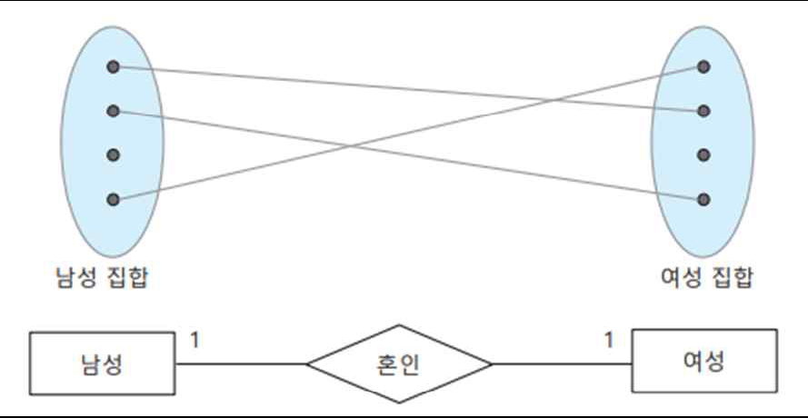
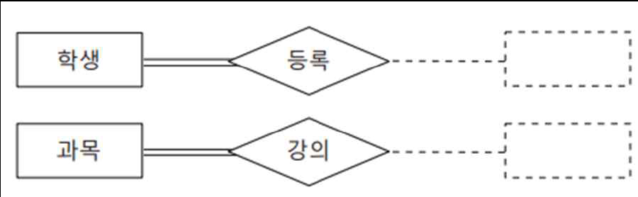

## 트랜잭션
### 트랜잭션과 로그
1. 로그를 이용한 회복 기법(recovery)
- 회복의 기본 개념
- 장애 발생 시점에 이미 `커밋된 트랜잭션의 변경 내용은 로그를 이용하여 반드시 데이터베이스에 반영`함. 반면 커밋되지 못하고 중단된 트랜잭션의 실행 결과는 철회되어야 함
- 트랜잭션 로그를 이용한 회복 기법의 적용 과정
    - 로그 기록의 역순으로 이전 상태로 되돌리는 취소(redo) 작업을 진행
    - 마지막 체크 포인트 이후의 커밋되지 않은 트랜잭션의 로그 내용들은 모두 롤백 즉, 순서의 역순으로 취소
    - 반대로, 장애 발생 시점까지 정상적으로 종료된 트랜잭션의 실행 결과를 보장하기 위해서는 로그 기록의 순서대로 다시 실행하는 재실행(redo)작업을 진행
    - 마지막 체크포인트 이후의 커밋된 트랜잭션의 로그 내용들은 모드 롤포워드(rollforward) 즉, 로그 순서대로 재실행

- 지연 갱신(deferred update) 모드 가정
    - 트랜잭션 로그 기반 회복의 예
    
    
### 트랜잭션과 로크(LOCK)
- 데이터베이스는 적절한 절차없이 동시 접근을 허용할 경우, 심각한 문제 발생 가능
- 로크(잠금) - 다중 사용자 환경에서 동시 접근을 올바르게 제어하기 위한 대표젹 기법
1. 로크의 개념
    - `바람직한 동시성(concurrency)`이란 2개 이상의 트랜잭션을 동시에 실행하는 비직렬 스케쥴(nonserial schedule)의 결과가 트랜잭션을 뒤섞지 않고 순차적으로 실행하는 `직렬 스케쥴(serial schedule)의 결과와 같도록 보장`하는 것임
    - 이를 보장하는 트랜잭션 스케쥴을 `'직렬 가능(serializable)'`이라고 함
    - 직렬 가능성(serializability)을 보장하기 위한 방법 중 하나가 `로크를 이용`하는 것
2. 로크(lock) 또는 잠금
    - `데이터베이스의 데이터를 다른 사용자가 접근하지 못하도록 잠그는 것`
    - 다수 트랜잭션의 동시 처리를 보장하는 동시성 제어 기법 중 대표적인 기법
    - `트랜잭션 내에서 데이터에 SQL 명령문을 실행하기 전에 반드시 해당 데이터에 로크를 설정(lock)하여 잠궈`야 함
    - 설정된 로크는 SQL 명령문 실행 직후가 아닌 `트랜잭션 커밋 혹은 롤백이 실행됨과 동시에 일제히 해제(unlock)`
3. 로크의 종류
- 로크의 종류
- 공유 로크(shared lock)
    - 데이터를 검색하는 `SELECT문을 실행하기 위한 읽기 전용 로크`
    - `읽기만 가능`하고 수정은 불가능
    - 공유 로크가 설정된 데이터에 대해서는 `추가적으로 공유 로크 설정 가능`
- 독점 로크(exclusive lock)
    - `INSERT, UPDATE, DELETE문과 같은 데이터 변경을 위한 배타적 로크`
    - 특정 데이터에 대해서 오직 하나의 트랜잭션만 독점 로크를 설정
    - 이미 독점 로크가 설정되어 있을 경우, 공유 로크도 독점 로크도 모두 추가 설정 불가능
    - 데이터에 대한 `모든 공유 로크와 독점 로크가 해제된 이후에만 독점 로크 설정 가능`

4. 로크 설정과 해제
- 로크 단위와 로크 설정
    - 데이터베이스 안의 모든 데이터를 접근할 때는 먼저 로크 테이블(lock table) 안에 해당 데이터에 대한 로크 정보를 기록
    - 로크 단위(lock granularity) : 로크 잠금 대상의 크기
        - 테이블 행 단위나 테이블, 데이터베이스 단위로 로크 설정 가능
        - `로크 단위가 커지면 관리는 쉬워지지만 로크의 충돌이 자주 발생`함
        - 로크를 어느 단위로 설정하고 해제할지를 결정하는 것도 결정해야 하는 중요한 문제
- 로크 양립성 (lock compatability)
    - 독점 로크와 공유 로크 2가지 유형의 로크 사이에 서로 추가 잠금 허용 여부를 결정하는 규칙
    
5. 2-단계 로킹 규약(2-phased locking protocol)
- 각 트랜잭션별로 `로크를 설정하는 과정과 로크를 해제하는 과정 2단계로 진행함으로써 필요한 순간까지 획득한 로크를 유지하도록 하는 규칙`
    - **1단계: 로크 확장 단계(growing phase)**
        - 접근하고자 하는 `데이터에 대한 모든 로크를 획득할 때까지 새로운 로크를 지속적으로 요청하여 잠금을 설정`
        - 보유하고 있는 로크를 해제할 수는 없고 `로크를 추가로 획득할 수만 있음`
    - **2단계: 로크 축소 단계(shrinking phase)**
    - 필요로 하는 모든 로크를 획득하는 시점인 `로크 포인트(lock point)가 되면 보유하고 있던 로크를 점차적으로 해제`
        - 일단 하나라도 로크를 해제하기 시작하면 `다시 새로운 로크를 요청할 수는 없음`

- 로크 진행으로 `교착상태가 발생할 수 있음`
    - 진행되는 시간이 가장 짧은 트랜잭션을 강제 롤백하고, 다른 트랜잭션을 커밋 후 다시 진행시킴

6. 트랜잭션의 고립수준
- 트랜잭션의 고립 수준
    - 로크 설정목적은 적절한 수준에서 트랜잭션 동시 실행이 이루어지도록 하기 위함
    - 고립 수준(isolation level)
        - 트랜잭션이 다른 트랜잭션과 고립되는 정도를 의미
        - 필요로 하는 트랜잭션의 실행 수준에 따른 다양한 고립 수준을 정의하고 상황에 맞는 적절한 수준의 잠금 전략을 수행하도록 함
- SQL 명령문에서 설정 가능한 4가지 트랜잭션 고립 수준

7. 고립 수준에 따라 발생할 수 있는 문제 유형
고립 수준에 따라 발생할 수 있는 문제 유형
- 오손 데이터 읽기(dirty data read) 문제
    - 커밋되지 않은 트랜잭션 T1의 수정된 중간 결과를 읽어오는 것이 허용된다면 발생할 수 있는 문제
    - 트랜잭션 T2가 T1의 중간 결과 값을 읽어 온 뒤에 T1이 최종적으로 커밋되지 않고 롤백되는 경우, T2가 읽은 결과 값은 존재하지 않는 데이터 즉, 오손 데이터(dirty data)를 읽어 온 결과가 됨
- 반복 불가능 읽기(non-repeatable read) 문제
    - 트랜잭션 T1이 읽어서 처리중인 데이터를 트랜잭션 T2가 자유롭게 변경하는 것이 허용된다면 발생할 수 있는 문제
    - T1이 같은 값을 반복해서 읽을 때 그 사이 T2가 변경한다면 값이 다를 수 있어 반복 읽기가 불가능한 상황이 됨
- 유령 데이터 읽기(phantom data read) 문제
    - 트랜잭션 T1이 읽어서 처리중인 데이터를 트랜잭션 T2가 변경하는 것을 방지하더라도 트랜잭션 T2의 데이터 추가가 허용된다면 발생할 수 있는 문제
    - 트랜잭션 T1이 같은 값을 반복해서 읽을 때 이전에 없던 트랜잭션 T2가 중간에 추가한 데이터 즉, 유령 데이터(phantomdata)가 나타날 수 있음
8. 고립 수준 설정
- 사용자가 SET 명령문을 통해 허용 가능한 고립 수준을 설정하면 고립 수준에 따라서 트랜잭션 간의 로크 설정 및 유지 방식이 결정
- 고립 수준을 정의하는 명령문의 형식
```SQL
SET TRANSACTION ISOLATION LEVEL 고립수준키워드 ;
```
- 4가지 고립수준 설정 예
    - 한번 설정된 고립 수준은 재설정 전까지 계속해서 수행되는 트랜잭션들에게 적용
    ```SQL
    SET TRANSACTION ISOLATION LEVEL READ UNCOMMITTED ; -- 고립수준 0
    SET TRANSACTION ISOLATION LEVEL READ COMMITTED ; -- 고립수준 1
    SET TRANSACTION ISOLATION LEVEL REPEATABLE READ ; -- 고립수준 2
    SET TRANSACTION ISOLATION LEVEL SERIALIZABLE ; -- 고립수준 3
    ```

## 정규화
### 1. 정규화
- 데이터베이스 설계
    - 대량의 데이터를 데이터베이스 안에 어떻게 조직하여 구성하느냐는 중요한 문제
    - 현실 세계를 정확하고 자연스럽게 반영할 수 있도록 데이터베이스의 논리적 구조를 결정
    - 전체 데이터베이스에 대한 `통합된 하나의 스키마를 정의`
- 이상현상
    - 잘못된 스키마 정의는 원하지 않는 여러 이상 현상을 발생시킴
        - SELECT문으로 검색할 경우는 아무런 이상 현상이 발생하지 않음
        - INSERT, UPDATE, DELETE문으로 데이터를 변경할 때는 3가지 이상 현상이 발생
- 정규화
    - `잘못된 스키마 정의를 바로 잡는 데이터베이스 설계 방법`

### 2. 이상현상 
- 삽입 이상(insertion anomaly)
    - 새 영화번호 ‘m006’이 상영관 ‘4관’에서 상영된다는 사실을 ‘예약’ 릴레이션에 추가가정
    - 불필요한 데이터를 함께 입력하지 않고서는 원하는 데이터만 입력이 불가능한 상황
- 갱신 이상(update anomaly)
    - 영화번호 ‘m002’인 영화의 상영관을 ‘3관’에서 ‘4관’으로 변경 가정
    - 중복된 속성 값 중 일부가 수정되지 않을 경우 데이터 불일치가 발생할 수 있는 상황
- 삭제 이상(deletion anomaly)
    - 고객번호 ‘y001’인 고객이 영화번호 ‘m004’인 영화의 예약을 취소하는 경우 가정
    - 삭제할 때 원하지 않는 유용한 데이터까지 함께 삭제되어 데이터 손실이 발생할 수 있는 상황

### 3. 정규화의 개념
- 이상현상 발생 원인
    - 속성 사이의 많은 연관 관계를 무리하게 하나의 릴레이션으로 표현할 때 발생
    - 이를 방지하려면 속성 사이의 연관 관계 즉, 종속성(dependency)을 분석하여 하나의 릴레이션에는 하나의 종속성만 표현되도록 릴레이션을 분해하면 됨
    - 기본적으로 연관성이 높은 속성들을 하나의 릴레이션으로 구성하는 것이 바람직
- 정규화(normalization)
    - 데이터 이상 방지를 위해 중복을 감소시키는 구조로 단계적 규칙에 따라 릴레이션을 분해하는 과정
    - 잘못된 설계를 바로 잡는 과정
- 정규화 과정에서 이상 문제를 해결하려면 연관성이 높은 속성들로만 릴레이션을 구성해야 함
    - 릴레이션 속성 사이의 연관성을 평가하기 위한 척도가 필요 -> 함수 종속성
    
### 4. 함수 종속성(Functional Dependency, FD)
1. 함수 종속성 정의
- 같은 릴레이션 안의 속성 간에 특정 속성 값이 함수적으로 다른 속성 값을 결정하는 종속 관계

- 같은 릴레이션 안에 포함된 속성 사이의 연관성을 분석할 수 있는 척도
    - ‘속성1 → 속성2’로 표기
        - 어떤 속성2의 값이 다른 속성1의 값에 의해 결정되는 함수 종속 관계
        - 속성1은 속성2를 결정하는 결정자(determinant), 속성2는 속성1에 종속된 종속자(dependent)
        
2. 함수 종속 다이어그램
- 함수 종속 다이어그램(FD diagram)
    - 하나의 릴레이션을 구성하는 속성들 간의 복잡한 함수 종속 관계를 이해하기 쉽도록 표현한 그림
    - 릴레이션 속성은 사각형으로, 속성 간의 함수 종속성은 화살표로 표기
- ‘학생_1’ 릴레이션의 모든 함수 종속성을 함수 종속 다이어그램으로 표현

3. 완전함수 종속성과 부분 함수 종속성
- 완전 함수 종속(full functional dependency)
    - 특정 속성이 결정자인 둘 이상의 전체 속성 조합에는 함수 종속이면서 결정자의 어떤 일부 속성에도 함수 종속이 아닐 때
        - 결정자인 기본키에 속한 모든 속성 값을 통해서만 기본키가 아닌 일반 속성을 결정할 수 있음
        - 보통 함수 종속은 완전 함수 종속을 의미
        - 결정자가 단일 속성이면 당연히 완전 함수 종속임
- 부분 함수 종속(partial functional dependency)
    - 특정 속성이 결정자인 둘 이상의 전체 속성 조합에도 함수 종속이면서 결정자의 일부 속성에도 함수 종속일 때
    - 결정자인 기본키에 속한 일부 속성 값을 통해서도 기본키가 아닌 일반 속성을 결정할 수 있음
- 함수 종속 다이어그램의 예

### 5. 정규형의 종류
- 정규형(NF: Normal Form)
    - 정규화 과정에서 릴레이션이 만족해야 하는 특정한 함수 종속성의 충족 조건
        - 특정 정규형이 요구하는 충족 조건을 릴레이션이 만족하면 해당 수준의 정규형을 충족함을 의미함
    - 제 3 정규형 이사의 정규형을 충족하면 충분한 정규화가 이루어졌다고 봄
        - 보통 제 3 정규형 또는 보이스코드 정규형까지만 정규화를 진행
    - 기본정규형(비정규 릴레이션-> 제 1 정규형(1NF) -> 제 2 정규형 -> 제 3 정규형 -> 보이스코드 정규형(BCNF)) -> 고급 정규형(4NF -> 5NF)
    - <- 데이터 중복성 증가                                                                 조인 연산 비용 증가 ->
#### 제 1 정규형
1. 제 1 정규형의 정의
    - 어떤 릴레이션 R에 속한 모든 속성의 도메인이 원자값만을 갖는다면 제 1 정규형에 속함
- 원자값(Atomic Value): 더이상 분리되지 않는 값, `하나의 값`
- 정규화 대사인 릴레이션이 관계형 데이터 모델의 기본 원칙을 따르기만 한다면 당연히 제 1 정규형에 속함
```SQL
학생2(`학번`, 학생이름, 주소, {전화번호}, 성별) - 비정규 릴레이션
학생2(`학번`, 학생이름, 주소, 집전화번호, 휴대폰번호, 성별) - 제 1 정규형
-- 전화번호라는 다양한 속성값이 포함, 중복되어 가질 수 있는 값은 원자값이 아님,,
```
2. 제 1 정규형의 문제점
- 삽입 이상
    - 과목번호 'c006'인 과목의 개설학과가 '통계'학과라는 사실만 따로 삽입할 수 없음
- 수정 이상
    - 컴퓨터학과의 학과장이 '박유찬'에서 '홍길동'으로 변경될 경우, 과목 개설학과 '컴퓨터'인 모든 튜플을 찾아 '학과장' 속성값을 한번에 '홍길동'으로 변경해야 함
- 삭제 이상
    - 만약, 학번 's002'인 학생이 'c002'과목 수강을 취소하여 이 튜플을 삭제하면 'c002'과목의 개설학과가 '경영'학과이고 학과장이 '김철수'라는 정보까지 데이터베이스에서 삭제됨 (원치않는 데이터 삭제 문제) 
3. 제 1 정규형의 문제점 해결

- 속성간의 종속성을 확인 후, 부분함수종속관계를 전부 `완전함수종속 관계`로 만듬
- 무손실 분해(non-loss decomposition)
    - 정규화 과정에서 릴레이션 분해는 어떤 정보도 손실되지 않게 동등한 릴레이션들로 분해해야 함
    - 정보 손실 없이 프로젝트 연산으로 무손실 분해된 릴레이션은 `자연 조인 연산에 의해 다시 분해 이전의 릴레이션으로 복원이 가능`
    - 복원이 불가능하면 잘못된 분해이며 이는 올바른 정규화가 아님
- 결정자와 결정자에 종속되는 속성들을 함께 떼어내어 `새로운 릴레이션을 생성할 때 결정자를 분할 전의 릴레이션에도 공통 속성으로 남겨두어야 함`
    - `결정자가 이후 외래키로써` 분해된 릴레이션 사이의 연관성을 유지할 수 있음
--> 제 2 정규형
#### 제 2 정규형
1. 제 2 정규형의 정의
    - 어떤 릴레이션 R이 제 1 정규형이고 기본키에 속하지 않는 모든 속성이 기본키에 완전 함수 종속이면 제 2 정규형에 속함
- 제 2 정규형은 제 1 정규형을 충족하는 릴레이션의 기본키가 복합 속성일 때, 기본키의 일부 속성이 결정자인지를 검사함
- 만약 기본키가 단일 솏ㅇ이면, 모든 속성이 완전 함수 종속이므로 검사할 필요가 없이 제 2 정규형에 속함
```SQL
학생3(`학번`, 학생이름, 주소, 집전화번호, 휴대폰번호, 성별) - 제 2 정규형
수강2(`학번, 과목번호`, 학점, 학년, 과목개설학과, 학과장) - 제 1 정규형
수강3(`학번, 과목번호`, 학점) - 제 2 정규형
학생4(`학번`, 학년) - 제 2 정규형
과목1(`과목번호`, 과목개설학과, 학과장) - 제 2 정규형
```

2. 제 2 정규형의 문제점
- 삽입 이상
    - 과목개설학과인 '통계'학과의 학과장이 '홍장미'라는 사실만 따로 삽입할 수 가 없음
- 수정 이상
    - 컴퓨터학과의 학과장이 '박유찬'에서 '홍길동'으로 변경될 경우, 여전히 과목 개설학과 '컴퓨터'인 모든 튜플을 찾아 '학과장' 속성값을 한번에 '홍길동'으로 변경해야 함
- 삭제 이상
    - 'c002'과목 수강을 취소하여 이 튜플을 삭제하면 'c002'과목의 '경영'학과의 학과장이 '김철수'라는 정보까지 데이터베이스에서 삭제됨 (원치않는 데이터 삭제 문제) 


3. 제 2 정규형의 문제점 해결
- 제 2 정규형을 충족하는 과목1 릴레이션에 삽입, 수정, 삭제 이상이 발생하는 이유
    - 아직도 둘 이상의 의미적 연관성을 하나의 릴레이션으로 함께 표현했기 때문
- `이행적 함수 종속성(transitive functional dependency)`
    - 기본키에 속하지 않은 일반 속성 값이 기본키에 속하지 않은 또 다른 일반 속성값을 결정함
    - 해결방법: `이행적 종속 관계를 끊어 두 종속 관계를 각기 다른 릴레이션`에 표현, 즉, 2개의 릴레이션으로 분해함
--> 제 3정규형
#### 제 3 정규형
1. 제 3 정규형의 정의
    - 어떤 릴레이션 R이 제 2 정규형이고 기본키에 속하지 않는 `모든 속성이 기본키에 이행정 함수 종속이 아니면` 제 3 정규형에 속함
- 제 3 정규형은 제 2 정규형을 충족하는 릴레이션의 기본키가 아닌 일반 속성이 결정자인지를 검사
- 일반 속성이 기본키 속성이 아닌 일반 속성에 종속적일 때 제 3 정규형에 위배됨
```SQL
수강3(`학번, 과목번호`, 학점) - 제 3 정규형
학생4(`학번`, 학년) - 제 3 정규형
과목1(`과목번호`, 과목개설학과, 학과장) - 제 2 정규형
과목2(`과목번호`, 과목개설학과) - 제 3 정규형
과목3(`과목개설학과`, 학과장) - 제 3 정규형
```
2. 제 3 정규형의 문제점
- 삽입 이상
    - 과목번호 'c004'의 강의 담당교수가 'p005'라는 사실만 따로 삽입할 수는 없음
- 수정 이상
    - 강의담당교수 'p001'의 담당 과목번호가 'c005'로 변경될 경우, 'p001'과 관련된 모든 튜플을 찾아 '과목번호 속성 값을 한꺼번에 'c005'로 변경해야 함
- 삭제 이상
    - 학번 's002'인 학생이 교과번호 'c002' 수강을 취소하여 이 튜플을 삭제하면 'p002'교수가 'c002'과목을 강의한다는 정보까지 함께 삭제 됨
 
3. 제 3 정규형의 문제점 해결
- 제 3 정규형을 충족하는 수강4 릴레이션에 삽입, 수정, 삭제 이상이 발생
    - 원인: 기본키가 아닌 속성이 기본키 일부 속성의 결정자가 되기 때문
    - 릴레이션의 후보키가 둘 이상이고 기본키가 둘 이상의 속성 조합일 때 발생
- 이러한 문제를 해결하려면 기본키가 아닌 결정자를 분리하여 2개의 릴레이션으로 분해

-> 보이스코드 정규형
#### 보이스코드 정규형
1. 보이스코드 정규형(Boyce codd Normal Form, BCNF)의 정의
    - 릴레이션 R의 `모든 결정자(determinant)가 후보키(candidate key)이면 릴레이션 R은 보이스코드 정규형에 속함`
- 복잡한 식별자 관계에 의한 문제를 해결하기 위해 제 3 정규형을 보완
- `강한 제 3 정규형` 이라고도 함

- 제 3 정규형이더라도 기본키 속성이 기본키 속성이 아닌 일반 속성에 종속적일 때 보이스코드 정규형에 위배됨
    - 모든 결정자를 후보키로 만듦, 즉, 기본키가 아니면서 결정자 역할을 하는 속성과 그 결정자에 함수 종속되는 속성을 하나의 릴레이션으로 분리
    - 이때, `결정자는 원 릴레이션에도 남겨서 외래키 역할을 하도록 함`
```SQL
수강3(`학번, 과목번호`, 학점) - 제 3 정규형, BCNF
학생4(`학번`, 학년) - 제 3 정규형, BCNF
과목1(`과목번호`, 과목개설학과, 학과장) - 제 2 정규형, BCNF x
과목2(`과목번호`, 과목개설학과) - 제 3 정규형, BCNF
과목3(`과목개설학과`, 학과장) - 제 3 정규형, BCNF
수강4(`학번, 과목번호`, 학점, 강의담당교수) - 제 3 정규형, BCNF x
수강5(`학번, 강의담당교수`, 학점) - 제 3 정규형, BCNF
과목4(`강의담당교수`, 과목번호) - 제 3 정규형, BCNF
```
#### 정규화의 적용
- 릴레이션을 정보 표현 측면에서 동등하면서도 중복을 감소시키는 더욱 작은 릴레이션들로 무손실 분해함으로써 이상 현상을 제거하는 데이터베이스 설계의 한 방법


### 반정규화(de-normalization)
-  반정규화? 정규화의 반대 개념, '역정규화'
    - 정규화와는 반대로 보다 낮은 수준의 정규형으로 릴레이션을 통합
    - 성능 저하가 문제될 경우 분해된 릴레이션을 역으로 통합, 성능을 향상시키는 설계 방법
-  높은 정규형을 만족하는 릴레이션 스키마가 반드시 최적이라고 할 수는 없음
    - 정규화는 데이터의 정합성과 무결성이 강화되는 장점이 있지만 반대로 릴레이션 수가 과다하게 늘어나 SQL 문장이 복잡해지고 조인연산 등으로 실행 시간이 오래 걸릴 수도 있기 때문
    - 자주 또 다량으로 조회되는 데이터에 대해서는 여긍로 데이터 중복을 허용하는 반정규화 수행 가능
- 반정규화는 다음 과정을 포함
    - 릴레이션 병합
    - 통계, 이력 릴레이션을 ㄹ추가
    - 여러 릴레이션에 같은 속성을 중복하여 추가
    - 총계, 평균 같은 파생 속성을 추가
- 반정규화는 데이터베이스 설계의 최종 단계에서 신중하게 고려

- join 연산 등 여러 릴레이션을 같이 조회해야하는 일이 많지 않으면 정규화를 할수록 많은 문제를 해결할 수 있음

## E-R 모델
### E-R 모델 개념 및 E-R 다이어그램 구성요소
- `개체-관계 모델(Entity-Relationship model)` 또는 E-R 모델
    - 1976년 피터 첸(Peter Chen)이 처음 제안
    - 현실 세계를 개체와 관계를 이용하여 개념 구조로 표현하는 대표적 개념적 모델링 방법
    - E-R 다이어그램(diagram)이라는 `그래픽 기호로 표현하여 쉽게 이해할 수 있음`
- E-R 다이어그램의 구성 요소
    - 기본적으로 `개체`를 표현하는 사각형
    - `관계`를 나타내는 마름모
    - 개체나 관계의 `속성`을 표현하는 타원
    - 그리고 이들을 연결하는 `링크(link)`
    
### 개체
- E-R 다이아그램에서 현실 세계를 모델링하는 가장 중요한 요소
#### 개체(entity)
- 현실 세계에서 저장할 가치가 있는 `데이터와 관련된 독립적 존재`를 의미
    - 사람(학생, 교수 등), 사물(컴퓨터, 도서 등), 장소(강의실, 주차장 등)와 같은 물리적 존재뿐만 아니라 추상적 개념(과목, 학과) 등이 해당
- 개체는 `개체의 특성을 나타내는 속성에 의해 구별`
    
- 도서(릴레이션)

- 데이터베이스 관점에서는 각 개체 정보의 저장 구조를 구성하는 것이 중요하므로 `개체의 공통된 특성을 모아 구조를 정의`
#### E-R 다이아그램에서 `사각형 기호`로 표시
    - 다른 개체와 구별되는 고유한 개체 이름과 하나 이상의 속성으로 정의
    - 개체의 속성은 개체 고유의 특성이나 상태 정보를 표현
    - 사각형 안에 개체 이름을 표기, 속성은 타원형 기호로 표시하여 사각형에 링크로 연결

#### 개체와 개체 타입, 개체 집합의 차이점
- 개념 데이터 모델링 과정에서 개체(entity)와 개체 타입(entity type), 개체 집합(entity set) 3가지 용어는 비슷하지만 개념적으로 다름

- `개체 인스턴스(Entity instance), 개체의 어커런스(Entity accurance)`는 실체화된 `개체의 한 값`
- `개체 집합(Entity Set)`은 개체 `인스턴스들의 모임`을 나타냄
- `개체 타입(Entity Type)`은 (도서번호, 도서명)과 같이 `속성의 이름들로만 기술된 레코드`를 말함
    - 개체 타입은 논리적인 형태(추상적)를 말하고 개체 인스턴스들은 데이터베이스에 저장되는 구체적인 값을 말함

- 개체와 개체 타입, 개체 집합의 예

### 속성
#### 속성(attribute)
- 개체 또는 관계가 갖는 `고유한 특성`
- 스스로 존재할 수는 없는 `종속적` 개념
- 개체나 관계와 연결되어 가장 작은 정보 단위로서 중요한 의미를 표현
#### `타원형 기호`로 표현하며 타원 안에 고유한 속성 이름을 표기, 직사각형이나 마름모 기호와 실선으로 연결
#### 속성 유형
- 단일 값 속성과 다중 값 속성
    - 특정 속성이 갖는 값이 하나이면 `단일 값 속성(single-valued attribute)`
        - 실선 하나로 표시
    - 만약 개체가 갖는 속성 값이 여러 개이면 `다중 값 속성(multivalued attribute)`
        - 실선 두개로 표시
    
- 단순 속성과 복합 속성
    -` 단순 속성(simple attribute)`: 의미적으로 더 이상 `분해할 수 없는 속성`
        - 기본 속성으로 대부분의 속성이 이에 속함
    - `복합 속성(composite attribute)`: 둘 이상의 속성으로 이루어져 의미적으로 `더 작은 단위로 분해가 가능한 속성`
        - 타원 모양의 상위 속성과 하위 속성을 실선 링크로 연결
        - 단순 속성은 의미가 하나이지만 복합 속성은 여러 의미를 포함
    
- 저장 속성과 유도 속성
    - `저장 속성(stored attribute)`: `실제 값`을 저장하는 속성(기본, 실선)
    - `유도 속성(derived attribute)`: 값을 저장하지 않아도 `다른 속성 값에서 계산되거나 유도될 수 있는 속성`
        - 점선으로 표시
- 키 속성
    - `키 속성(key attribute)`: 각 개체를 `유일하게 식별할 수 있는 고유한 값을 갖는 속성`(PK)
        - 속성 이름에 밑줄을 그음 


### 관계
#### 관계(relationship)
- `개체와 개체 사이에 맺어지는 연관성`을 의미
- 주로 저장 가치가 있는 데이터를 발생시키는 의미 있는 연관성을 표현
- 관계는 개체 없이는 존재할 수 없는 `종속적` 존재
- 거래(등록, 구매, 예약 등), 행위(치료, 상담, 수강 등), 신분(소속, 관리 등)과 같은 물리적, 추상적 개념들이 해당
- ‘관계성’이라고도 하며 관계 이름과 필요한 속성들로 정의
#### E-R 다이아그램에서 `마름모 기호`로 표시
- 보통 `둘 이상의 개체와 실선으로 연결`
- 관계의 속성은 각 관계를 맺음으로써 발생하는 특성 정보를 표현
- 마름모 기호 안에 관계 이름(정확하게는 관계 타입)을 표기하고 타원형 기호로 표시되는 속성을 마름모에 실선으로 연결
#### 관계와 관계 타입, 관계 집합의 차이
- `관계`
    - 특정 개체와 개체 사이에 맺어지는 하나의 연관성을 의미
- `관계 집합`
    - 개체 집합과 개체 집합 사이에 실제로 맺어지는 `모든 관계 인스턴스`를 의미
- `관계 타입`(일반적)
    - 개체 타입과 개체 타입 사이에 성립할 수 있는 모든 관계를 총체적으로 추상화하여 표현
    - `개체 타입의 모든 인스턴스들, 즉 개체 집합 사이의 사상을 의미`
    
- 관계와 관계 타입, 관계 집합의 예


### 관계의 유형
#### 분류기준1: 관계 카디널리티(relationship cardinality)
- 관계를 맺는 두 개체 집합 간의 사상(mapping) 형태를 정의
- 두 개체 집합이 서로 관계를 맺을 때 각 개체 인스턴스에 사상되는 상대 개체 인스턴스의 개수가
기준이 됨
- 최대 사상 수
    - 특정 개체와의 관계에 실제 참여하는 상대 개체의 수 중에서 최대값을 표현
    - 최대값은 `1 또는 다수(many)를 의미하는 m(혹은 n)`으로 표기
    - `일대일(1:1)`
        - 두 개체가 서로 오직 하나의 개체와만 관계를 맺을 수 있다면 일대일 관계
        
- 관계의 유형(최대 사상 수)
    - `일대다(1:n)`
        - 한 개체는 여러 개체와 관계를 맺을 수 있지만 상대 개체는 많아야
        하나의 개체와만 관계를 맺을 수 있다면 일대다 관계
    - `다대일(n:1)`
        - 한 개체는 최대 하나의 개체와 관계를 맺을 수 있지만 상대 개체는
        여러 개체와 관계를 맺을 수 있다면 다대일 관계
    - `다대다(m:n)`
        - 두 개체가 서로 여러 개체와 관계를 맺을 수 있다면 다대다 관계
    
- 관계의 유형(최소 사상 수)
    - 특정 개체와의 관계에 실제 참여하는 상대 개체의 수 중에서 최소값을 표현
        - 최소값 1인 경우(전체 참여)
        - 만약 개체가 적어도 하나 이상의 개체와 반드시 관계를 맺어야 한다면 최소 사상 수는 1
        
        - 최소값 0인 경우(부분 참여)
        - 만약 개체가 다른 개체와 관계를 맺을 수도 혹은 맺지 않을 수도 있다면 최소 사상 수는 0
        