### 관계의 유형
#### 분류기준1: 관계 카디널리티(relationship cardinality)
- 관계를 맺는 두 개체 집합 간의 사상(mapping) 형태를 정의
- 두 개체 집합이 서로 관계를 맺을 때 각 개체 인스턴스에 사상되는 상대 개체 인스턴스의 개수가
기준이 됨
- 최대 사상 수
    - 특정 개체와의 관계에 실제 참여하는 상대 개체의 수 중에서 최대값을 표현
    - 최대값은 `1 또는 다수(many)를 의미하는 m(혹은 n)`으로 표기
    - `일대일(1:1)`
        - 두 개체가 서로 오직 하나의 개체와만 관계를 맺을 수 있다면 일대일 관계
        
- 관계의 유형(최대 사상 수)
    - `일대다(1:n)`: 일:1, 다: n 표시
        - 한 개체는 여러 개체와 관계를 맺을 수 있지만 상대 개체는 많아야
        하나의 개체와만 관계를 맺을 수 있다면 일대다 관계
    - `다대일(n:1)`: 다: n, 일:1 표시
        - 한 개체는 최대 하나의 개체와 관계를 맺을 수 있지만 상대 개체는
        여러 개체와 관계를 맺을 수 있다면 다대일 관계
    - `다대다(m:n)`: 다: m, n 표시
        - 두 개체가 서로 여러 개체와 관계를 맺을 수 있다면 다대다 관계
    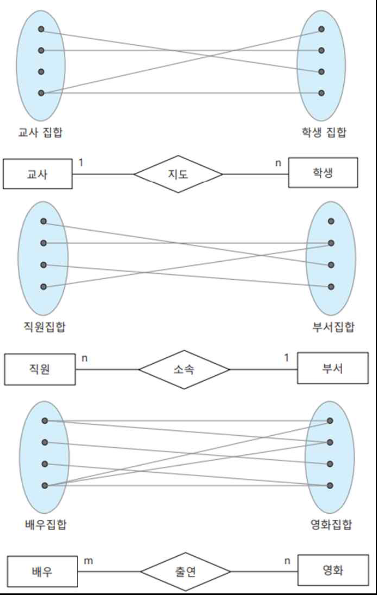
- 관계의 유형(최소 사상 수)
    - 특정 개체와의 관계에 실제 참여하는 상대 개체의 수 중에서 최소값을 표현
        - 최소값 1인 경우(`전체 참여`)
        - 만약 개체가 `적어도 하나 이상의 개체와 반드시 관계를 맺어야 한다면 최소 사상 수는 1`
        - 이중 실선
        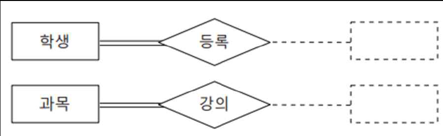
        - 최소값 0인 경우(`부분 참여`)
        - 만약 개체가 다른 개체와 `관계를 맺을 수도 혹은 맺지 않을 수도 있다면 최소 사상 수는 0`
        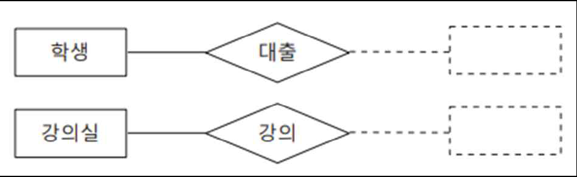
        - 실선
- 관계의 유형(관계차수) : 관계 1개에 참여하는 개체의 수를 기준으로
    - 분류기준2: `관계 차수(relation degree)`
        - `관계에 참여하는 개체의 수`
    - 1진 관계 또는 순환(recursive) 관계
        - `차수가 1`이며 `개체가 자기 자신과 스스로` 맺는 관계
    - `2진 관계`
        - 차수가 2인 `가장 일반적인 관계 유형`으로, `두 개의 개체가 서로` 맺는 관계
    - 3진 관계(드뭄)
        - `3개의 개체가 함께` 맺는 관계
    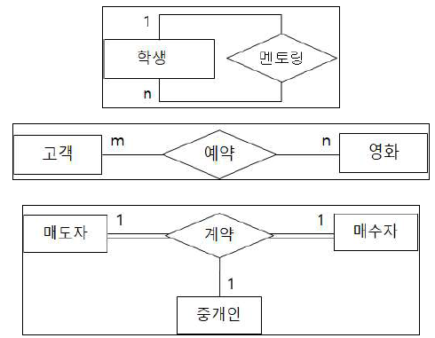
- 관계의 유형(관계 종속성)
    - 분류기준3: 관계의 종속성
        - 비식별 관계와 식별 관계
        - `비식별 관계` (non-identifying relationship) (강한 관계)
            - 보통 독립적인 두 개체가 `대등한 관계`를 맺을 때 `실선 마름모`로 표시
        - `식별 관계`(identifying relationship) (약한관계)
            - 두 개체가 대등한 관계가 아닌 `종속적 관계`를 맺는 경우 `이중 실선 마름모`로 표시
            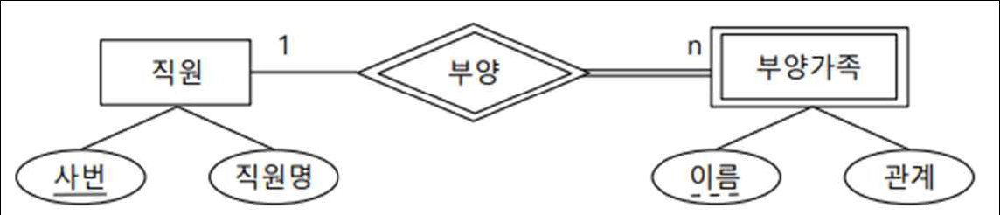
            - `부양가족` 개체는 `직원` 개체에 `존재 종속`(existence dependence)
                - 부양가족 개체는 직원개체가 존재해야 있을 수 있음
        - Key 속성을 갖는지의 여부에 따라 강 개체, 약 개체로 나눌 수 있음
            - `강 개체`(strong entity) : 자신을 `고유하게 식별할 수 있는 속성을 갖는 개체`
            - `약 개체`(weak entity) : 자신을 `고유하게 식별할 수 있는 속성을 갖지 못하는 개체`
                - 소유자 개체가 있어야만 존재 가능
                - `이중실선 사각형`으로 표시
                - 강 개체에 종속되는 약 개체는 `독립된 존재가 아니므로 고유한 식별 속성을 갖지 못함`
                - 대신 키의 일부가 될 수 있는 `부분키(partial key) 속성만을 갖으며 점선 밑줄로 표시`
- 일반화(generalization) 관계
    - 개체 사이의 `상하 관계`
    - `IS-A 관계`라고도 하며 `역삼각형`으로 표현
    - 역삼각형 위로는 `상위 개체`(supertype entity)를, 아래에는 `하위 개체`(subtype entity)를 실선으로 연결
        - 상위 개체는 하위 개체들이 `공통으로 갖는 속성`을 표현
        - 하위 개체는 공통 속성 이외에 추가로 갖는 `고유 속성만을 표현`
        - 상위 개체의 속성 중에 `구별자(discriminator) 역할의 속성`을 포함
        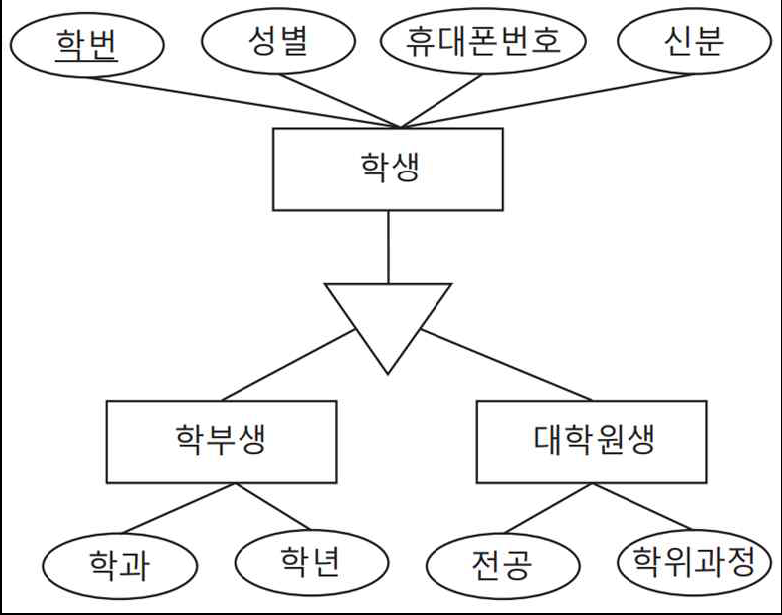
- 개체와 관계의 종류
    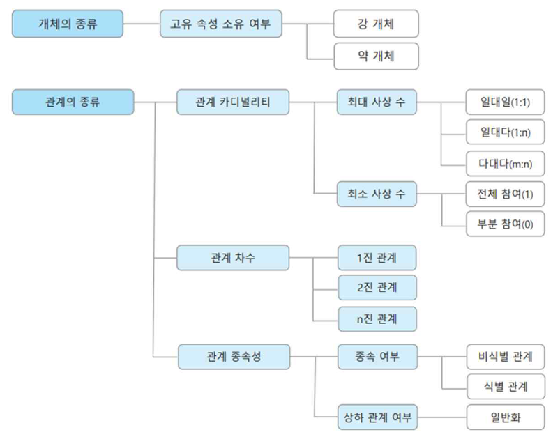

- E-R 다이아그램의 표기법 요약
    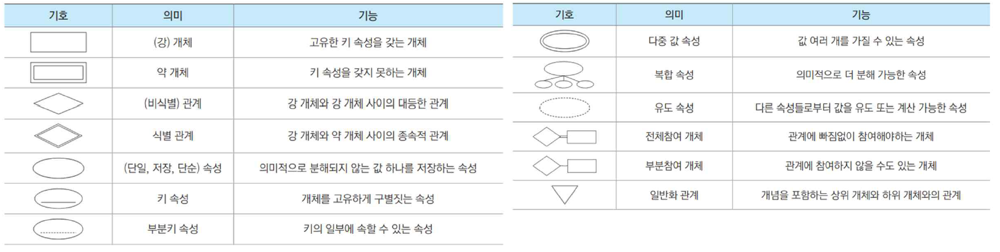
    - E-R 다이아그램 표기의 예
    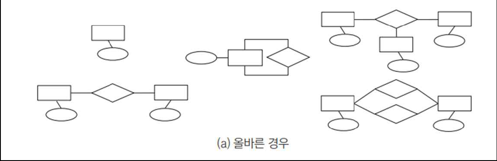
    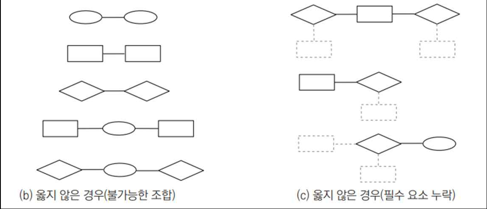
- E-R 다이아그램의 작성 예(통합)
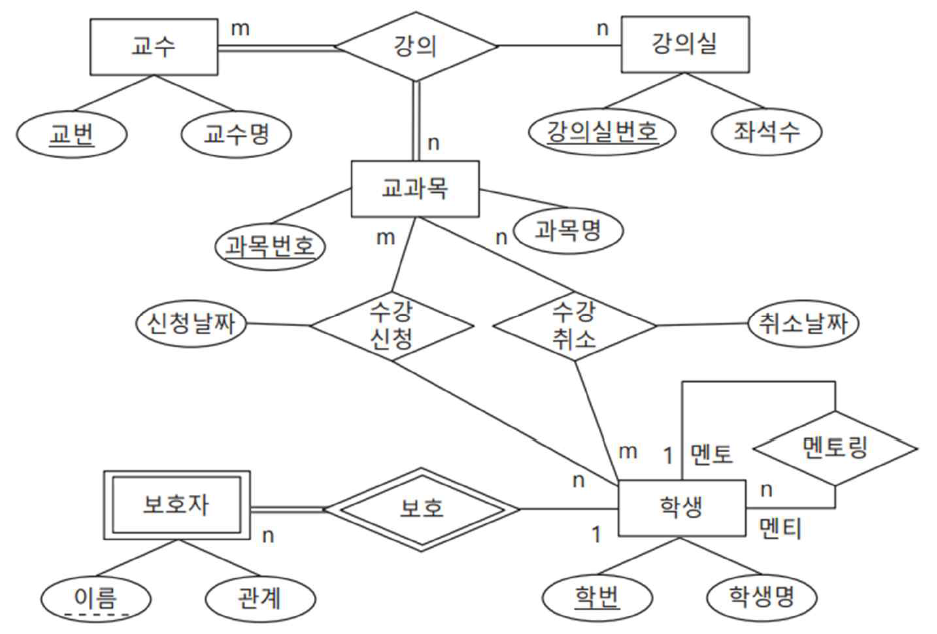

##### 예제1
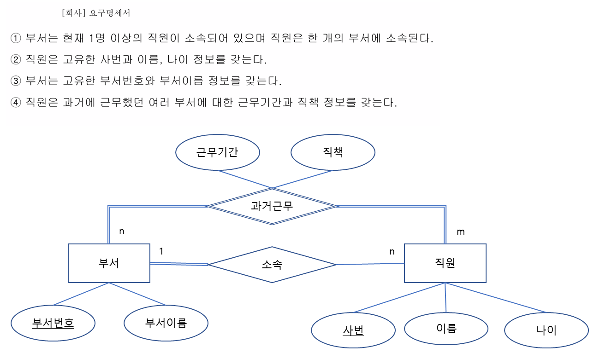

##### 예제2

## 데이터베이스 설계

### 데이터베이스 설계
#### 데이터 베이스 역할 및 모델링 개념
1. 데이터베이스 역할
2. 데이터 모델링(Data modeling)
- 데이터베이스 구조를 생성하는 절차적 과정
- 실세계를 개념화하고 논리적 구조로 추상화한 다음 물리적 테이블 구조를 컴퓨터 안에 생성하는 일련의 단계를 거쳐 데이터베이스 구조를 완성
- 모델링 과정
    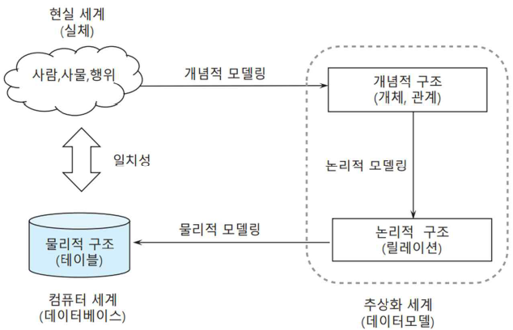
    - 현재 가장 많이 이용하는 모델- 관계형 모델
    
#### 데이터베이스의 설계 과정
- 반복적인 설계 과정을 통해 정제된 최종 설계 결과가 생성
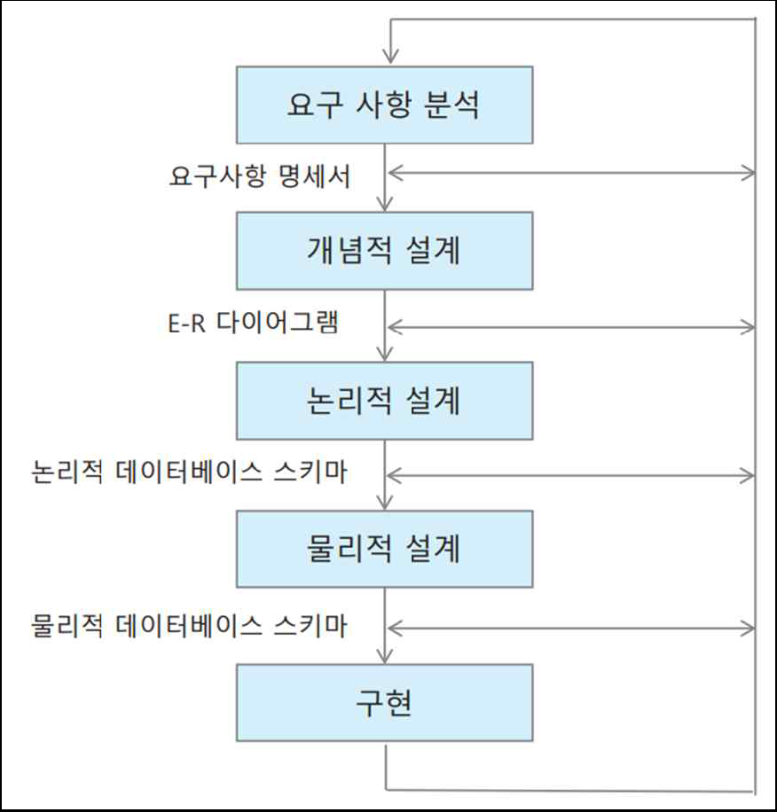

### 요구사항 분석
- 문서분석, 인터뷰, 설문조사 등 진행
- 요구사항 명세서 작성하는 단계
- 이 과정으로 전체 데이터의 퀄리티가 결정되기도 함(가장 중요 ☆☆☆☆☆)
#### 요구사항 명세
- 데이터베이스 설계 과정의 첫 번째 단계
    - 구축하고자 하는 데이터베이스의 구현 범위와 사용자의 범주를 결정
    - 예비 사용자들로부터 요구 사항을 수집하고 업무 처리를 위해 필요한 데이터를 분석
    - 사용자와의 인터뷰, 설문지 조사, 업무 관련 문서의 검토와 기존 시스템 또는 유사 시스템에 대한     분석 등을 포함
- 분석 결과는 요구사항 명세서로 문서화
    - 분석가는 담당자의 요구를 정확하게 파악하도록 노력하고 용어 등이 모호성이 없도록 최대한 명확하게 명세서를 정리
    - 명세서는 분석가의 자의적 해석이나 짐작이 아닌 사용자의 요구 사항만을 충실히 반영하여 구체적 문장 형태로 서술
    - 최종적인 요구사항 명세서는 사용자에게 최종 확인을 받는 과정이 필요
- 요구사항 분석 적용 예(병원 DB)

### 개념적 설계
- 개념적 스키마를 완성 (E-R 다이어그램)
- ☆☆☆☆
- 개념적 설계(E-R 다이아그램 작성) 과정
    - 데이터베이스 설계의 전체 골격을 결정하는 과정
        - 요구사항 명세서의 내용을 기반으로 핵심적인 데이터 요소들을 추출하여 E-R 다이아그램을 작성
        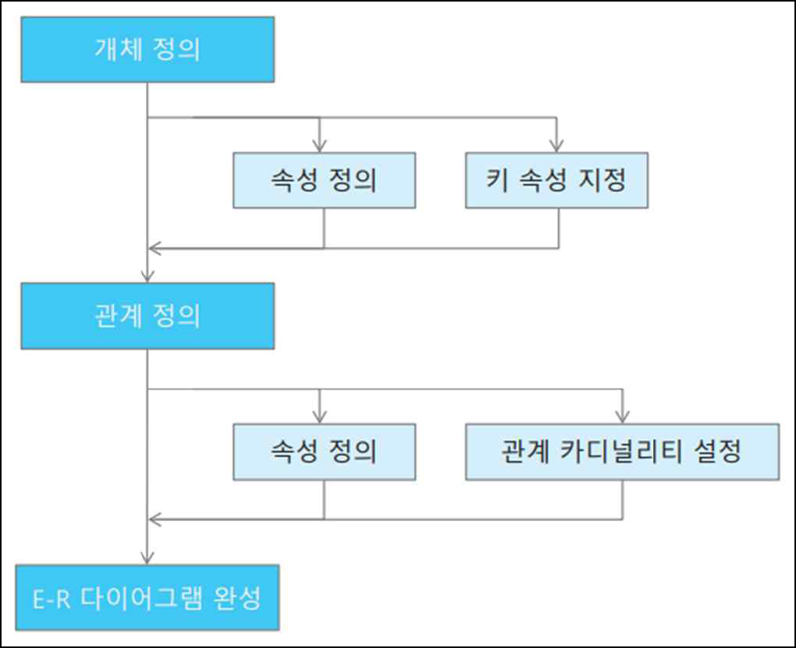
    - 개체 정의
        - 개체 도출
        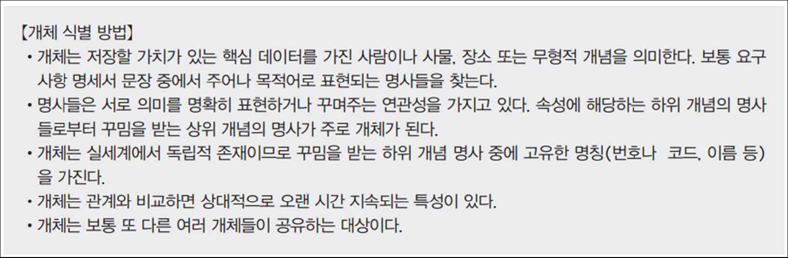
        - 개체 정의 예
        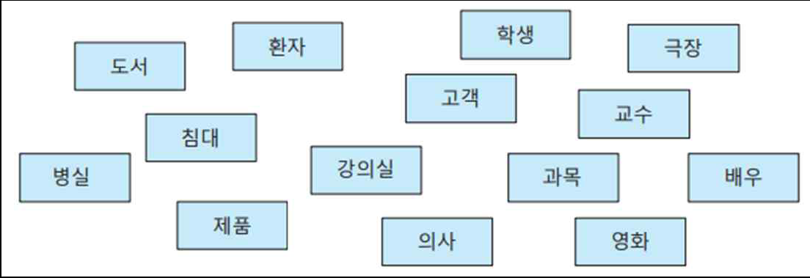
    - 관계 정의
        - 관계 도출
        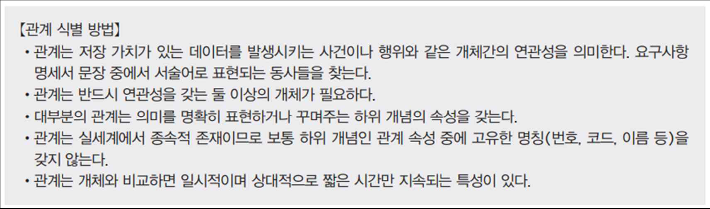
        - 관계 정의 예
        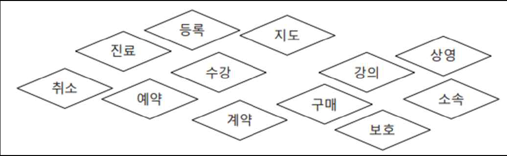
    - 속성 정의
        - 속성 도출
        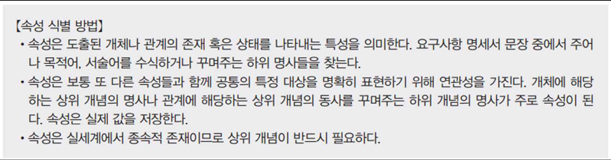
        - 속성 정의 예
        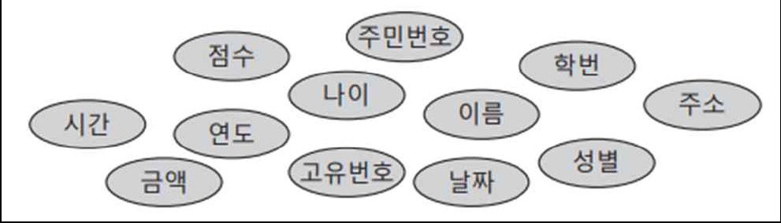
    - 개체, 관계, 속성 구별 방법
    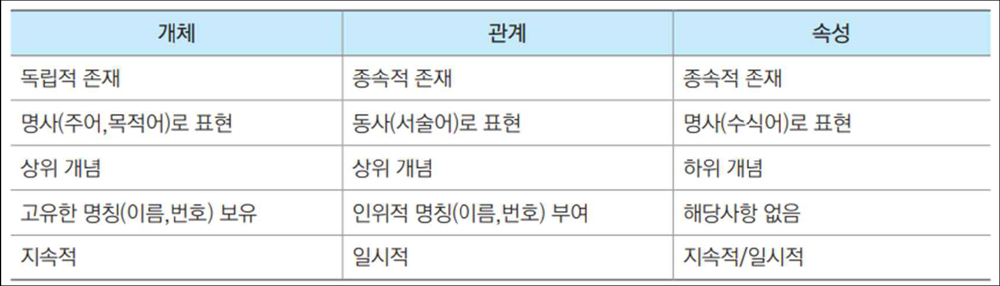
- 유의사항
    - 명세서 문장 안에서 개체를 찾아 사각형, 관계는 마름모, 속성은 타원형으로 표시
    - 의미가 중복되거나 반복되는 대상은 하나의 표준 용어로 통일하여 표시
    - 데이터와 직접적인 연관성이 낮거나 혹은 너무 일반적인 표현은 삭제(가운데줄) 표시
    - 특히, 데이터 관점에서 불필요하거나 기능 관련 표현들은 무시
    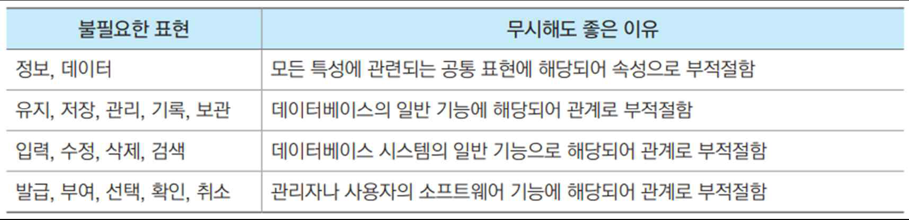
    
### 논리적 설계
- 경제적, 구조적 요건에 맞춰 데이터베이스를 설계하게 됨
- 논리적 데이터베이스 스키마
- ☆☆☆☆☆
### 물리적 설계
- 논리적 데이터베이스 스키마를 바탕으로 물리적 데이터베이스 스키마를 작성
- 트랜잭션의 유형, 빈도 -> 뷰, 인덱스를 설계
### 구현
### ERwin 실습