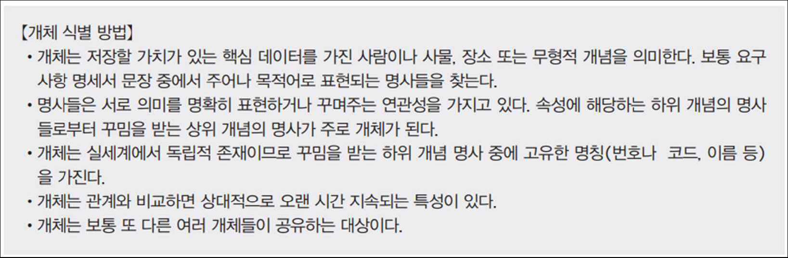
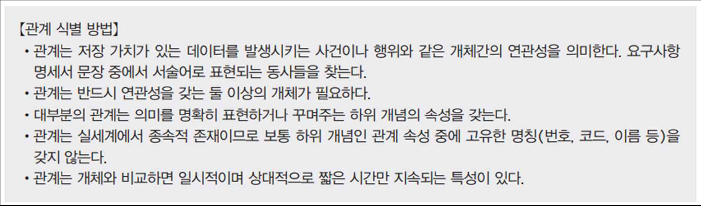
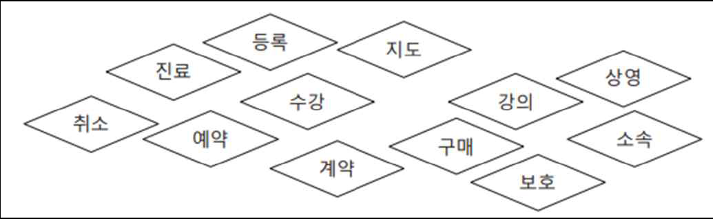
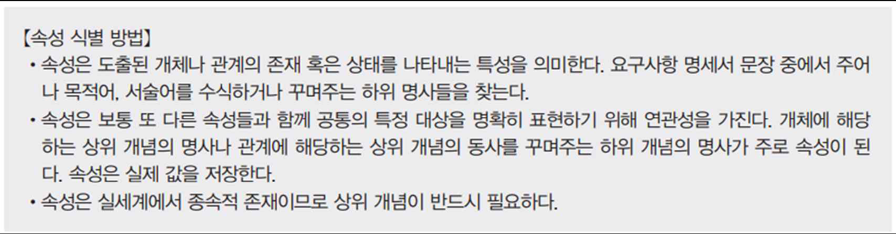
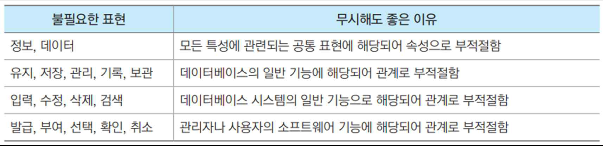

### 개념적 설계
- 개념적 스키마를 완성 (E-R 다이어그램)
- ☆☆☆☆
- 개념적 설계(E-R 다이아그램 작성) 과정
    - 데이터베이스 설계의 전체 골격을 결정하는 과정
        - 요구사항 명세서의 내용을 기반으로 핵심적인 데이터 요소들을 추출하여 E-R 다이아그램을 작성
        
    - 개체 정의
        - 개체 도출
        
        - 개체 정의 예
        
    - 관계 정의
        - 관계 도출
        
        - 관계 정의 예
        
    - 속성 정의
        - 속성 도출
        
        - 속성 정의 예
        
    - 개체, 관계, 속성 구별 방법
    
- 유의사항
    - 명세서 문장 안에서 개체를 찾아 사각형, 관계는 마름모, 속성은 타원형으로 표시
    - 의미가 중복되거나 반복되는 대상은 하나의 표준 용어로 통일하여 표시
    - 데이터와 직접적인 연관성이 낮거나 혹은 너무 일반적인 표현은 삭제(가운데줄) 표시
    - 특히, 데이터 관점에서 불필요하거나 기능 관련 표현들은 무시
    

- 예제(병원 DB)

### 논리적 설계
- 경제적, 구조적 요건에 맞춰 데이터베이스를 설계하게 됨
- 논리적 데이터베이스 스키마
- ☆☆☆☆☆
- 논리적 설계 과정
    - 개체 변환
        - `개체`는 기본적으로 하나의 `릴레이션`으로 변환
            - 새로 생성된 릴레이션을 E-R 다이아그램의 개체를 표현한다고 해서 `개체 릴레이션(entity relation)`
            이라고 함.
            - 생성된 개체 릴레이션은 개체 이름이 릴레이션의 이름이 됨
        - 개체의 키 속성은 릴레이션의 기본키 속성으로, 일반 속성은 릴레이션의 속성으로 변환
            - 개체의 속성 이름이 릴레이션의 속성 이름이 됨
        
    - 관계 변환
        - 일대다(1:n) 관계 변환
            - 일대다 관계 자체는 하나의 `외래키 속성`으로 변환
            - 일대다 관계를 갖는 두 릴레이션에서 `1 측 개체 릴레이션의 기본키 속성`을 가져와 `다 측 개체 릴레이션에 외래키 속성`으로 추가하여 포함시킴
            - 추가하는 외래키 속성의 이름에 관계 이름을 포함하도록 변경('과번호' -> '소속진료과번호')하여 의미를 명확히 함
            - 일대다 관계가 가지고 있던 모든 하위 속성들도 외래키를 추가한 다 측 개체 릴레이션의 속성으로 함께 변환
        
        - 일대일(1:1) 관계 변환
            - 일대일 관계도 하나의 `외래키 속성`으로 변환
            - `한쪽 개체 릴레이션의 기본키 속성`을 가져와 `다른 쪽 개체 릴레이션에 외래키 속성`으로 포함(어느쪽에 외래키를 두든 상관 x)
            - 일대일 관계가 갖고 있던 `모든 속성들도 외래키를 추가한 릴레이션의 속성으로 함께 변환`
        
        - 다대다(m:n) 관계 변환
            - 다대다 관계에서 `관계와 관계에 포함된 속성은 하나의 독립된 릴레이션으로 변환`, 관계 이름이 새로운 릴레이션의 이름이 됨
            - 관계의 속성은 릴레이션 속성으로 변환됨
            - 새로 생성된 릴레이션을 `관계 릴레이션`이라고 함, 관계 릴레이션은 보통 키속성이 없으므로 관계를 맺고 있던 `양쪽 개체 릴레이션의 기본키 속성을 외래키 속`성으로 포함시키고, `양쪽 기본키의 조합을 새로운 기본키로 지정`함
        
- 병원 DB의 논리적 데이터베이스 스키마

- 예제

### 물리적 설계
- 논리적 데이터베이스 스키마를 바탕으로 물리적 데이터베이스 스키마를 작성
- 트랜잭션의 유형, 빈도 -> 뷰, 인덱스를 설계
### 구현
### ERwin 실습
- <- (2개이상) 까마귀발
- |  1개이상   해쉬 마크
- o  0개       타원 
- 개체(Entity) : 개체 유형의 이름, 식별자, 속성을 표현
- 서브 타입(Sub-Category) : IS-A 관계를 갖는 슈퍼(상위) 개체와 서브(하위) 개체를 개체 간의 부모와 자식 관계로 표현
- 일대다 식별(Identifying) 관계 : 두 개체 사이의 1:n 식별 관계를 표현(식별자) 
    - 부모 주식별자가 자식 주식별자에 포함되어있다.
    - 실선
- 일대다 비식별(Non-Identifying) 관계 : 두 개체 사이의 1:n 비식별 관계를 표현
    - 점선 표기
- 다대다 식별(Many-to-Many) : 두 개체 사이의 m:n 식별 관계를 표현

- o|<- (0, 1, 또는 그이상의 개체 허옹)
- |<- (1 또는 그 이상의 개체를 허용) (가장많이 사용 , 1대n 관계일때)
- o|- (0 또는 1개의 개체를 허용)
- -- (정확하게 무조건 한개만 허용)

- 부모 테이블, 자식테이블