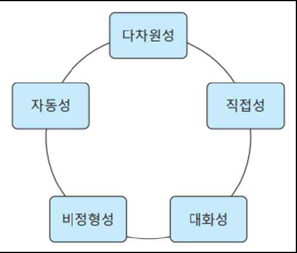

# 데이터웨어하우스와 데이터베이스 응용
## 데이터웨어하우스 개념
### 출현배경
#### 정보의 위기(information crisis)
- 저장된 방대한 양에 비해 실제 의사 결정에 활용할 수 있는 정보는 매우 제한적임
- '풍요속의 빈곤'처럼 데이터는 넘쳐나는데 정작 필요한 정보는 얻을 수 없음
    
- 기존 정보 시스템이 의사 결정에 도움을 주지 못하는 구조적인 문제점
    
    - 비통합성
    - 비일관성
    - 비신뢰성
    - 단기성
    - 비생산성
- 데이터베이스
    - 즉각적인 업무 처리를 위한 OLTP(On-Line Transaction Processing) 환경에 적합
    - 신속한 데이터 처리에 비해 상대적으로 데이터 분석은 느리고 많은 제한을 가짐
- 해결 방안 : 업무용 데이터와 분석용 데이터의 저장소를 분리
    - 데이터베이스 - 업무 트랜잭션 처리를 위한 운영 저장소로 사용
    - `분석을 위한 새로운 저장소를 구축` => `데이터웨어하우스`
        
### 데이터웨어하우스(data warehouse) 정의
- `의사결정을 위한 효율적인 분석 기반을 제공하는 통합 데이터 저장소`
- 이질적인 데이터들의 추출, 변환, 통합 과정을 통해 구축된 거대한 `분석전용 데이터 창고`
- 데이터웨어하우스의 특성
    1. `주제 지향성(subject-oriented)`
        - `분석 프로그램 중심`의 데이터 구조
        - `분석 주제 중심`으로 구성, 주제별로 요약
        - 대학의 예) 학생별, 교수별, 과목별로 다양한 분석 가능
        
    2. `통합성(integrated)`
        - 데이터베이스뿐만 아니라 `외부 문서(웹 문서, 엑셀 문서, 텍스트 문서 등) 간의 통합을 고려`
        - 분석을 위해서는 하나의 `통일된 형식`으로 변환이 필요
        - 통합 과정에서 데이터 유형과 측정 단위, 데이터의 불일치 문제 등을 해결
        - 데이터웨어하우스의 핵심이 되는 가장 중요한 특성으로 많은 시간과 노력이 필요함
        
    3. `시계열성(time-variant)`
        - 데이터베이스 - 주로 현 시점까지의 업무 결과를 반영
        - 분석 과정 - `과거부터 현재까지 여러 시점의 데이터`가 모두 의미가 있음
        - 추이 분석을 위해서는 `각 시점에서의 데이터 버전` 즉, `스냅샷(snapshot)`을 저장하는 것이 중요함
        - 데이터웨어하우스 - 스냅샷 데이터들이 축적되는 대규모 저장소
        - 시간 흐름에 따라 원시 데이터 혹은 요약 데이터 형태로 다양하게 중복 저장
        
    4. `비휘발성(nonvolatile)`
        - 데이터웨어하우스 - `수정이나 삭제가 거의 없는 일종의 검색 전용` 데이터베이스
        - 데이터가 일단 저장되면 `검색이나 추가적 적재만 발생, 갱신과 삭제는 거의 발생하지 않음`
        
### 데이터베이스와 데이터웨어하우스의 차이점
- 데이터웨어하우스 : 의사 결정에 필요한 올바른 정보(right information)를 올바른 형식(right
form)으로 적시(right time)에 제공하기 위한 저장소
- 데이터베이스와 데이터웨어하우스의 차이점
    
## 데이터웨어하우스 설계
### 데이터웨어하우스 시스템
- 데이터웨어하우스 시스템의 구조 : 3-계층 구조(3-tier architecture)
    
### 데이터웨어하우스 구축 방식
- `상향식`
    - 소규모의 `데이터 마트(data mart)`들을 순차적으로 먼저 구축한 후 나중에 이를 통합하여 전사적 데이터웨어하우스(enterprise data warehouse)를 완성하는 방식
-  `하향식`
    - 먼저 `전사적 데이터웨어하우스를 구축한 뒤, 필요할 경우 순차적으로 데이터 마트를 하나씩 추가`하여 전체 시스템을 완성하는 방식
-  `절충식`
    - `기획과 설계는 하향식 구축 방식`으로 하고 `실제 구축은 상향식 구축 방식처럼 가장 우선시 되는 중요한 분야부터 진행`하는 방법
    - 전사적 관점에서 하나의 전체 데이터웨어하우스를 슈퍼 마트(super mart)라고 하는 핵심 저장 단위들로 분할하여 설계한 후, 각 슈퍼 마트들을 우선순위에 따라 독자적으로 구축해감으로써 최종적으로 전사적 데이터웨어하우스를 완성해가는 방식
    - 데이터 마트(data mart)
        - 조직의 일부 사용자만 사용할 목적으로 `주제 범위를 제한하여 구축한 데이터 저장소`
        - 데이터웨어하우스의 부분 집합으로 규모가 작아 ‘`미니 데이터웨어하우스`’로 불림
        - 분석 대상이 특정 주제로 집중되기 때문에 부서 단위의` 분석 업무에 적합

#### 데이터 웨어하우스 정리
- 정형, 개인파일, 외부매체, raw data들을 통합할 수 있는 구조
- 데이터 조작(수정,삭제) 불가, 조회 중심
- 주제별 데이터 저장소 구성
- 데이터 시간정보 포함 필수(시계열 데이터)
- 데이터 중복 허용
- 데이터 접근의 효율성 -> 인덱스
#### 데이터 마트, 데이터 레이크란?
- 데이터베이스를 가르키는 3가지 스타일: Data Mart, Data Warehouse, Data Lake
- Data Mart(DM, 데이터 마트)
    - Data Mart(이하 DM)은 현업에서 데이터를 활용하는 담당자가 데이터를 활용하기 위한 형태 거의 그대로 데이터를 쌓아두는 공간이다.

    - 각 현업에서 사용하는 업무단위 처럼 상세한 단위로 데이터를 저장하고, 사용한다.

    - DM은 현업 담당자(소비자)가 필요한 데이터(상품)을 직접 골라담아 소비할 수 있는 공간(소매점..마트!)이라고 할 수 있다.

- 그리고 데이터 소매점(DM)에는 데이터를 공급하는 도매점(DW)이 있다.

- Data Warehouse(DW, 데이터 웨어하우스)
    - Data Warehouse(이하 DW)는 데이터 소매점(DM)에 공급하게될 데이터를 다양한 원천에서 수집하여 주제별로 저장하는 데이터 도매점과 같은 공간이다.

    - 즉 다양한 원천에서 발생하는 데이터를 소비자에게 전달하기 전에 통합하여 저장하는 공간이라고 할 수 있다.

    - 그런데 다양한 원천에서 발생하는 데이터는 발생 지점의 환경에 따라 서로 다른 구조(스키마)나 데이터에 사용된 용어(동음이의어/이음동의어)등의 문제가 야기된다.

    - DW는 이러한 문제들을 전사적 관점에서 고려하여 다양한 데이터를 통합저장하는 구조로 설계되고 구축된다.

    - 단, DW 스타일에서는 통합되는 과정에서 데이터를 정제하는 비용과 버려지는 데이터가 발생한다. 이러한 점이 Data Lake의 등장이 야기되는 지점이다.

- Data Lake(DL, 데이터 레이크)Permalink
    - Data Lake(이하 DL)은 다양한 원천을 하나의 통합된 형태로 정제한 DW와 달리, 다양한 원천을 그대로 가져와 저장하여 다양성을 보존하는 스타일을 가지고 있다.
    - 즉, DL은 원천에서 발생한 데이터를 다양한 형태 그대로 한 곳에 저장하는 공간이라고 할 수 있다.

### 데이터웨어하우스 설계
- `다차원성`
    - 다차원적인 분석을 위해서 데이터웨어하우스는 다차원 구조로 구성
    - 다차원 구조는 각 분석 관점 간의 다양한 조합에 의해 데이터에 대한 상호 연관성 분석이 가능하도록 함
- `다차원 모델링(multi-dimensional modeling)`
    - 높은 연관성을 갖는 데이터들을 데이터웨어하우스 안에서 다차원성을 유지하도록 구조화하는 것
    - 데이터웨어하우스는 데이터베이스와는 다르게 개체와 관계가 아닌 차원 중심으로 모델링
    - 다차원 모델링 방법
        - 다차원 데이터베이스 : `데이터 큐브(data cube)` 개념을 이용
        - 관계형 데이터베이스 : `스타 스키마(star schema)` 개념을 이용
#### 다차원 데이터베이스(MDB; Multi-Dimensional Database)
- `관계형 데이터베이스의 한계점을 극복하기 위해 개발된 분석 전용 데이터베이스`
- `다차원 큐브 구조`로 모델링 -> 저장소 `구조 자체가 다차원 분석에 적합하도록 생성되기 때문에 복잡한 모델링이 필요 없음`
    

#### 다차원 질의(multi-dimensional query)
- 다차원 데이터베이스의 `어느 영역을 분석하고자 하는지를 명세`
    - 큐브를 자신이 원하는 모양으로 절단하여 살펴보는 것
    - 슬라이싱(slicing) : 큐브의 일부분을 `둘로 쪼개어` 자신이 원하는 큐브 단면을 분석하는 것을
    - 다이싱(dicing) : 큐브 중에서 보고자 하는 `부분만을 선별함으로써 작은 부분 큐브 형태의 영역`을
    분석하는 것
    - 피보팅(pivoting) : 큐브의 `축 위치를 바꾸어` 같은 분석 결과를 확인하는 것
- 다차원 질의의 기본 유형
    
#### 다차원 모델
- 데이터 큐브(data cube)
    - 다차원 모델의 기본 구조, 보통 2차원 면들로 조합된 다면체 도형으로 표현
    - `차원(dimension) : 데이터 큐브의 각 축`
    - `차원 멤버(dimension member) : 축 좌표`
    - 축 좌표들의 조합으로 큐브 안의 특`정 셀(cell)을 지정하고 큐브 셀 안에는 하나의 측정값(measure)이 저장됨`
    - 데이터 큐브는 n개의 차원성을 갖는 데이터들을 n-차원의 큐브 구조로 모델링
    - N차원 큐브의 예
    
- 차원(dimension)
    - 데이터에 대한 하나의 `분석 관점 또는 분석 시각`을 표현
    - `분석 관점이 다양하고 데이터 간의 상호 연관성이 높을수록 차원의 개수는 증가`
    - 각 차원은 하나의 축으로 표현되기 때문에 차원의 개수에 따라 큐브의 구조가 결정
    - 같은 축을 구성하는 차원 멤버들은 유사한 일련의 항목들이거나 유사하지만 수준이 다른 항목들임
- 개념 계층(concept hierarchy)
    - `같은 차원 안의 수준들 간의 수직적 상하 관계`
    - 상위 수준의 개념으로부터 하위 수준의 개념으로 차원 멤버들을 계층적으로 조직화  
    
#### 스타 스키마
- 차원 모델링(dimensional modeling)
    - `관계형 스키마 구조에 차원성을 부여`하는 설계 방법
    - 테이블들이 `입체적인 다양한 연관성을 가질 수 있도록 주제 중심의 스키마 구조로 변환`
    - 오직 분석을 빠르고 효과적으로 지원하기 위한 스키마 구조를 정의하는데 중점
    - 차원 모델링에 사용되는 `대표적인 모델은 스타 스키마`
- `스타 스키마(star schema)`
    - `관계형 데이터베이스에 가상의 데이터 큐브를 만들기 위한 차원 모델링의 대표적 모델`
    - 비정규화된 관계형 스키마의 특수한 형태
    - 스타 조인 스키마(star join schema), 별 스키마 또는 성형 스키마
    - `하나의 사실 테이블(fact table)을 중심으로 주위에 여러 개의 차원 테이블(dimension table)들이 연결되는 방사성 구조`
    - 장점 : 구조가 단순하고 속도가 빠름
    - 사실(fact)
    - 사실 테이블(fact table)에 저장되는 매 순간 조직에서 발생하는 `측정값(measure) 또는 집계값`
    - 대부분 수치 데이터이며 분석 대상이 되는 `실제 값`(판매량, 매출액, 구매자수, 수익률)
- 차원(dimension)
    - 차원 테이블(dimension table)에 저장되는 `사실을 바라보는 특정 관점`을 의미
    - 사실 테이블의 `측정값 의미를 설명하는 데이터`(대리점명, 분기명, 제품명, 고객 연령)
- `스타 조인(star join)`
    - 일대다 참조 관계를 이용하여 하나의 `사실 테이블과 작은 크기의 여러 차원 테이블들을 일대다 참조 관계를 이용하여 하나로 결합하는데 사용`하는 조인 연산
    - 대학 장학 스타 스키마 예
    
#### 스노우플레이크 스키마
- 스노우플레이크 스키마(snowflake schema)
    - `데이터 중복을 줄이기 위해 차원 테이블을 정규화한 구조`
    - 스타 스키마의 변형된 형태로 눈송이 스키마라고도 함
- 대학 장학 스노우플레이크 스키마 예
    
#### 스타 스키마와 스노우플레이크 스키마의 비교
- 관계형 데이터베이스 기반의 차원 모델링 비교

- 보통 응답 시간이 빠르고 구조가 단순하여 이해하기 쉽기 때문에 스타 스키마를 많이 사용
#### 은하수 스키마
- 같은 차원 테이블을 공유하는 여러 사실 테이블들을 포함하는 관계형 스키마 구조
- 여러 스타 스키마들이 모여서 구성되므로 스타 패밀리 또는 성운 스키마라고도 함

#### 다차원 모델링의 예

## OLAP
### OLAP의 정의
- 최종 사용자가 직접 다양한 분석 관점의 흐름에 따라 대규모의 다차원 데이터를 온라인에서 동적으로 분석하고 보고서를 만드는 모든 과정
- 다차원 공유 정보에 대한 `신속한 분석`(FASMI; Fast Analysis of Shared Multi-dimensional Information)
- `데이터웨어하우스와 분석자 사이의 중개자로서 데이터를 다차원으로 분석할 수 있도록 지원하는 프로그래밍 기술`
- 데이터웨어하우스의 OLAP(온라인 분석 처리; On Line Analytical Processing)은 데이터베이스의 OLTP(On Line Transaction Processing)에 대응하는 개념
- 코드(Codd)에 의해 처음으로 OLAP 개념이 사용
- OLAP 분석 과정은 `질의가 꼬리를 물고 진행`되면서 최종적으로는 중요한 의사 결정에 필요한 분석 정보를 모두 얻게 됨
- 데이터베이스(DBMS 엔진과 질의 도구) <-> 데이터웨어하우스(OLAP 엔진과 OLAP 도구)
### OLAP의 특성
1. `다차원성`(가장 중요한 특성)
    - OLAP은 `다차원 구조로 조직화`함으로써 사용자들이 관심 주제별로 다양한 관점에서 접근 가능하도록 함(OLAP의 가장 중요한 특징)
2. `직접성`
    LAP은 의사결정자가 `개발자의 도움 없이도 스스로 직접 분석하도록 지원`함
3. `대화성`
    - OLAP은 사용자의 반복적인 질문을 통해 의사 결정에 필요한 정보들을 발견해내도록 `대화식 인터페이스`를 지원함
4. `비정형성`
    - OLAP은 사용자가 `즉각적으로 보고서를 자유롭게 만들 수 있도록 함`
5. `자동성`
    - OLAP은 메타 데이터를 활용하여 `몇 번의 조작만으로도 원하는 분석 보고서를 생성`
    
### OLAP의 종류

### OLAP 인터페이스
- OLAP 도구의 인터페이스는 사용자가 원하는 분석 결과를 손쉽고 빠르게 생성하도록 지원
    - 드릴-다운(drill-down) 연산
        - 요약된 현재 수준보다 보다 `상세한 하위 수준으로 단계적으로 데이터를 분석`해가는 연산 차원의 개념 계층을 따라 진행
    - 롤-업(roll-up) 연산
        - 상세한 현재 수준보다 요약된 `상위 수준 방향으로 단계적으로 집계된 데이터를 분석`해가는 연산
        - 드릴-업(drill-up)이라고도 하며, 드릴-다운과는 반대 방향으로 진행
    - 슬라이스와 다이스(slice & dice) 연산
        - 큐브의 일부분을 원하는 형태로 잘라서 작은 부분 큐브를 만드는 연산
    - 피봇(pivot) 연산
        - 최종 결과 화면에서 현재 분석 중인 데이터의 축을 변경하기 위한 연산
    - 드릴-쓰루(drill-through) 연산
        - 큐브 안의 요약된 데이터 수준에서 연관된 상세 데이터로 이동하여 분석하는 연산
    - 드릴 어크로스 연산
        - 현재 검색중인 큐브에서 요구사항에 따라 다른 큐브로 넘어가면서 분석하는 연산
## 데이터베이스 응용
### 분산 데이터베이스
- 물리적으로는 `분산된 데이터베이스를 컴퓨터 네트워크로 연결하여 하나의 데이터베이스처럼 사용할 수 있도록 저장·관리하는 데이터베이스`
- 지리적으로 분산된 여러 데이터베이스를 마치 하나의 중앙 집중형 데이터베이스처럼 논리적으로 통합하여 사용자가 사용할 수 있도록 지원
- `데이터의 분산을 사용자에게 숨기고 모든 복잡한 분산 처리 과정을 관리하는 분산 DBMS가 필요`
- 분산 데이터 독립성(distributed data independency)
    - 5가지 데이터의 분산 투명성을 보장
    - 위치 투명성(location transparency)
    - 중복 투명성(replication transparency)
    - 단편화 투명성(fragmentation transparency)
    - 병행 투명성(concurrency transparency)
    - 장애 투명성(failure transparency)
#### 분산 데이터베이스의 스키마 구조 
- 데이터 투명성을 제공하기 위한 전역, 단편화, 할당 스키마를 포함한 분산 데이터베이스의 구조
    - 전역 스키마 : 분산 데이터베이스의 모든 데이터 구조와 제약 조건을 정의
    - 단편 스키마 : 전역 스키마를 논리적으로 분할한 단편들을 정의
        - `완전성, 회복성, 분리성`
    - 할당 스키마 : 각 단편들을 물리적으로 저장할 지역 위치를 정의
    - 지역 스키마 : 지역별로 저장하는 데이터의 구조와 제약조건을 정의
    
### 객체지향 데이터베이스
- 객체지향 데이터베이스(object-oriented database)
    - 객체, 속성, 메소드, 클래스 계층과 상속, 복합 객체 등의 핵심 객체지향 개념을 지원함으로써 객체단위로 데이터를 저장·관리하는 데이터베이스
    - 객체지향(object oriented) 개념은 본래 확장성이 있어 새로운 요구사항을 지원하고 데이터의 의미 관계를 표현하기 쉬워 데이터베이스 모델로 적합함
    - ‘객체’라는 같은 개념으로 응용 프로그램 개발과 데이터 저장을 일관되게 할 수 있어 데이터 유형 불일치(data type mismatch) 문제를 해결
    
    - 클래스 계층과 단일/다중 상속
    
### 객체-관계 데이터베이스
- 객체-관계 데이터베이스
    - 관계 데이터베이스에 객체지향 데이터 모델의 장점을 접목한 이종(hybrid) 데이터베이스
    - 관계 데이터 모델의 단순성과 편의성, 객체지향 데이터 모델의 확장성을 모두 제공
    - 객체-관계 데이터 모델 : 객체 지향 개념과 관계 개념을 통합한 모델
    - 릴레이션 개념에 객체지향의 객체, 객체 식별자, 사용자 정의 유형, 참조 유형, 메소드 등의 개념을 추가적으로 지원한다. 관계 데이터 모델의 테이블이 투플 또는 객체들의 집합으로 선택적으로 정의된다.
    - `SQL3` : 객체-관계 데이터베이스의 질의어
        - 관계 데이터베이스의 질의어 SQL3 표준에 질의어를 확장하여 객체지향 개념을 지원
- 객체-관계 데이터베이스와 객체 지향 데이터베이스
    - 개념적으로나 기능적으로는 매우 유사
    - 모델링 기능과 효율성 측면에서는 상이
    - 객체지향 데이터베이스가 객체지향 프로그래밍에 데이터베이스 기능을 갖도록 확장했다면 객체-관계 데이터베이스는 관계 데이터베이스에 객체 개념을 갖도록 확장한 것
- 객체-관계 DBMS(ORDBMS; Object Relational DBMS)
    - Universal Server, Oracle, DB2 Universal DB 등
### 멀티미디어 데이터베이스
- 텍스트, 그래픽, 이미지, 비디오, 오디오 등이 복합적으로 구성된 다양한 미디어를 효율적으로 저장·관리하기 위한 데이터베이스
- 문자와 숫자 등 정형 데이터 이외에 사진, 동영상, 음성 등과 같은 다양한 비정형 데이터를 효과적으로 저장하고 질의하는 기능을 제공
- 저장과 검색
    - 다양한 유형의 멀티미디어 데이터는 기본적으로 대용량이고 정형화된 데이터가 아니므로 미디어    별로 별도의 저장과 검색 방법이 필요함
    - 저장 : 음성, 영상 등 압축을 필요로 하는 메가바이트 단위의 원시 데이터(raw data)뿐만 아니라 해상도, 용량, 형식 등의 멀티미디어 관련 특성 데이터와 미디어 내용을 설명하는 키워드 등의 명    세 데이터 등이 함께 저장
    - 검색 : 멀티미디어 데이터의 특성이나 내용에 관한 키워드 검색이 기본 제공되며 사진이나 동영상 속의 내용과 의미를 직접 추출하여 질의할 수 있는 다양한 검색 기법이 필요
- 시스템 유형
    - 파일 시스템 활용 방식
    - 관계 데이터베이스 활용
    - 관계 데이터베이스의 확장 기능(BLOB(Binary Large OBject)) 활용 방식
    - 객체지향 데이터베이스 활용
### 공간 데이터베이스
- 다차원 공간 안의 객체와 객체간의 공간 관계를 공간적 특성과 함께 저장하고 관리하는 데이터베이스
- 위치에 기반한 공간 데이터의 저장, 공간 색인, 공간 질의, 공간 분석 등의 기능을 제공
- 일반적으로 3가지 부류의 공간 데이터 유형을 관리
    - `지리 데이터(geographic data)` : 도로, 지형, 행정 경계, 토지 특성, 지역 기후 등 위도와 경도, 고도를 갖는 좌표 기반 데이터
    - `기하학 데이터(geometric data)` : 빌딩, 항공기, 다리 등과 같은 구조 객체의 공간 구성 정보를 2, 3차원 공간 좌표로 표현한 데이터
    - `공간 속성 데이터(spatial attribute data)` : 지도 및 위성 이미지와 각 공간 객체 그리고 위치에 관련한 각종 특성, 통계자료 등을 표현한 데이터

