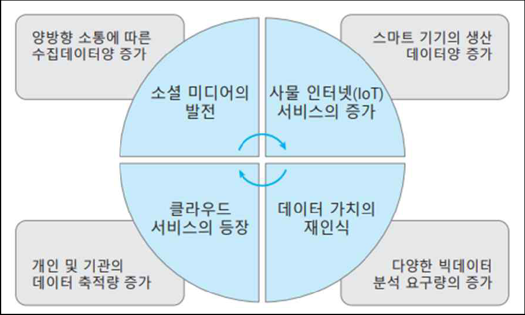
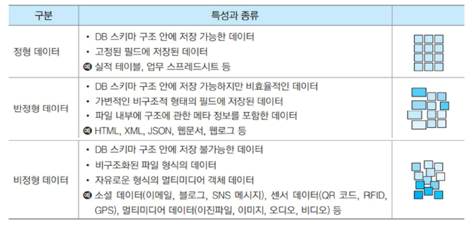

## 빅데이터와 NoSQL
1.1 빅데이터의 등장 배경
- 빅데이터 기술
    - 현대 사회의 복잡성을 분석하고 예측하기 위해 꼭 필요한 데이터 관리 기술
    - 빅데이터가 모든 사람의 관심사가 된 가장 큰 원인 : 디지털 정보량의 급격한 증가
- 새로운 대용량 데이터의 시대적 변화에 대처하는 데이터 기술과 활용 측면의 모든 노력과 대응은 ‘빅데이터’라는 개념으로 정의됨
- 다양한 오픈 소스 프로젝트로 대용량 데이터의 처리 비용이 낮아지면서 여러 성공 사례를 통해 빅데이터에 대한 관심과 활용이 크게 증가하고 있음

- 데이터 과학

### 빅데이터 개념
- 빅데이터(big data)의 정의
    - 기존 하드웨어나 소프트웨어의 처리 능력을 넘어서는 대용량 데이터의 집합
    - 이전에는 얻을 수 없었던 통찰을 제공하기 때문에 의사 결정을 위한 소중한 정보 자산으로 간주됨
    - 대량일 뿐만 아니라 다양하고 복합적인 성격을 갖기 때문에 기존 데이터 처리 기술의 한계를 넘어섬 -> 새로운 빅데이터 관련 기술이 필요한 이유
    - 대량의 데이터로부터 가치를 발굴하는 것은 새로운 통찰을 얻는 과정
    - ‘DIKW’(Data Information Knowledge Wisdom) 피라미드’로 표현
- 빅데이터의 특성
    - `증가된 데이터의 용량(Volume)` : 데이터의 규모
        - 기존 데이터 관리 기술의 수용 한계를 넘는 대용량(페타바이트) 수준 이상
    - 높`아진 데이터의 다양성(Variety)` : 데이터의 다양성
        - 기존 데이터 저장 기술로는 처리하기 어려운 `다양한 유형의 비정형 데이터`까지 포함
    - `빨라진 데이터의 생성 속도(Velocity)` : 데이터의 발생 속도
        - 끊임없이 쏟아지는 데이터의 양 이외에도 데이터의 발생 속도 또한 감당하기 어려운 수준임
    - 광범위한 가치(Value) : 데이터의 가치
        - 기업과 사회의 현실 문제를 해결하여 시간, 비용, 만족도 측면에서 가치 창출를 기대
    - 신뢰할 수 있는 정확성(Veracity) : 데이터의 정확성
        - 질 높은 의사결정을 위해서 정확한 사실 데이터에 기반한 신뢰할 수 있는 분석을 요구
        
- 빅데이터의 유형
    - 정형 데이터(structured data)
        - 정해진 형식과 구조에 따라 고정된 필드에 저장되도록 구성된 데이터
        - 예) ‘인사’ 테이블이나 ‘매출’ 스프레드시트와 같이 통일된 형식
        - 정형화된 형식과 저장 구조를 가지므로 검색, 변경 등의 연산이 쉽다.
        
    - 반정형 데이터(semi-structured data)
        - 고정된 필드로 저장되지만 데이터의 형식과 구조가 변경될 수 있는 데이터
        - 보통 구조 정보를 데이터와 함께 제공하는 XML, JSON 등의 파일 형식의 데이터
        - 메타 데이터를 포함하고 있어 파싱을 통해 정형 데이터로의 변환이 가능
        
    - 비정형 데이터(unstructured data)
        - 음성이나 동영상, 블로그, SNS 메시지 등과 같이 정해진 형식이나 구조가 없는 정형화되지않은 데이터
        - 대부분 크기와 형식을 미리 정의하기 어려운 데이터들을 포함
        - 최근 비중이 가장 빠르게 증가하는 데이터 유형, 잠재 가치가 가장 높음
        
- 빅데이터의 분류와 특성

- 빅데이터의 주요 기술
    - 빅데이터의 핵심은 대용량의 데이터 저장소를 구축하고 적합한 데이터 분석 모형을 적용하여 탐색, 분석, 시각화하는 것
    - 데이터의 수집에서부터 저장, 처리, 분석에 이르기까지 빅데이터의 유형별로 각기 다른 기술이 요구됨
    - 5가지 주요 기술들은 빅데이터 분석을 위한 전체 과정에서 단계별로 순차적으로 활용
    
#### 빅데이터의 수집
-빅데이터의 수집
    - 조직 내·외부의 데이터를 효과적으로 수집하는 과정
    - 데이터를 찾아내고 모아서 변형하는 과정을 거쳐 정제된 데이터로 만드는 복잡한 작업
    - 분석 과정에서 가장 중요하면서도 어려운 과정
    - 의미있는 분석 결과를 얻기 위해 다음 4가지 기준을 고려
        - 데이터의 충분성(데이터의 축적 기간 및 분량의 충분성 등)
        - 데이터의 완전성(데이터 누락 및 결측값의 비율 등)
        - 데이터의 일관성(데이터 유형과 값의 일치성 등)
        - 데이터의 정확성(데이터 편향과 분산 등)
- 수집 데이터의 유형 분류

- 빅데이터 수집 과정
- ETL(Extract, Transformation, Load) 과정
    - 데이터웨어하우스나 데이터마이닝에서는 수집된 데이터를 분석이 쉽도록 통일된 형태로 변환하는 과정
    - 빅데이터 수집을 위해서는 ETL 과정을 포함하되 보다 복잡하고 섬세한 작업이 요구됨
- 빅데이터의 수집 기술
    - 수집 데이터의 유형에 따라 적합한 수집 기술을 선택하여 적용
    - 비정형 데이터는 연산이 불가능하고 수집 과정이 가장 어렵지만 분석 가치가 가장 높기 때문에 대용량 수집과 저장을 위한 자동화 기술이 중요함
- 수집 데이터의 처리
    - 데이터 가공이나 데이터 분석을 준비하는
    - 빅데이터 전처리(pre-processing) : 수집 데이터에 대한 필터링, 데이터 유형 변환, 정제 등의 작업을 수행하는 과정, 이 과정을 거친 후 데이터 저장소에 적재됨
    - 빅데이터 후처리(post-processing) : 데이터 저장소에 적재된 데이터를 분석이 쉽도록 가공하는 작업 과정, 데이터의 변환, 통합, 축소 과정을 포함
#### 빅데이터의 처리와 하둡(맵리듀스)
- 데이터 처리 방식 : 대화형(interactive), 일괄형(batch), 실시간형(real time)
    - 처리 비중이 높은 비정형 데이터를 어떻게 분석할 것인지, 복잡한 처리 과정을 어떻게 분산할 것인지 그리고 어떤 분석 모델을 적용할 것인가 등에 따라 적합한 처리 방식을 적용
    - 보통 일괄 처리나 실시간 처리 방식을 적용
- 아파치 하둡
    - 빅데이터는 규모가 크기 때문에 처리 시간이 문제가 되므로 여러 서버에 분석 작업을 분배하고 결과를 조합하는 분산병렬 컴퓨팅 기술을 활용
    - 대부분의 빅데이터 처리 시스템은 대용량 데이터의 수집, 관리, 유통, 분석 과정을 분산 병렬 처리 => 가장 인기있는 하둡이 대표적인 예
    - 하둡(Hadoop; High-availability distributed object-oriented platform)
        - 대용량의 데이터를 분산처리할 수 있는 플랫폼
        - 아파치 재단에서 공개한 자바 기반의 오픈소스 소프트웨어
        - 빅데이터 기술에서 가장 중요한 요소로 빅데이터 생태계의 중심
        - 수직적 확장이 아닌 분산 처리 서버의 수를 계속 늘려가는 수평적 확장 방식
        
### 빅데이터 기술과 NoSQL
