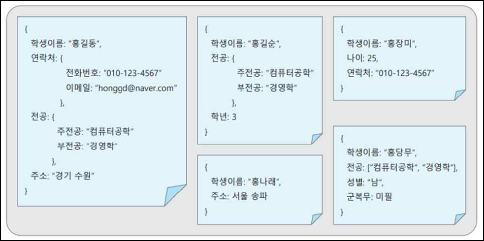
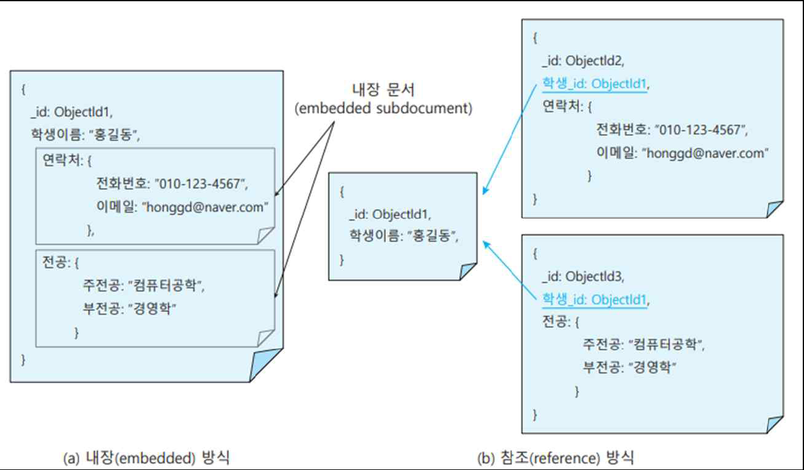

# NoSQL과 몽고DB
## NoSQL 몽고DB 개요
### NoSQL 데이터베이스의 등장
- 관계형 데이터베이스의 한계 -> 대안으로 등장
    - 빅데이터, IoT, 클라우드와 같은 새로운 환경에서 요구하는 차원이 다른 대용량 데이터와 대규모 사용자의 등장으로 서버 개선과 확장만으로는 해결하기 어려움
    - 기존 데이터베이스 기술이 새로운 환경의 데이터와 사용자, 작업의 규모에 효율적이지 못함
- NoSQL 데이터베이스 유형의 특성 비교
    
### 몽고DB
- NoSQL 중에서 가장 많이 사용하는 DBMS
- `오픈 소스 DBMS`로 문서 기반 데이터베이스 유형을 지원
    - 강점 : `단순함과 속도, 확장성 등`
- 몽고DB DBMS(MongoDB v1.0)
    - 2009년 11월에 발표, C++로 개발되었고 오픈 소스로 코드가 공개되어 있어 깃허브(GitHub) 등에서 자유롭게 다운로드받을 수 있음
    - 2007년 10gen 신생 기업이 웹 애플리케이션 서비스를 위한 소프트웨어 플랫폼(SaaS)으로 개발한 많은 제품군 중에서 데이터베이스에 특화된 제품
    - 구글, 페이스북과 같은 주요 서비스의 백엔드 소프트웨어로 사용되고 있는 가장 널리 알려진 NoSQL 데이터베이스 관리 시스템
#### 몽고DB의 특성
1. `유연성(flexibility)`
    - 일정한 형식없이 문서 안에 데이터를 저장하므로 `스키마를 미리 정의하지 않아도 됨`
    - 문서 안에 `어떤 유형의 데이터도 저장가능` -> 스키마 선언없이도 필드 추가와 삭제 가능
2. `확장성(scalability)`
    - 기본적으로 `분산 확장을 고려하여 설계`되었고 테이블 대신 `문서를 사용`함으로써 `여러 서버에 쉽게 분산할 수 있어 분산 확장이 용이`함
    - `수평적 분산 확장(scale-out) 방식`에 효과적
3. `고성능(performance)`
    - 최대한 고성능을 유지하기 위해 설계되어 `기본적인 읽기와 쓰기 속도가 빠름`
    - `복제(replication)와 샤딩(sharding)을 통한 가용성의 향상`
    - 샤드(shard): 데이터의 수평분할, 데이터의 개개의 파티션

#### 몽고DB의 구조
- `‘데이터베이스’-‘컬렉션’-‘문서’로 연결되는 계층적 구조를 가지고 데이터를 관리`
    - `문서(document)` : 실제 데이터가 적혀있는 ‘서류’에 비유
        - 몽고DB의 `기본 저장 단위`, 테이블의 행과 개념이 비슷함
        - 문서는 `‘필드(field)이름’과 ‘필드값’으로 이루어진 쌍들의 집합`
            - 필드값 : 문자열이나 숫자, 날짜와 같이 간단한 데이터 유형, 배열 또는 다른 하위 문서
            - 구성 방식이 자바스크립트 객체와 비슷하여 `객체지향 프로그램과의 상호연계가 자연스러움`
            - 내부적으로 `JSON의 이진 유형인 BSON(Binary JSON)의 형식으로 컬렉션 안에 저장`
    - `컬렉션(collection)` : 관련 서류들을 하나로 묶는 ‘서류철’에 비유
        - 문서들의 모임으로 `여러 문서들을 포함하며 같은 컬렉션 안에도 저장되는 문서 구조가 다양할 수 있음`
        - 동적 스키마를 갖는 테이블과 비슷함
        - 모든 문서는 `고유한 값을 갖는 ‘id’ 필드를 포함` -> 컬렉션 안에서 각 문서를 구별
    - `데이터베이스(database)` : 서류철들을 체계적으로 저장하는 ‘서류함’에 비유
        - 컬렉션들의 모임으로 `여러 컬렉션들을 포함`
        - 컬렉션들의 물리적인 컨테이너, 개념적으로는 컬렉션들을 구분하는 이름 공간(name space)의 역할을 함
            - `‘admin’ 데이터베이스` : 인증과 권한 부여에 관한 데이터를 저장
            - `‘local’ 데이터베이스` : 단일 서버에 대한 데이터를 저장
            - `‘config’ 데이터베이스` : 샤딩된 클러스터에 관한 각 샤드(shard) 정보를 저장
- 몽고DB 안의 계층 구조
    - `서버에 해당하는 몽고 인스턴스가 여러 개 실행 가능`
    - 각 `몽고 인스턴스는 여러 데이터베이스를 포함`하고 각 테이터베이스 안에는 다양한 컬렉션이 존재
    - 각 컬렉션마다 여러 문서 안에 필드이름과 값의 쌍 형태로 데이터를 표현하고 저장
    
#### 문서 데이터 모델
- 문서 데이터 모델(document data model)
    - 몽고DB는 문서 기반의 데이터 모델을 사용
    - 데이터의 계층적 표현이 가능, 복잡한 조인연산 없이도 `하나의 문서 안에 모두 표현 가능`
    - 몽고DB 문서 데이터 모델의 데이터 저장
        
- JSON과 BSON의 차이
    - 보통 `JSON 문서를 사용`하지만 `내부 저장시에는 이진 포맷으로 인코딩한 BSON 문서로 변환되어 저장`됨
    - JSON(JavaScript Object Notation)
        - 자바스크립트에서 객체 생성시 사용하는 표현 방법
        - `‘필드명’과 ‘필드값’의 쌍`으로 구성
        - 사람이 쉽게 이해할 수 있는 텍스트 형식, 검색을 위해서는 파싱이 필요함
        - 단점 : 날짜 유형과 이진 데이터 유형을 지원하지 않음
    - BSON(Binary JSON)
        - JSON 데이터를 컴퓨터가 쉽게 이해할 수 있는 이진 형식으로 변환한 형태
        - `검색 속도가 빠르`고 JSON의 데이터 유형에 추가하여 `날짜와 이진 데이터 유형을 지원`
        - 몽고DB가 자동으로 처리해주기는 하지만 `인코딩과 디코딩이 추가로 필요`함
- 몽고DB의 동적 스키마
    - 몽고DB는 `동적 스키마`를 가짐
    - 미리 정해진 고정 `스키마가 존재하지 않음(schema less)`의 의미
        - 스키마의 존재 -> 구조가 미리 정의되어 있고 급격한 변화에 대응하기 어려움
    - 같은 컬렉션 안에 있는 문서들끼리도 서로 다른 스키마를 가질 수 있음(schema free)
        - 몽고DB는 모든 문서의 필드들이 같지않고 `같은 필드라도 데이터 유형이 다를 수 있음`
        - 몽고DB는 필요할 때 언제든지 여러 개의 필드를 추가하거나 배열로 바꾸는 작업만으로 쉽게 해결
    - 같은 컬렉션 안의 문서들이 모두 다른 구조를 가질 수 있는 예
        
- 몽고DB의 관계 표현
    - 관계형 데이터베이스는 1:1, 1:n, m:n 관계(relationship)를 외래키 참조 관계로 표현
    - 몽고DB는 외래키 개념이 없어 문서 간의 `연관 관계를 다음 2가지 방식으로 표현`
        - `내장(embedded) 방식`
            - 관계를 갖는 데이터를 `하나의 문서 안에 함께 저장하는 반정규화 형태`
            - 문서 안에 내장된 서브 문서(sub document) 형태로 표현
        - `참조(reference) 방식`
            - 관계를 갖는 `다른 문서의 키 필드값을 참조키로 저장하는 정규화 형태`
            - 서로 다른 독립된 문서에 대한 _id 필드값을 외래키처럼 저장함으로써 관계를 표현
            
- 몽고DB와 관계형 데이터베이스 비교
    
- 예제 실습

- 영화, 회원 컬렉션 
## 몽고DB 실습
## 컬렉션 문서 관리 명령문
